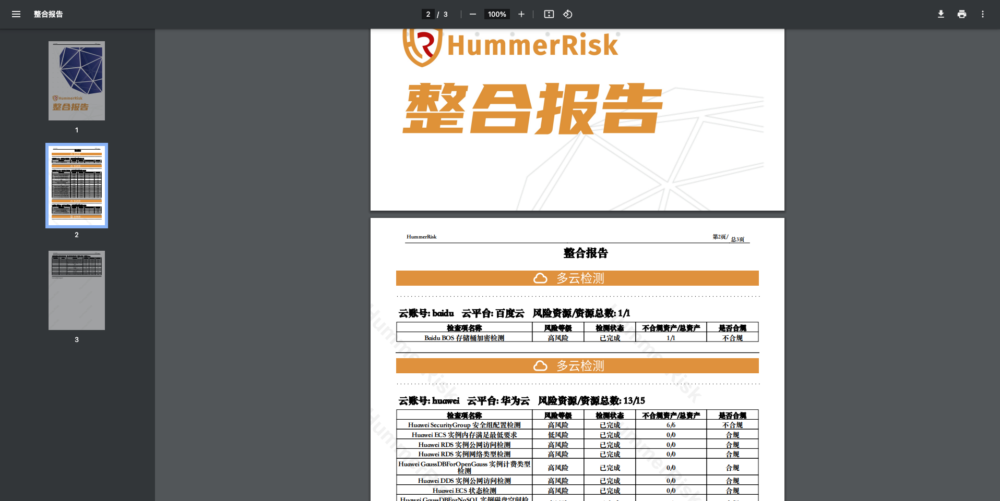

## 1 新功能 Features

### 1.1 报告中心

!!! abstract "报告中心"
    如下图所示，定制整合报告功能，生成并下载为 PDF 格式。原下载报告菜单改名为云资源合规分析。
{ width="95%" }
{ width="95%" }
{ width="95%" }
{ width="95%" }

### 1.2 K8s 检测

!!! abstract "K8s 检测"
    如下图所示，新增 Kubernetes、Rancher、KubeSphere 检测规则组以及规则。
{ width="95%" }
{ width="95%" }

### 1.3 账号管理

!!! abstract "账号管理"
    如下图所示，新增云账号管理页面关联菜单功能，新增资源同步日志。
{ width="95%" }

## 2 性能优化 Optimization

### 2.1 检测结果

!!! abstract "优化资源检测结果列表页面。"

### 2.2 规则列表

!!! abstract "优化规则列表页面，通过标签过滤数据功能。"

### 2.3 检测结果

!!! abstract "优化日志级别，修改日志执行检测的 log 输出。"

### 2.4 结果详情

!!! abstract "优化检测结果详情安全评分的计算与展示。"

### 2.5 规则列表

!!! abstract "优化规则列表（云资源检测规则、K8s 资源检测规则、主机检测规则）页面样式，调整排版。"

### 2.6 路由

!!! abstract "优化整体路由和跳转链接，由驼峰式命名修改为短横线命名，可读性更强、兼容性更好、符合标准化。"

### 2.7 URL

!!! abstract "优化 Controller 的 URL 地址，提高 URL 的可读性，使 URL 路径更直观，易于理解和记忆。"

## 3 Bug修复 Bug Fixes

### 3.1 镜像检测

!!! abstract "修复镜像检测页面 log 错误。"

### 3.2 检测详情

!!! abstract "修复云资源检测详情安全评分不正确的问题。"

### 3.3 关于

!!! abstract "修复关于页面信息。"