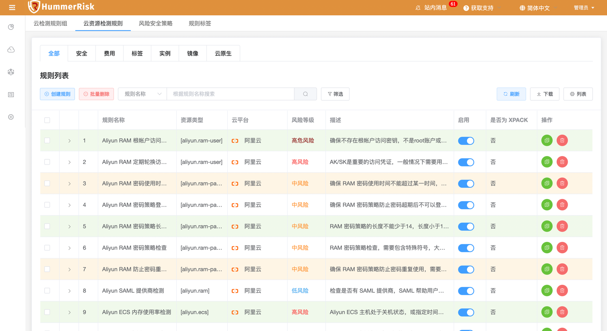
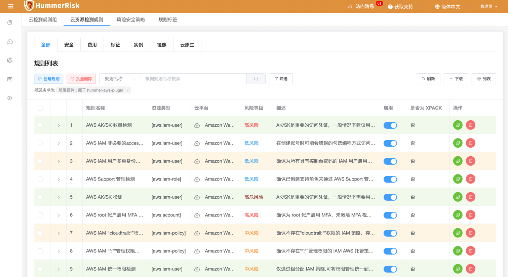

## 1 新功能 Features

### 1.1 检测规则

!!! abstract "检测规则"
    如下图所示，新增阿里云检测规则。
{ width="95%" }

### 1.2 检测规则

!!! abstract "检测规则"
    如下图所示，新增 AWS 检测规则。
{ width="95%" }

## 2 性能优化 Optimization

### 2.1 消息管理

!!! abstract "优化云检测消息管理。"

### 2.2 漏洞库

!!! abstract "优化云原生漏洞库。"
