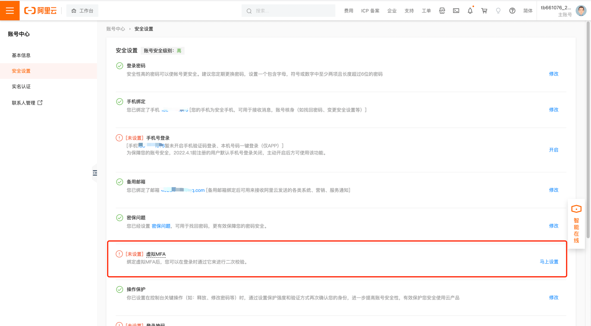

# RAM用户是否开通MFA二次验证登录

!!! info "检查项说明"
    Aliyun 检测RAM用户是否开通MFA二次验证登录，开通视为“合规”，否则属于“不合规”

!!! info "处置方案"
    进入阿里云后台，顺序操作：管理控制台-账号管理-安全设置-虚拟MFA-设置

{ width="95%" }

!!! info "操作步骤"

    * 1.使用阿里云账号登录阿里云控制台。
    * 2.将鼠标悬停在右上角头像的位置，单击安全设置。
    * 3.在安全设置页面的虚拟MFA区域，单击马上设置。
    * 4.在验证身份页面，选择合适的方式并根据页面提示进行身份验证。
    * 5.在安装应用页面，单击下一步。
    * 6.在移动设备端，添加虚拟MFA设备。

        说明: 

        如下以Android系统上的阿里云应用为例。

        * 登录阿里云应用。
        * 选择控制台 > 虚拟MFA。
        * 单击+，选择合适的方式添加虚拟MFA设备。

            * 扫码添加（推荐）：单击扫码添加，扫描阿里云控制台绑定MFA页面出现的二维码，然后单击确定。
            * 手动添加：在移动设备端，单击手动添加，输入账号和密钥，然后单击确定。
    
              说明: 
    
                在阿里云控制台绑定MFA页面，鼠标悬停在扫描失败处查看账号和密钥。

    * 7.在阿里云控制台，输入移动设备端显示的动态验证码，单击下一步，完成绑定。
        
        说明
        
        移动设备端的阿里云应用会显示您当前账号的动态验证码，每30秒更新一次。

!!! info "后续步骤"

    启用多因素认证后，阿里云账号再次登录阿里云时，系统将要求输入两层安全要素：
    
    * 1.第一层安全要素：输入用户名和密码。
    * 2.第二层安全要素：输入虚拟MFA设备生成的验证码。

        说明:

        * 为阿里云账号启用多因素认证，只针对阿里云账号生效，不会影响RAM用户的登录。
        * 卸载MFA应用或删除已绑定的虚拟MFA设备前，请先前往阿里云控制台停用多因素认证，否则将导致您无法正常登录阿里云。

!!! info "帮助资源"
    https://help.aliyun.com/document_detail/28635.html
