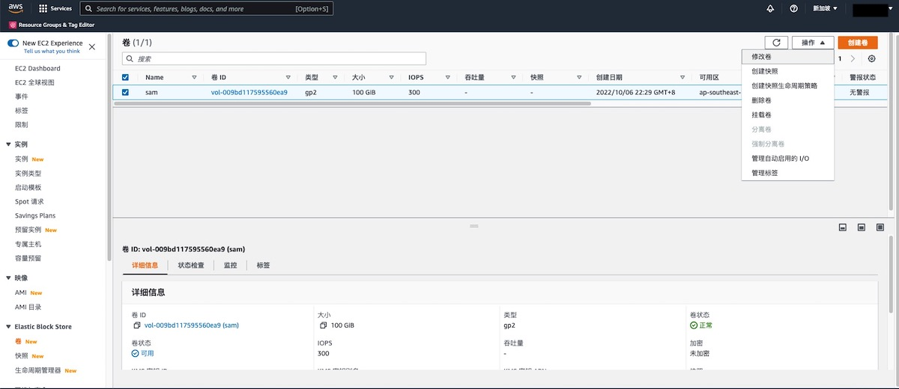

# AWS EBS 连接性检测

### 检查规则说明
!!! info ""
    检测您账号下的EBS是否为未使用状态，连接视为“合规”，否则视为“不合规”
    EBS通常情况下不应长时间处于空闲状态，应该进行回收或使用。

    ```YAML
    policies:
    # 检测您账号下的EBS是否连接，连接视为“合规”，否则视为“不合规”
    - name: aws-unattached-ebs
        resource: aws.ebs
        filters:
        - Attachments: []
        - "tag:maid_status": absent
    ```

### 处置方案
!!! info ""
    您可以使用 AWS 控制台、AWS Command Line Interface (CLI)、REST API 来执行具体的操作。   
    我们以 AWS 控制台为例，删除未使用的 EBS 。


### 操作步骤
!!! info ""

    * 1.登录 AWS 管理控制台，通过导航菜单进入 EC2 控制面板。 https://console.aws.amazon.com/ec2/ 
    * 2.在左侧菜单中找到Elastic Block Store > 卷 。
    * 3.在列表中找到检测结果中对应的卷，确认状态是'可用'。
    * 4.选择要操作的卷，点击上方的操作按钮，选择删除卷。
{ width="900px" }

### 帮助资源
!!! info ""
    https://docs.aws.amazon.com/zh_cn/AWSEC2/latest/UserGuide/ebs-deleting-volume.html
