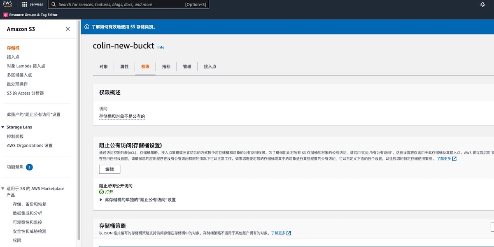

# AWS S3全局访问检测

### 检查规则说明
!!! info ""
    检测您账号下的S3是否存在ACL配置，允许进行全局访问存储桶，不允许视为“合规”，否则视为“不合规”。
    全局访问的权限默认包括：'READ', 'WRITE', 'WRITE_ACP', 'READ_ACP', 'FULL_CONTROL'

    ```YAML
    policies:
        - name: s3-global-access
        resource: aws.s3
        filters:
            - type: global-grants
    ```

### 处置方案
!!! info ""
    您可以使用 AWS Management Console、AWS Command Line Interface (CLI)、REST API 或 AWS 软件开发工具包向资源 ACL 添加授权。    
    我们会以AWS控制台方式为例，介绍如何处理问题。   
    说明：Amazon S3 中的大多数现代使用案例不再需要使用 ACL，我们建议您禁用 ACL，除非在需要单独控制每个对象的访问的异常情况下。使用对象所有权，您可以禁用 ACL 并依赖策略进行访问控制。禁用 ACL 时，可以使用策略管理对它们的访问。
    


### 操作步骤
!!! info ""

    * 1.使用具有 AWS S3 管理权限的账号登录控制台。
    * 2.通过导航菜单进入 S3 控制台。https://console.aws.amazon.com/s3/
    * 3.点击左侧菜单的存储桶。
    * 4.根据检测结果，在存储桶列表中找到存在问题的存储桶，点击存储桶名称，进入详情页面
    * 5.点击权限标签，进入权限管理页面。
    * 6.在 Access control list (访问控制列表) 下，选择 Edit (编辑)。
    * 7.这里我们要修改 Bucket ACL 的公共访问，请将'所有人(公有访问权限)'后面的权限都取消掉。

{ width="900px" }


### 帮助资源
!!! info ""
    https://docs.aws.amazon.com/zh_cn/AmazonS3/latest/userguide/managing-acls.html

