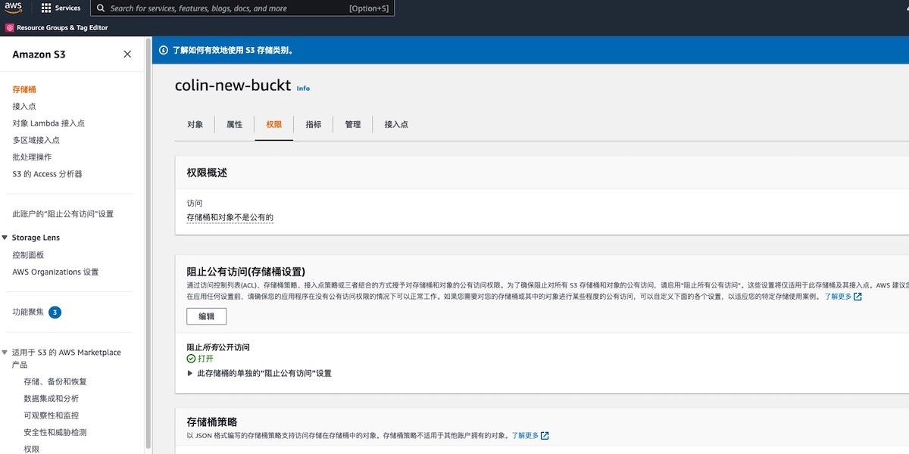

# AWS S3公开读写访问权限检测


### 检查规则说明
!!! info ""
    检测您的S3存储桶是否有允许公开读写的访问权限。如允许则该存储桶不合规。

    ```YAML
    policies:
        # 查看您的S3存储桶是否不允许公开读写访问权限。如允许则该存储桶不合规
        - name: s3-public-acls
        resource: aws.s3
        filters:
            - type: check-public-block
            BlockPublicAcls: false
            BlockPublicPolicy: false
    ```

    
### 处置方案
!!! info ""
    进入 AWS 控制台，依次操作：S3控制台-存储桶-存储桶详情-权限

{ width="95%" }

### 操作步骤
!!! info ""

    * 1.使用具有 AWS S3 管理权限的账号登录控制台。
    * 2.通过导航菜单进入 S3 控制台。https://console.aws.amazon.com/s3/
    * 3.点击左侧菜单的存储桶。
    * 4.根据检测结果，在存储桶列表中找到存在问题的存储桶，点击存储桶名称，进入详情页面
    * 5.点击权限标签，进入权限管理页面。
    * 6.点击阻止共有访问中的编辑按钮，勾选所有的内容。
    * 7.当系统要求确认时，请输入 confirm。然后选择 Confirm (确认) 以保存更改。


### 帮助资源
!!! info ""
    https://docs.aws.amazon.com/zh_cn/AmazonS3/latest/userguide/configuring-block-public-access-bucket.html

    关于四个 Amazon S3 阻止公有访问设置的信息，请参考一下链接：  
    https://docs.aws.amazon.com/zh_cn/AmazonS3/latest/userguide/access-control-block-public-access.html#access-control-block-public-access-options
