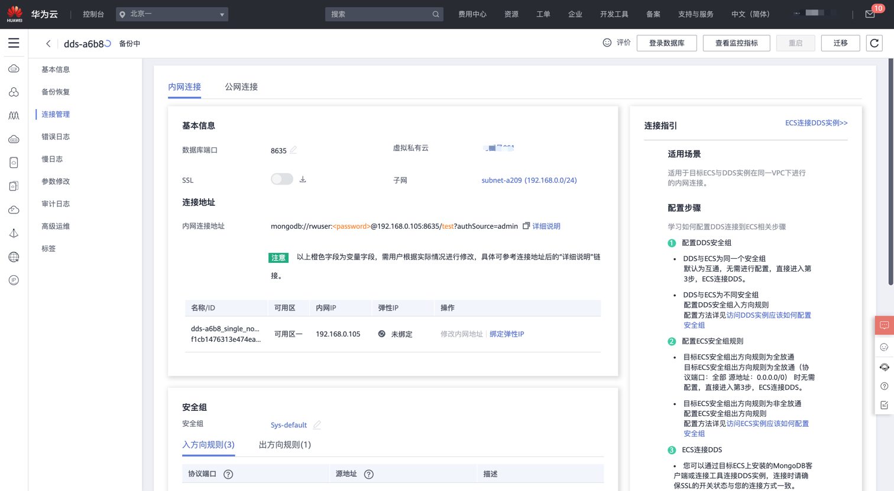
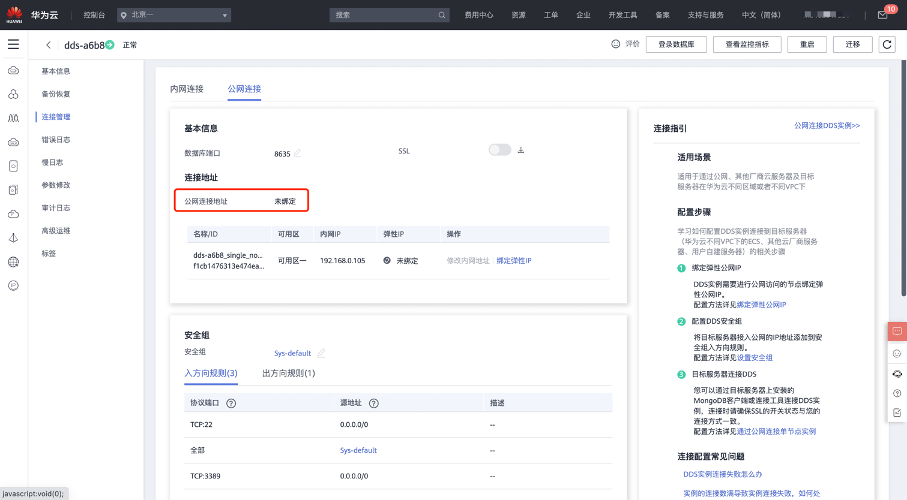

# Huawei DDS 实例公网访问检测

### 1.检查项说明
!!! info ""
    Huawei  账号下 DDS 实例不允许任意来源公网访问，视为“合规”，否则属于“不合规”。

### 2.处置方案
!!! info ""
    1. 前往华为云控制台，调整 DDS 实例公网访问控制。
    2. 内网连接。使用内网IP地址连接。
        * 系统默认提供内网IP地址。
        * 当应用部署在弹性云服务器上，且该弹性云服务器与华为云关系型数据库实例处于同一区域，同一VPC时，建议单独使用内网IP通过弹性云服务器连接文档数据库服务实例。
    3. 公网连接。使用弹性公网IP连接，需购买弹性公网IP。
        * 当应用部署在弹性云服务器上，且该弹性云服务器与文档数据库实例处于不同区域时，建议单独使用弹性公网IP通过弹性云服务器连接文档数据库实例。
        * 当应用部署在其他云服务的系统上时，建议单独使用弹性公网IP通过弹性云服务器连接文档数据库实例。

### 3.操作步骤
!!! info ""
    1. 使用华为云账号登录控制台。
    2. 通过导航菜单进入服务控制台。https://console.huaweicloud.com/dds。
    3. 找到相关的资源，进入连接管理菜单进行设置。
        * 找到内网连接菜单，根据需求进行设置。
        * 找到公网连接菜单，根据需求进行设置。

> 图1 进入连接管理: 内网连接设置

{ width="95%" }

> 图2 进入连接管理: 公网连接设置

{ width="95%" }

### 4.帮助资源
!!! info ""
    - https://support.huaweicloud.com/dds/index.html
