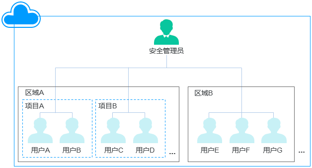
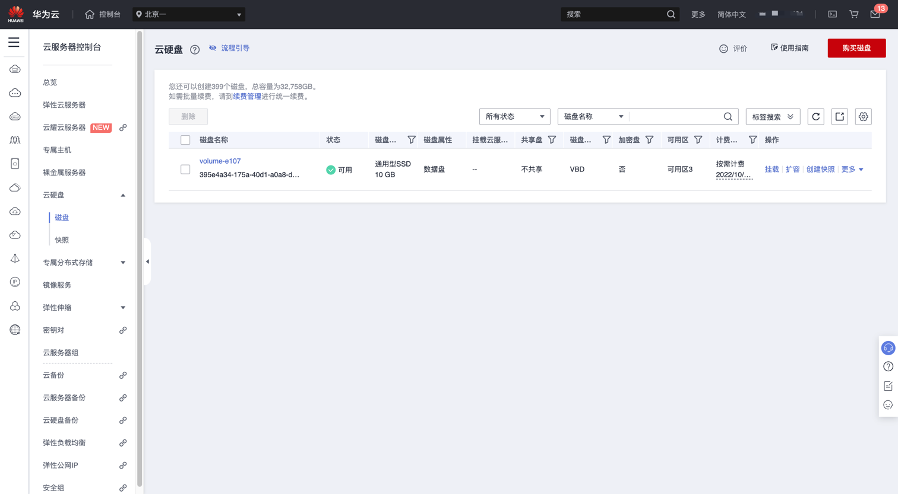

# Huawei Disk 磁盘加密状态检测

### 1.检查项说明
!!! info ""
Huawei 账号下所有的磁盘均已加密；若您配置阈值，则磁盘加密的 Id 需存在您列出的阈值中，视为“合规”，否则属于“不合规”。

### 2.处置方案
!!! info ""
    1. 前往华为云控制台，调整云硬盘加密状态。
    2. 什么是云硬盘加密
        * 当您由于业务需求从而需要对存储在云硬盘的数据进行加密时，EVS为您提供加密功能，可以对新创建的云硬盘进行加密。
        * EVS加密采用行业标准的XTS-AES-256加密算法，利用密钥加密云硬盘。加密云硬盘使用的密钥由数据加密服务（DEW，Data Encryption Workshop）中的密钥管理（KMS，Key Management Service）功能提供，无需您自行构建和维护密钥管理基础设施，安全便捷。KMS使用符合FIPS 140-2第3等级认证的硬件安全模块（HSM，Hardware Security Module），从而保护密钥的安全。所有的用户密钥都由HSM中的根密钥保护，避免密钥泄露。
    3. 云硬盘加密的密钥
        * 使用KMS提供的密钥，包括默认主密钥和用户主密钥 (CMK, Customer Master Key)：
            * 默认主密钥: 由EVS通过KMS自动创建的密钥，系统为您创建默认主密钥名称为“evs/default”。
            * 默认主密钥不支持禁用、计划删除等操作。
            * 用户主密钥: 由用户自己创建的密钥，您可以选择已有的密钥或者新创建密钥，具体请参见《数据加密服务用户指南》的“密钥管理 > 创建密钥”章节。
        * 使用用户主密钥加密云硬盘，若对用户主密钥执行禁用、计划删除等操作，将会导致云硬盘不可读写，甚至数据永远无法恢复，具体请参见表1。
    4. 加密云硬盘与快照、备份、镜像之间的关系
        * 云硬盘加密功能支持系统盘、数据盘、快照、备份和镜像，具体说明如下：
            * 系统盘的加密与创建云服务器的镜像相关：
                * 如果使用加密镜像创建云服务器，那么系统盘默认开启加密功能，加密方式与镜像保持一致。具体请参见“镜像服务用户指南 > 管理私有镜像 > 加密镜像” 。
            * 创建空白云硬盘时，可以选择加密或者不加密，创建完成后无法更改加密属性。
            * 通过快照创建云硬盘时，云硬盘加密属性和快照源云硬盘保持一致。
            * 通过备份创建云硬盘时，云硬盘的加密属性无需和备份保持一致。
            * 通过镜像创建云硬盘时，云硬盘加密属性和镜像源云硬盘保持一致。
            * 通过云硬盘创建备份时，备份的加密属性与源云硬盘保持一致。
            * 通过云硬盘创建快照时，快照的加密属性与源云硬盘保持一致。
    5. 哪些用户有权限使用云硬盘加密
        * 安全管理员（拥有“Security Administrator”权限）可以直接授权EVS访问KMS，使用加密功能。
        * 普通用户（没有“Security Administrator”权限）使用加密功能时，根据该普通用户是否为当前区域或者项目内第一个使用加密特性的用户，作如下区分：
            * 是，即该普通用户是当前区域或者项目内第一个使用加密功能的，需先联系安全管理员进行授权，然后再使用加密功能。
            * 否，即区域或者项目内的其他用户已经使用过加密功能，该普通用户可以直接使用加密功能。
        * 对于一个租户而言，同一个区域内只要安全管理员成功授权EVS访问KMS，则该区域内的普通用户都可以直接使用加密功能。
    6. 云硬盘加密的使用场景
        * 对于一个租户而言，区域以及项目下的用户关系示意图如图1所示。以区域B为例，根据首次使用加密功能的用户是否拥有“Security Administrator”权限分为以下两个场景：
        * 如果安全管理员首次使用加密功能，则操作流程如下：
        * 授权EVS访问KMS。
        * 授权成功后，系统会为您创建默认主密钥“evs/default”，此密钥用来加密云硬盘。
            * 说明：
            * 云硬盘的加密依赖KMS，首次使用加密功能时，需要授权EVS访问KMS。当授权成功后，用户组中的所有用户使用加密功能均无需再次进行授权操作。
        * 选择密钥。
            * 您可以选择使用的密钥如下：
                * 默认主密钥“evs/default”。
                * 用户主密钥，即您在使用云硬盘加密功能前已经创建的密钥，或者新创建密钥，创建方法请参见创建密钥。
        * 安全管理员成功使用加密功能后，则区域B中的所有用户都可以直接使用加密功能。
        * 如果是用户E（普通用户）首次使用加密功能，则操作流程如下：
            * 用户E使用加密功能，系统提示权限不足，无法授权EVS访问KMS。
            * 联系安全管理员，让安全管理员授权EVS访问KMS。
        * 授权成功后，用户E以及区域B中的所有用户都可以直接使用加密功能，无需再联系安全管理员进行授权。
        * 如果当前区域内存在多个项目，则每个项目下都需要安全管理员执行授权操作。            

表1 用户主密钥不可用的影响

|   用户主密钥的状态    |   影响    | 恢复方法 |
|:-------:|:-------:| :----: |
|    处于“禁用”状态    |  若加密磁盘已经挂载至云服务器，则该磁盘将在一段时间后不可读写，甚至数据永远无法恢复。且该磁盘卸载后，将无法重新挂载。 若加密磁盘没有挂载至云服务器，该磁盘将无法实现挂载。   | 启用用户主密钥，具体请参见启用密钥。 |
|    处于“计划删除”状态    |   若加密磁盘已经挂载至云服务器，则该磁盘将在一段时间后不可读写，甚至数据永远无法恢复。且该磁盘卸载后，将无法重新挂载。 若加密磁盘没有挂载至云服务器，该磁盘将无法实现挂载。   | 取消删除用户主密钥，具体请参见取消删除密钥。 |
|    已经被删除    |   若加密磁盘已经挂载至云服务器，则该磁盘将在一段时间后不可读写，甚至数据永远无法恢复。且该磁盘卸载后，将无法重新挂载。 若加密磁盘没有挂载至云服务器，该磁盘将无法实现挂载。   | 磁盘数据永远无法恢复。 |

图1 用户关系示意图
{ width="900px" }

### 3.操作步骤
!!! info ""
    1. 使用华为云账号登录控制台。
    2. 通过导航菜单进入服务控制台。https://console.huaweicloud.com/ecm。
    3. 找到相关的资源，进入云硬盘管理菜单进行设置。

{ width="900px" }

### 4.帮助资源
!!! info ""
    - https://support.huaweicloud.com/productdesc-evs/evs_01_0001.html
    - https://support.huaweicloud.com/usermanual-dew/dew_01_0178.html
