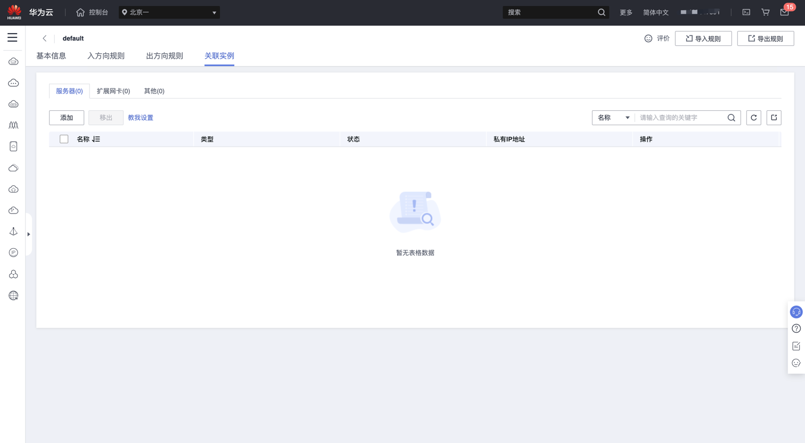

# Huawei ECS 实例网络类型检测

### 1.检查项说明
!!! info ""
Huawei  账号下所有 ECS 实例已关联到 VPC；若您配置阈值，则关联的 VpcId 需存在您列出的阈值中，视为“合规”，否则属于“不合规”。

### 2.处置方案
!!! info ""
    1. 前往华为云控制台，调整 ECS 实例 VPC 管理。
    2. 虚拟私有云（Virtual Private Cloud，以下简称 VPC），为云服务器、云容器、云数据库等资源构建隔离的、用户自主配置和管理的虚拟网络环境，提升用户云上资源的安全性，简化用户的网络部署。
    3. 您可以在VPC中定义安全组、VPN、IP地址段、带宽等网络特性。用户可以通过VPC方便地管理、配置内部网络，进行安全、快捷的网络变更。同时，用户可以自定义安全组内与组间弹性云服务器的访问规则，加强弹性云服务器的安全保护。
    4. 华为云提供了管理虚拟私有云的功能：创建虚拟私有云、修改虚拟私有云基本信息、为虚拟私有云添加扩展网段、删除虚拟私有云扩展网段、删除虚拟私有云和导出虚拟私有云列表。

{ width="95%" }

### 3.操作步骤
!!! info ""
    1. 使用华为云账号登录控制台。
    2. 通过导航菜单进入服务控制台。https://console.huaweicloud.com/ecm。
    3. 找到相关的资源，进入管理菜单进行设置。

> 图1 进入 VPC 管理: 关联实例

{ width="95%" }

### 4.帮助资源
!!! info ""
- https://support.huaweicloud.com/ecs_faq/ecs_faq_1339.html
