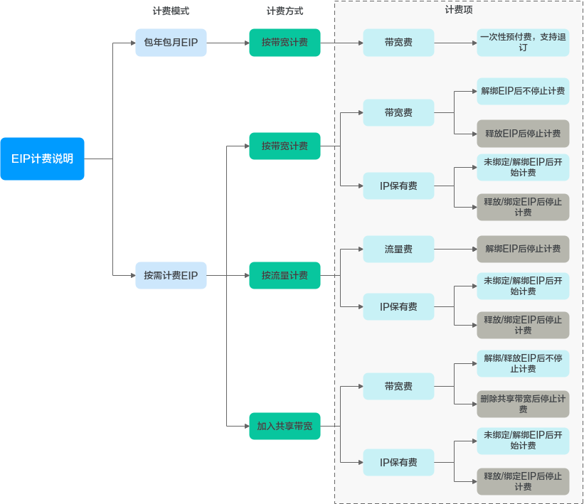
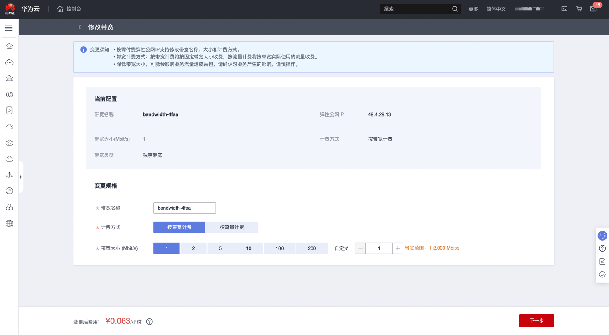

# Huawei EIP 带宽峰值检测

### 1.检查项说明
!!! info ""
Huawei 检测您账号下的弹性 IP 实例是否达到最低带宽要求，符合视为“合规”，否则视为“不合规”。

### 2.处置方案
!!! info ""
    1. 前往华为云控制台，调整 EIP 实例管理。
    2. 弹性公网IP提供“包年/包月”和“按需计费”两种计费方式，不同计费模式下的计费方式和计费项不同。
        * 包年/包月计费模式下的计费项有“按带宽计费”，计费项有带宽费。
        * 按需计费模式下的计费项有“按带宽计费”、“按流量计费”、“加入共享带宽”。
            * “按带宽计费”的计费项有：带宽费、IP保有费。
            * “按流量计费”的计费项有：流量费、IP保有费。
            * “加入共享带宽”的计费项有：带宽费、IP保有费。

{ width="900px" }

### 3.操作步骤
!!! info ""
    1. 使用华为云账号登录控制台。
    2. 通过导航菜单进入服务控制台。https://console.huaweicloud.com/vpc。
    3. 找到相关的资源，进入管理菜单进行设置。

> 图1 进入弹性 IP 管理: 修改带宽

{ width="900px" }

### 4.帮助资源
!!! info ""
- https://support.huaweicloud.com/function-eip/index.html
