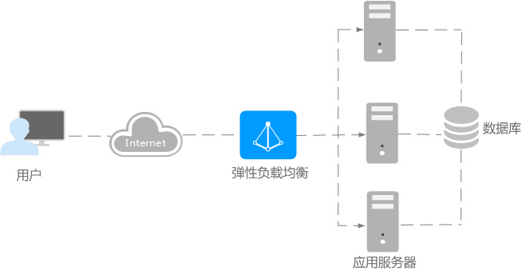
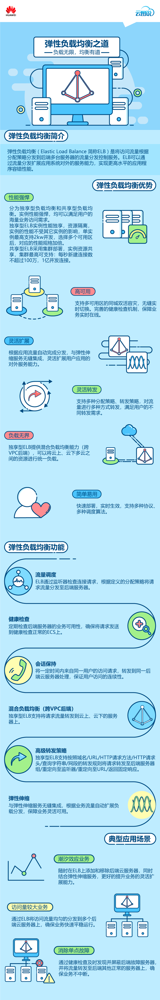
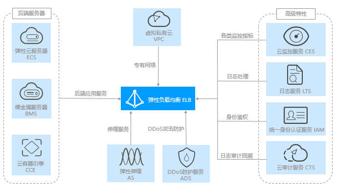

# Huawei ELB 实例关联云服务器组检测

### 1.检查项说明
!!! info ""
    Huawei 账号下负载均衡实例是否已关联到后端云服务器组；若关联，符合视为“合规”，否则视为“不合规”

### 2.处置方案
!!! info ""
    1. 前往华为云控制台，调整 ELB 实例管理。
    2. 弹性负载均衡（Elastic Load Balance，简称ELB）是将访问流量根据分配策略分发到后端多台服务器的流量分发控制服务。弹性负载均衡可以通过流量分发扩展应用系统对外的服务能力，同时通过消除单点故障提升应用系统的可用性。
    3. 如下图所示，弹性负载均衡将访问流量分发到后端三台应用服务器，每个应用服务器只需分担三分之一的访问请求。同时，结合健康检查功能，流量只分发到后端正常工作的服务器，从而提升了应用系统的可用性。

{ width="95%" }

{ width="95%" }

{ width="95%" }

### 3.操作步骤
!!! info ""
    1. 使用华为云账号登录控制台。
    2. 通过导航菜单进入服务控制台。https://console.huaweicloud.com/vpc。
    3. 找到相关的资源，进入管理菜单进行设置。

### 4.帮助资源
!!! info ""
    - https://support.huaweicloud.com/productdesc-elb/elb_pro_0008.html
