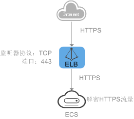

# Huawei ELB 负载均衡 HTTPS 监听检测

### 1.检查项说明
!!! info ""
    Huawei ELB 负载均衡开启 HTTPS 监听，符合视为“合规”，否则属于“不合规”。

### 2.处置方案
!!! info ""
    1. 前往华为云控制台，调整 ELB 实例管理。
    2. HTTPS协议适用于需要加密传输的应用。您可以添加一个HTTPS监听转发来自HTTPS协议的请求。ELB对于用户的HTTPS的请求进行解密，然后发送至后端服务器；后端服务器处理完请求后的返回包首先发送至ELB，由ELB进行加密后，再传回用户侧。
    3. 添加HTTPS监听器时，要求后端子网预留足够的IP地址，可以通过负载均衡器的“基本信息 > 后端子网”添加多个后端子网来增加后端子网的IP地址。添加子网后，请取消对应子网的ACL配置，否则可能导致负载均衡访问异常。
    4. 如果您不希望负载均衡器对HTTPS流量进行解密，可以通过配置相同端口的TCP监听器将HTTPS流量透传到后端服务器。具体原理参见TCP监听器将HTTPS流量透传到后端服务器。

!!! warning "注意"
    * 独享型负载均衡前端协议为“HTTPS”时，后端协议可以选择“HTTP”或“HTTPS”。
    * 共享型负载均衡前端协议为“HTTPS”时，后端协议默认为“HTTP”，且不支持修改。
    * 如果您的独享型负载均衡实例类型为网络型（TCP/UDP），则无法创建HTTPS监听器。

{ width="95%" }

### 3.操作步骤
!!! info ""
    1. 使用华为云账号登录控制台。
    2. 通过导航菜单进入服务控制台。https://console.huaweicloud.com/vpc。
    3. 找到相关的资源，进入管理菜单进行设置。

!!! info "添加独享型负载均衡HTTPS监听器"
    1. 登录管理控制台。
    2. 在管理控制台左上角单击图标，选择区域和项目。
    3. 单击页面左上角的，选择“网络 > 弹性负载均衡”。
    4. 在“负载均衡器”界面，单击需要添加监听器的负载均衡名称。
    5. 切换到“监听器”页签，单击“添加监听器”，配置监听器。
    6. 单击“下一步：配置后端分配策略”。
    7. 单击“下一步：添加后端服务器”。添加后端服务器并配置健康检查。
    8. 单击“下一步：确认配置”。
    9. 确认配置无误后，单击“提交”。

!!! info "添加共享型负载均衡HTTPS监听器"
    1. 登录管理控制台。
    2. 在管理控制台左上角单击图标，选择区域和项目。
    3. 单击页面左上角的，选择“网络 > 弹性负载均衡”。
    4. 在“负载均衡器”界面，单击需要添加监听器的负载均衡名称。
    5. 切换到“监听器”页签，单击“添加监听器”，配置监听器。
    6. 单击“下一步：配置后端分配策略”。
    7. 单击“下一步：添加后端服务器”。添加后端服务器并配置健康检查。
    8. 单击“下一步：确认配置”。
    9. 确认配置无误后，单击“提交”。
    10. 单击“完成”。

!!! info "TCP监听器将HTTPS流量透传到后端服务器"
    * 如果您不希望负载均衡器对HTTPS流量进行解密，可以通过配置相同端口的TCP监听器将HTTPS流量透传到后端服务器。并且在实例的安全组配置相同端口的TCP入方向规则，以允许相同端口上来自负载均衡器的入站流量。
    * 如下图所示，TCP监听器如何将端口为443的HTTPS流量进行无解密透传到后端服务器。
    * 图1 TCP透传HTTPS流量

{ width="50%" }

### 4.帮助资源
!!! info ""
    - https://support.huaweicloud.com/usermanual-elb/elb_ug_jt_0009.html
