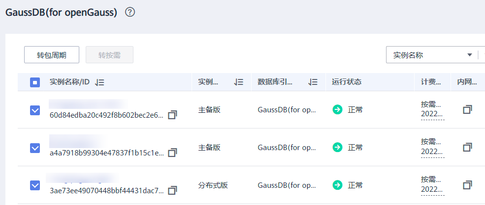
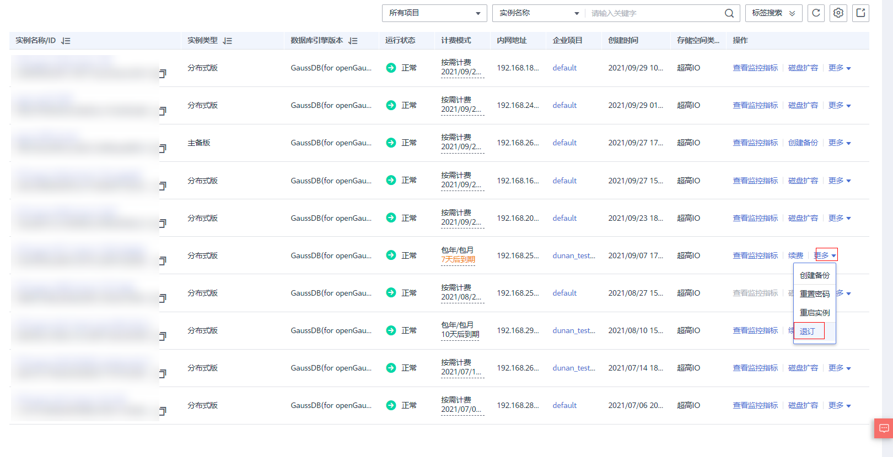

# Huawei GaussDB 实例计费类型检测

### 1.检查项说明
!!! info "检查项说明"
    Huawei 检测您账号下 GaussDB 数据库实例计费类型信息，按需视为“合规”，否则视为“不合规”。

### 2.处置方案
!!! info ""
    1. 前往华为云控制台，调整 GaussDB 实例管理。
    2. GaussDB 服务支持按需实例转为包周期（包年/包月）实例。由于按需资源费用较高，需要长期使用资源的按需用户可以选择对按需资源进行转包周期，继续使用这些资源的同时，享受包周期的优惠资费。
    3. 对于“包年/包月”模式的数据库实例，您需要退订订单，从而删除数据库实例资源。目前仅支持退订单个实例，具体退订操作请参考退订单个实例。关于退订费用，请参见退订规则说明。
    4. 对于“按需计费”模式的实例，您需要在“实例管理”页面对其进行删除，更多操作请参见删除按需实例。

!!! warning "注意事项"
    1. 运行状态为冻结、创建失败、规格变更中、扩容中的实例不支持按需实例转包周期。
    2. 按需实例转包周期不会影响业务。

### 3.操作步骤
!!! info ""
    1. 使用华为云账号登录控制台。
    2. 通过导航菜单进入服务控制台。https://console.huaweicloud.com/vpc。
    3. 找到相关的资源，进入管理菜单进行设置。

!!! info "单个按需实例转包周期"
    1. 登录管理控制台。
    2. 在“实例管理”页面，选择目标实例，单击“操作”列的“转包周期”，进入“按需转包周期”页面。
    3. 选择续费规格，以月为单位，最小包周期时长为一个月。
    4. 如果订单确认无误，单击“提交”，进入“支付”页面。
    5. 如果暂不确定实例规格，单击“确认订单，暂不付款”，系统将保留您的订单，稍后可在“费用 > 我的订单”中支付或取消订单。
    6. 选择支付方式，单击“确认付款”。
    7. 按需转包周期创建成功后，用户可以在“实例管理”页面对其进行查看和管理。
    8. 在实例列表的右上角，单击刷新列表，可查看到按需转包周期完成后，实例状态显示为“正常”。“计费模式”显示为“包年/包月”。

!!! info "按需实例批量转包周期"
    1. 登录管理控制台。
    2. 在“实例管理”页面，勾选目标实例，单击实例列表上方的“转包周期”，进入“按需转包周期”页面。
    3. 选择续费规格，以月为单位，最小包周期时长为一个月。
        * 如果订单确认无误，单击“提交”，进入“支付”页面。
        * 如果暂不确定实例规格，单击“确认订单，暂不付款”，系统将保留您的订单，稍后可在“费用 > 我的订单”中支付或取消订单。
    4. 选择支付方式，单击“确认付款”。
    5. 按需转包周期创建成功后，用户可以在“实例管理”页面对其进行查看和管理。
    6. 在实例列表的右上角，单击刷新列表，可查看到按需转包周期完成后，实例状态显示为“正常”。“计费模式”显示为“包年/包月”。

{ width="95%" }

!!! warning "说明"
    1. 仅“按需计费”模式的实例支持转包周期。
    2. 运行状态为“正常”或“异常”的实例才可转包周期。
    3. 批量转换属于白名单特性，如需配置白名单权限，您可以在管理控制台右上角，选择工单 > 新建工单，提交开通白名单的申请。

!!! info "单个包周期实例转按需"
    1. 登录管理控制台。
    2. 在“实例管理”页面，选择目标包周期实例，单击“操作”列的“更多 > 转按需”，进入“包周期转按需”页面。
    3. 进入计费模式变更页面，对实例进行计费模式的变更。
    4. 包周期转按需创建成功后，用户可以在“实例管理”页面对其进行查看和管理。
    5. 在实例列表的右上角，单击刷新列表，可查看到按需转包周期完成后，实例状态显示为“正常”。“计费模式”显示为“按需”。

!!! info "包周期实例批量转按需"
    1. 登录管理控制台。
    2. 在“实例管理”页面，勾选目标实例，单击实例列表上方的“转按需”，进入“包周期转按需”页面。
    3. 进入计费模式变更页面，对实例进行计费模式的变更。
    4. 包周期转按需创建成功后，用户可以在“实例管理”页面对其进行查看和管理。
    5. 在实例列表的右上角，单击刷新列表，可查看到按需转包周期完成后，实例状态显示为“正常”。“计费模式”显示为“按需”。

!!! warning "说明"
    1. 仅“包年/包月”模式的实例支持转按需。
    2. 运行状态为“正常”或“异常”的实例才可转按需。
    3. 实例的按需计费方式需要等包周期到期后才会生效，且自动续费功能会同步失效。
    4. 批量转换属于白名单特性，如需配置白名单权限，您可以在管理控制台右上角，选择工单 > 新建工单，提交开通白名单的申请。

!!! info "退订单个实例"
    1. 登录管理控制台。
    2. 在“实例管理”页面，选择目标实例，单击“操作”列的“更多 > 退订”。
    3. 在“退订资源”页面，确认待退订实例信息，并选择退订原因，单击“退订”。
    4. 资源退订相关信息，请参考退订规则说明。
    5. 在弹出框中确认是否退订该资源，单击“是”，提交退订申请。

!!! warning "须知"
    * 提交退订后，资源和数据将会被删除并无法找回。
    * 如需保留数据，请务必确认完成数据备份后再提交退订。

{ width="95%" }

### 4.帮助资源
!!! info ""
    - https://support.huaweicloud.com/usermanual-opengauss/opengauss_05_0021.html
    - https://support.huaweicloud.com/usermanual-opengauss/opengauss_05_0022.html
    - https://support.huaweicloud.com/usermanual-opengauss/opengauss_03_0002.html
