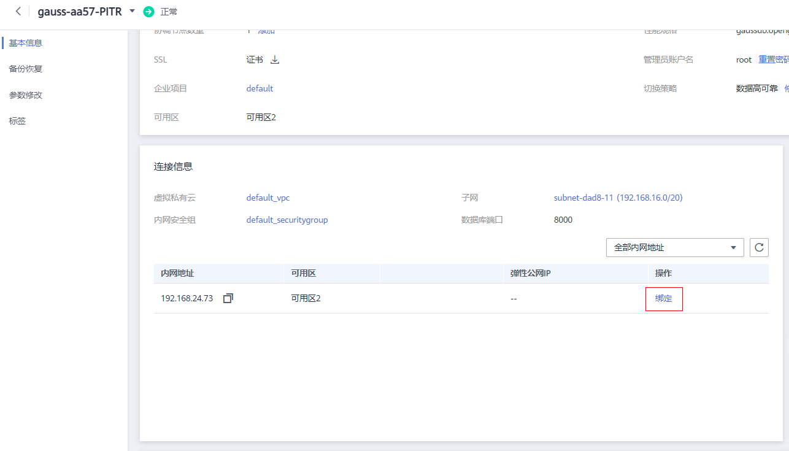
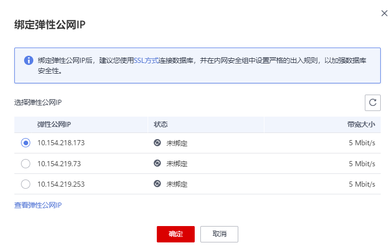
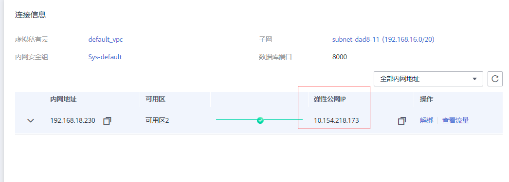
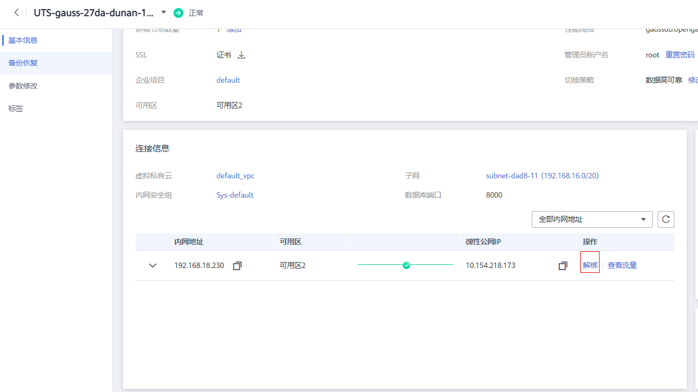

# Huawei GaussDB 实例公网访问检测

### 1.检查项说明
!!! info "检查项说明"
    Huawei 检测您账号下 GaussDB 实例不允许任意来源公网访问，符合视为“合规”，否则属于“不合规”。

### 2.处置方案
!!! info ""
    1. 前往华为云控制台，调整 GaussDB 实例管理。
    2. GaussDB 实例创建成功后，支持用户绑定弹性公网IP，在公共网络来访问数据库实例，绑定后也可根据需要解绑。
    3. 可以根据业务需要为 GaussDB 实例绑定IP地址，或者将 GaussDB 实例已经绑定的IP地址进行解绑。
    4. 为保证数据库可正常访问，请确保数据库使用的安全组开通了相关端口的访问权限，假设数据库的访问端口是 1611，那么需确保安全组开通了 1611 端口的访问。

!!! warning "注意事项"
    对于已绑定弹性公网IP的实例，需解绑后，才可重新绑定其他弹性公网IP。

### 3.操作步骤
!!! info ""
    1. 使用华为云账号登录控制台。
    2. 通过导航菜单进入服务控制台。https://console.huaweicloud.com/vpc。
    3. 找到相关的资源，进入管理菜单进行设置。

!!! info "绑定弹性公网IP"
    1. 登录管理控制台。
    2. 在“实例管理”页面，选择指定的实例，单击实例名称，进入实例基本信息页面。
    3. 在“连接信息”模块处，单击内网地址后的“绑定”。
    4. 在弹出框的EIP地址列表中，显示“未绑定”状态的EIP，选择所需绑定的EIP，单击“是”，提交绑定任务。如果没有可用的EIP，单击“查看弹性公网IP”，获取EIP。
    5. 在“连接信息”模块的内网地址处，查看结果。

{ width="95%" }
{ width="95%" }
{ width="95%" }

!!! warning "说明"
    绑定成功后，您还可以单击内网IP前的查看弹性公网IP详细信息。

!!! info "解绑弹性公网IP"
    1. 登录管理控制台。
    2. 对于已绑定EIP的实例，在“实例管理”页面，选择指定实例，单击实例名称，进入实例基本信息页面。
    3. 在“连接信息”模块，单击IP地址后面的“解绑”，在弹出框中单击“是”，解绑EIP。
    4. 若您已开启高危操作保护，在“身份验证”弹出框中单击“获取验证码”，正确输入验证码并单击“确定”，页面自动关闭。 通过进行二次认证再次确认您的身份，进一步提高帐号安全性，有效保护您安全使用云产品。关于如何开启操作保护，具体请参考《统一身份认证服务用户指南》的内容。
    5. 在“连接信息”模块的内网地址处，查看结果。 如需重新绑定，请参见绑定弹性公网IP。

{ width="95%" }

### 4.帮助资源
!!! info ""
    - https://support.huaweicloud.com/usermanual-opengauss/opengauss_01_0037.html
