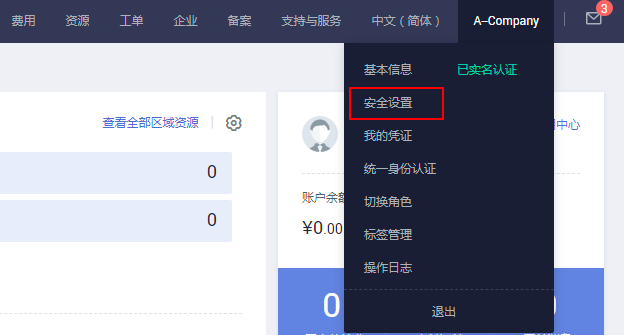
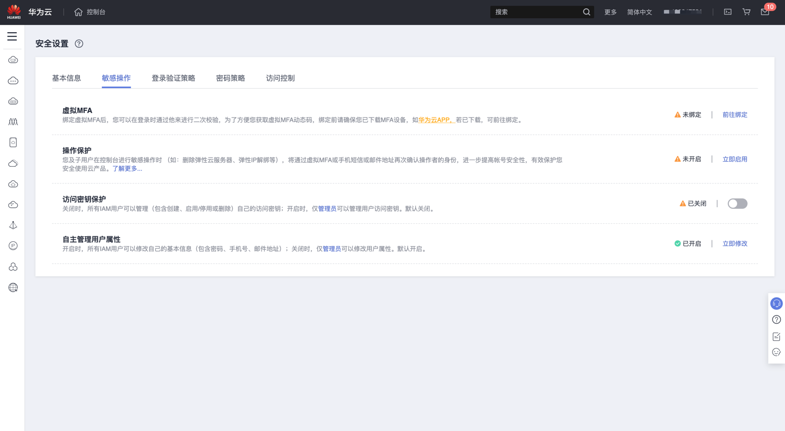
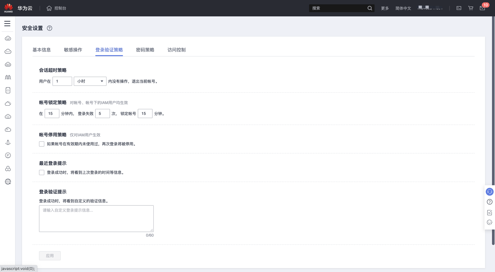

# Huawei IAM 用户是否登录保护检测

### 1.检查项说明
!!! info ""
    Huawei 检测 IAM 用户是否开启登录保护，开启视为“合规”，否则属于“不合规”。

### 2.处置方案
!!! info ""
    前往华为云控制台，调整 IAM 用户开启登录保护。当您需要对帐号的安全信息进行设置时，可以通过“安全设置”进行操作。“安全设置”包括“基本信息”、“敏感操作”、“登录验证策略”、“密码策略”、“访问控制”。

### 3.操作步骤
!!! info ""
   1. 使用华为云账号登录控制台
   2. 通过导航菜单进入服务控制台。https://console.huaweicloud.com/iam
   3. 找到相关的安全设置菜单进行设置
      如何进入安全设置
      *所有用户均可通过控制台入口进入“安全设置”。
          *1.登录华为云，在右上角单击“控制台”。
          *2.在“控制台”页面，鼠标移动至右上方的用户名，在下拉列表中选择“安全设置”。
          图1 进入安全设置

{ width="900px" }

!!! info ""
    *管理员可通过IAM控制台进入“安全设置”。
        *1.登录华为云，在右上角点击“控制台”。
        *2.在控制台页面，鼠标移动至右上方的用户名，在下拉列表中选择“统一身份认证”。
        图2 进入统一身份认证服务
        
{ width="900px" }

!!! info ""
    如何进行安全设置

{ width="900px" }
{ width="900px" }

### 4.帮助资源
!!! info ""
    - https://support.huaweicloud.com/usermanual-iam/iam_01_0704.html
