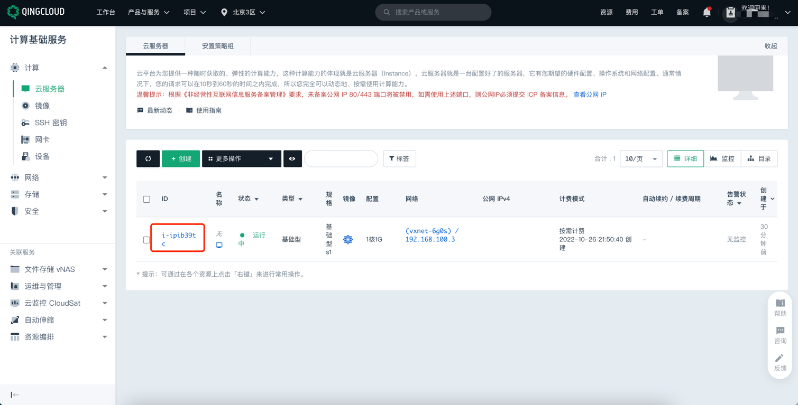
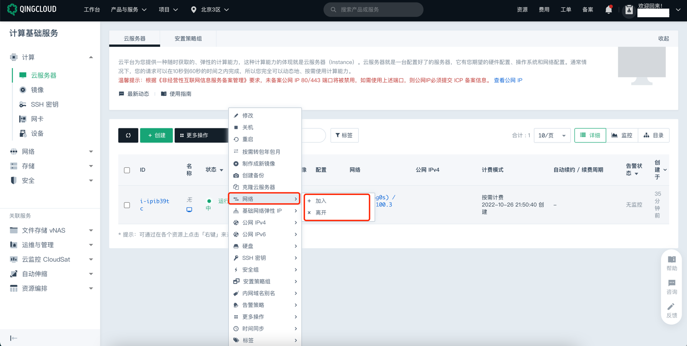
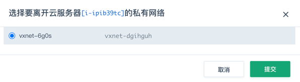
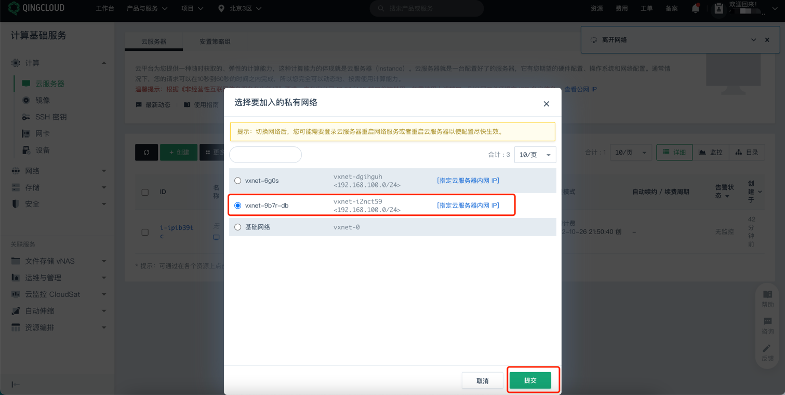

# 青云 ECS 实例网络类型检测

### 1.检查项说明
!!! info ""
    青云账号下所有 ECS 实例已关联到VPC，若您配置阈值，则关联的VpcId需存在您列出的阈值中，视为“合规”，否则视为“不合规”

### 2.处置方案
!!! info ""
    1. 前往青云控制台，调整网络类型；
    2. VPC是您在 QingCloud 公有云上构建出的一个专属隔离的网络环境。在 VPC 网络内，您可以自定义 IP 地址范围，创建子网，您也可以通过管理路由器自定义端口转发、隧道服务( GRE 隧道 、IPSec 隧道 )、VPN 服务等管理服务。根据VPC公网流量转发能力不同，VPC分为免费（仅具有内网通信功能）、小型（100kpps)、中型（150kpps)、大型（200kpps)、超大型（250kpps)，您可根据自己的需求选择。
    3. 查看当前 ECS 的 VPC 是否和预期一致，如果不一致可进行更换；

### 3.操作步骤
!!! info ""
    1. 使用腾讯云账号登录控制台；
    2. 通过导航菜单进入云服务器控制台；https://console.qingcloud.com/pek3/instances/
    3. 选择需要更换 VPC 网络的的 ECS, 右击实例-网络；
    4. 离开当前网络；
    5. 加入新的目标网络。

{ width="900px" }

{ width="900px" }

{ width="900px" }

{ width="900px" }

### 4.帮助资源
!!! info ""
    - https://docsv3.qingcloud.com/helpcenter/net/
    