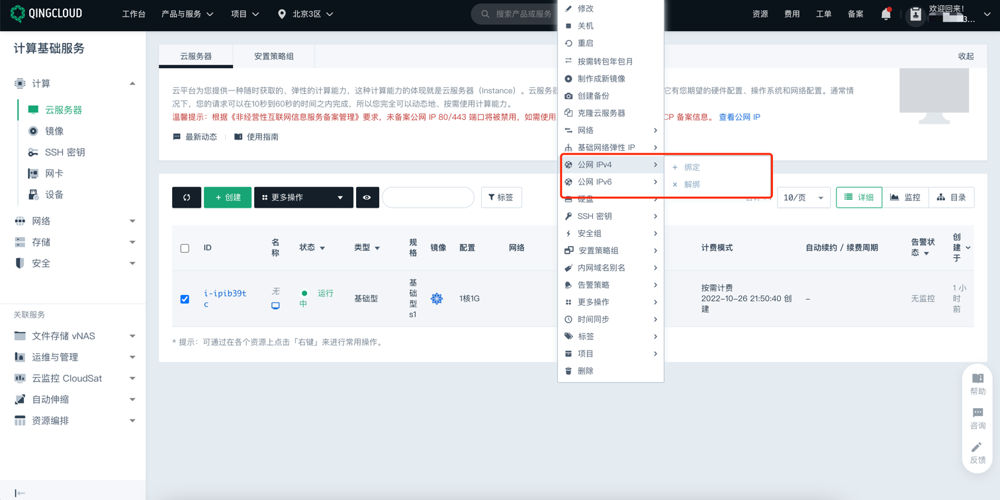

# 青云 ECS 实例公网 IP 检测

### 1.检查项说明
!!! info ""
    青云 ECS 实例未直接绑定公网 IP ，视为“合规”，否则属于“不合规”；该规则仅适用于 IPv4 协议

### 2.处置方案
!!! info ""
    1. 给云主机直接绑定公网 IP 不仅容易被攻击，同时还会存在很多安全风险，您可以前往青云云控制台，根据实际情况，选择是否给云主机解绑公网；
    2. 弹性公网IP（EIP）是可以独立购买和持有的公网 IP 地址资源，EIP 绑定云资源后，云资源可以通过 EIP 与公网通信。

### 3.操作步骤
!!! info ""
    1. 使用青云账号登录控制台；
    2. 选择产品与服务 > 计算 > 云服务器，进入云服务器页面；https://console.qingcloud.com/pek3/instances/
    3. 点击鼠标右键，弹出菜单窗口。
    4. 请根据需要选择绑定公网 IPv4 或者公网 IPv6。
    5. 点击解绑，弹出选择公网 IP 窗口。
    6. 选择待解绑的公网 IP 地址。
    7. 点击提交，完成公网 IP 地址的解绑操作。
    8. 在云服务器列表页面，您可以查看云服务器的公网 IP 所在列显示为空。

{ width="900px" }

### 4.帮助资源
!!! info ""
    - https://docsv3.qingcloud.com/compute/vm/manual/public_ip/20_del_public_ip/
    