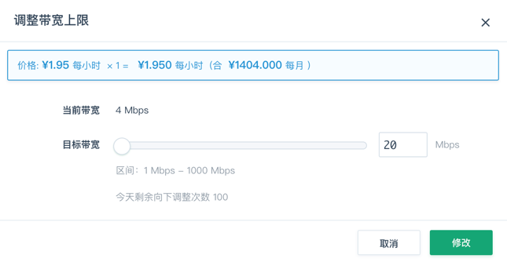
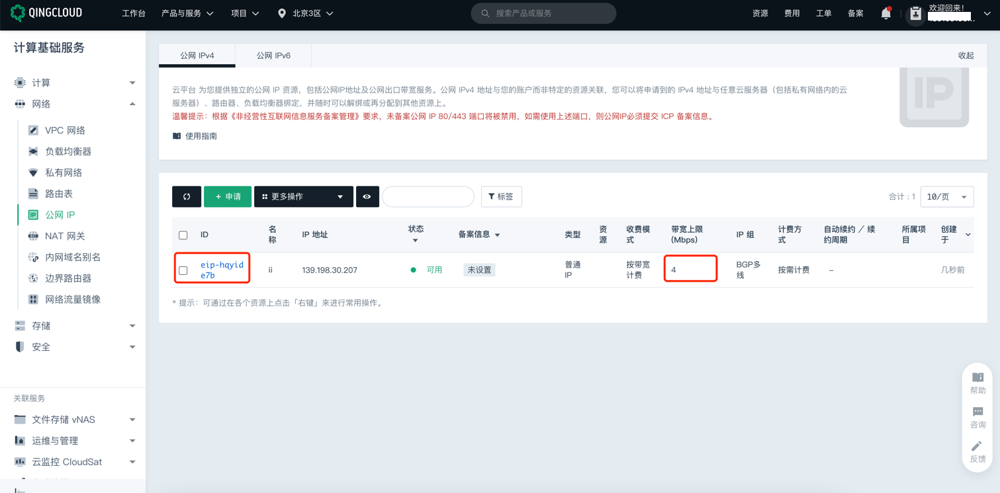
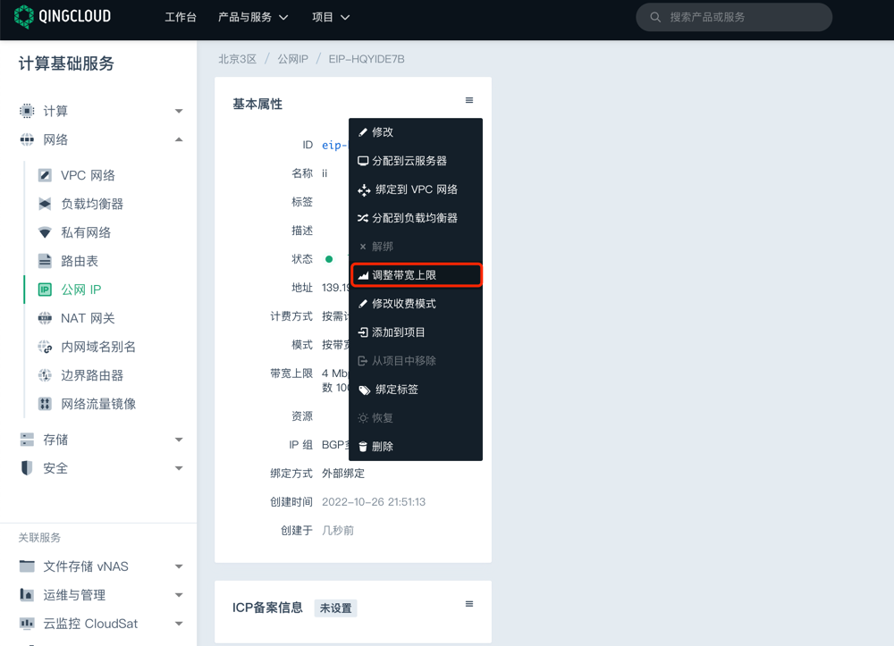

# 青云 EIP 带宽峰值检测

### 1.检查项说明
!!! info ""
    Tencent 检测您账号下的弹性IP实例是否达到最低带宽要求，默认为 10M，"是"视为“合规”，否则视为“不合规”

### 2.处置方案
!!! info ""
    1. 公网 IP 是在互联网上合法的静态 IP 地址；在 QingCloud 系统中，公网 IP 地址与账户而非特定的资源关联，因此可以将申请到的公网 IP 地址与任意云服务器（包括私有网络内的云服务器）/路由器/负载均衡器绑定，并且可以解绑、再分配到其他资源上；
    2. 外部绑定是指在云服务器外部通过网络地址转换 (NAT) 方式将公网 IP 地址转换成用户私有网络地址或基础网络地址，从而实现云服务器与公网互通；
    3. 公网 IP 的绑定模式分为两类：
        - 外部绑定：是指在云服务器外部通过网络地址转换 (NAT) 方式将公网 IP 地址转换成用户私有网络地址或基础网络地址，从而实现云服务器与公网互通；通过外部绑定方式分配公网IP给服务器后，便可实现云服务器公网访问，无须再做额外配置；
        - 内部绑定：是指通过在云服务器内部添加一块可连接到公网网关的网卡的方式来绑定公网IP；通过内部绑定方式分配公网IP给服务器后，还需要用户手动配置网卡 IP 地址及相关路由，才能实现云服务器的公网访问；
    4. 绑定公网IP，调整公网IP带宽以达到预期

### 3.操作步骤
!!! info ""
    1. 使用青云账号登录控制台;
    2. 通过导航菜单进入云服务器控制台; https://console.qingcloud.com/pek3/eips
    3. 选择需要调整的 IP，点击公网IP的 ID;
    4. 在"基本属性"版块，点击右上方更多，选择调整带宽上限，弹出设置框后，填写带宽的值;
        - { width="400px" }
    5. 注意包年包月的IP无法修改带宽.

{ width="900px" }

{ width="900px" }

### 4.帮助资源
!!! info ""
    - https://docsv3.qingcloud.com/network/eip/manual/ipv4/outband_ipv4/