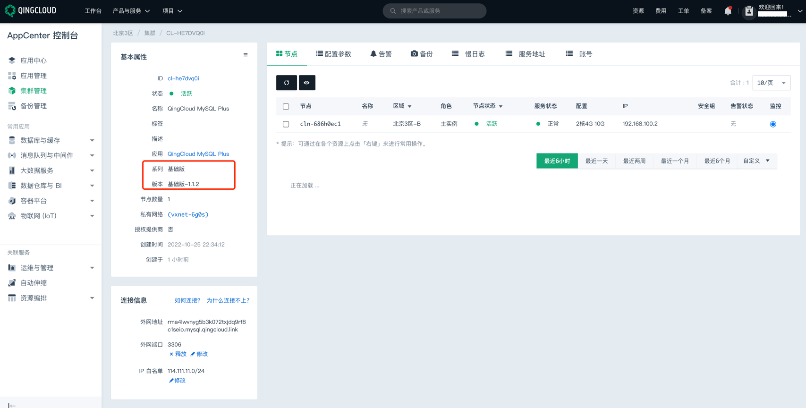
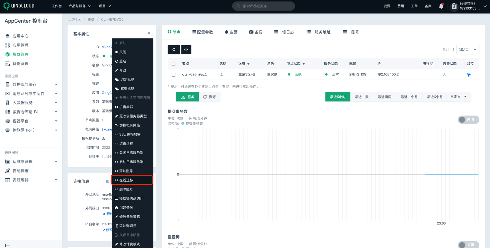
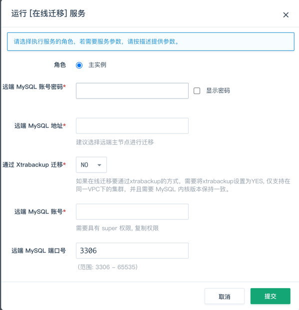

# 青云 MySQL实例高可用状态检测

### 1.检查项说明
!!! info ""
    青云账号下 MySQL 实例具备高可用能力，视为“合规”，否则属于“不合规”

### 2.处置方案
!!! info ""
    1. 前往青云控制台，调整网络类型；
    2. 青云的 MySQL 集群支持高可用版和金融版集群可选择多可用区部署和单可用区部署；基础版默认为单可用区部署；
        - 多可用区部署 ：将节点分散部署在当前区域的不同可用区，可用性高；
        - 单可用区部署 ：将节点部署在当前区域同一个可用区，网络延迟最低；可指定节点所在当前区域的可用区；
    3. 如果当前是单可用区版本，需要进行迁移或升级到多可用区的高可用版本以保证数据的高可用性

### 3.操作步骤
!!! info ""
    1. 使用青云账号登录控制台；
    2. 通过导航菜单进入云数据库-MySQL (或其他数据库)控制台；https://console.cloud.tencent.com/mysql
    3. 查看当前 MySQL 实例的版本，如果当前是基础版，根据实际情况可迁移至高可用版本的机器；
        - { width="600px" }
    4. 进入 MySQL 控制台；
    5. 选择产品与服务 > 数据库与缓存 > 关系型数据库 MySQL Plus，进入 MySQL Plus 集群管理页面；
    6. 点击立即部署，进入应用部署页面；
    7. 选择区域，根据就近原则，选择实例所在区域；
    8. 配置实例基本属性、应用版本、网络信息、环境参数等信息；
        a. 基本设置 （系列选择高可用版或金融版，同时勾选多个可用区）
        b. 主机实例设置
        c. 网络设置
        d. 服务环境参数设置
        e. 用户协议
    9. 确认配置和费用信息无误后，点击提交，创建集群；
    10. 集群创建成功后，可在集群管理页面，查看和管理当前高可用版本 MySQL Plus 集群，然后配置获取高可用机器的连接信息；
    11. 进入基础版 MySQL 集群页面，进行在线迁移；
        - { width="600px" }
    12. 配置填写高可用集群的连接信息，进行迁移同步，将基础版的数据库数据迁移到高可用数据库；
        - { width="300px" }

{ width="95%" }

### 4.帮助资源
!!! info ""
    - https://cloud.tencent.com/document/product/1003/79713
