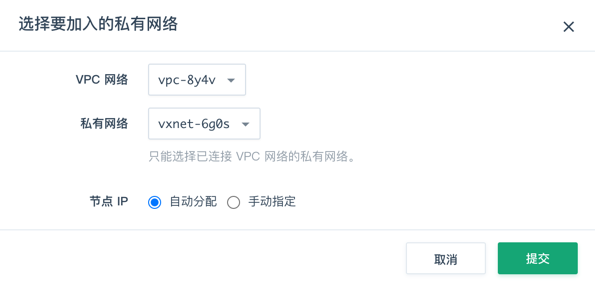
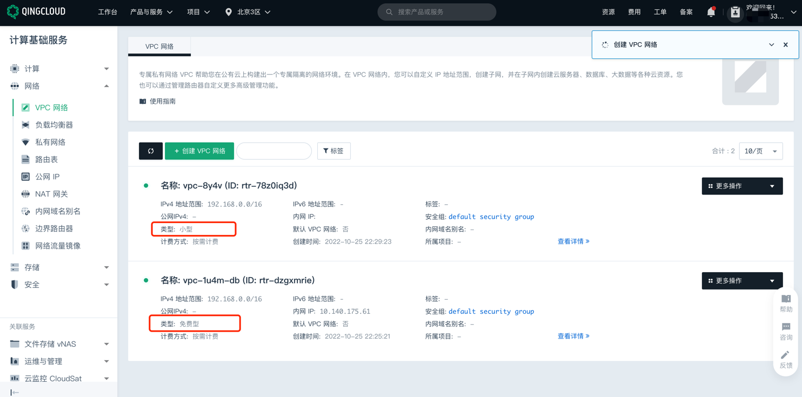
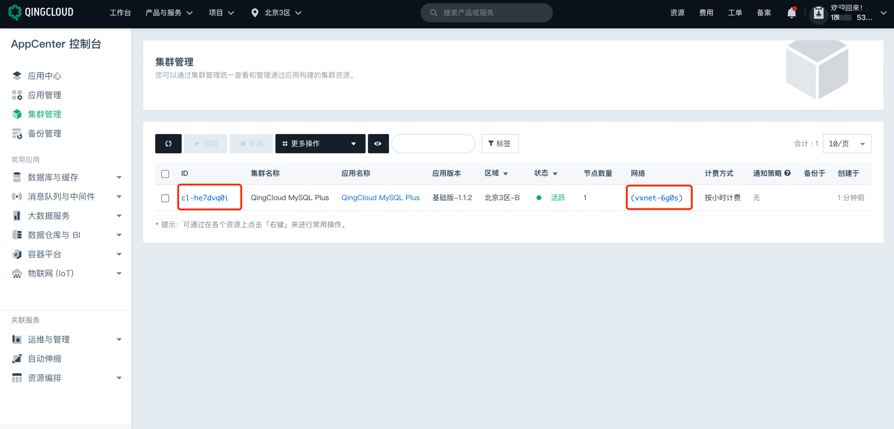
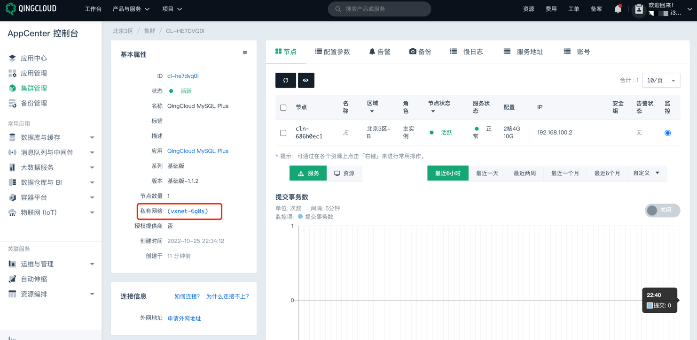
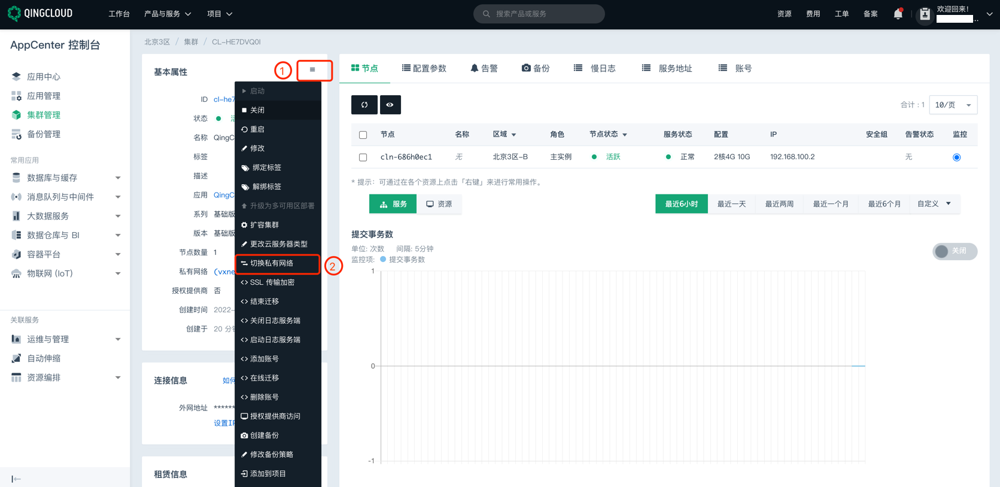

# 青云 MySQL 实例网络类型检测

### 1.检查项说明
!!! info ""
    青云账号下 MySQL 实例已关联到 VPC；若您配置阈值，则关联的 VpcId 需存在您列出的阈值中，视为“合规”，否则视为“不合规”

### 2.处置方案
!!! info ""
    1. 前往青云控制台，调整网络类型；
    2. 青云网络分为免费型、小型、中型、大型及超大型，不同类型可支持的管理流量转发能力不同；
        - 免费型 VPC 仅具备内网通信功能，不支持绑定公网 IP 和转发公网流量，且暂不支持在免费型 VPC 中创建弹性容器实例(QCI)、AppCenter 集群和边界路由器； 若您的云服务器需要上网，需要给私有网络内的云服务器单独绑定公网 IP；
    3. 不支持切换至免费型私有网络，因免费型私有网络不支持用于集群网络环境；
    4. 前提条件:
        - 已获取管理工作台登录账号和密码，且已获取集群操作权限；
        - 已创建 MySQL Plus 集群，且集群状态为活跃；
        - 至少已创建两个私有网络；

### 3.操作步骤
!!! info ""
    1. 使用青云账号登录控制台；
    2. 选择产品与服务 > 数据库与缓存 > 关系型数据库 MySQL Plus，进入集群管理页面;https://console.qingcloud.com/pek3/clusters/
    3. 选择目标集群，点击目标集群 ID，进入集群详情页面；
    4. 在基本属性模块，点击编辑下拉列表，展开属性编辑栏目；
    5. 点击切换私有网络，弹出私有网络配置窗口；
        - { width="400px" }
    6. 配置网络信息；
        - 角色 ：选择需切换网络环境的节点角色；仅可选择节点列表已有角色；
        - VPC 网络 ：默认为集群当前 VPC 网络；
        - 私有网络 ：在下拉框选择当前 VPC 网路下已创建私有网络；
        - 节点 IP ：默认为自动分配；选择手动配置需为各节点配置 IP；
        - 预留 IP ：默认为自动分配；选择手动配置需为集群配置高可用写 IP、高可用读 IP、高可用Proxy IP；
    7. 点击提交，返回集群详情页面，即可查看修改后的私有网络信息。

{ width="900px" }

{ width="900px" }

{ width="900px" }

{ width="900px" }

{ width="600px" }

### 4.帮助资源
!!! info ""
    - https://docsv3.qingcloud.com/database/mysql/manual/mgt_connect/mgt_vxnet/
    