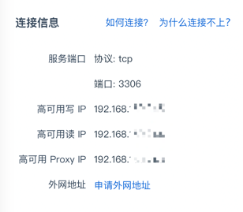
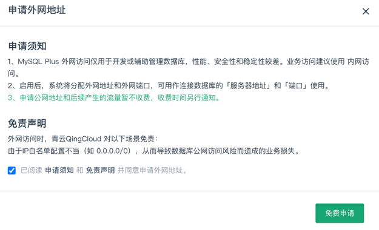
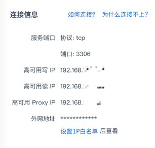
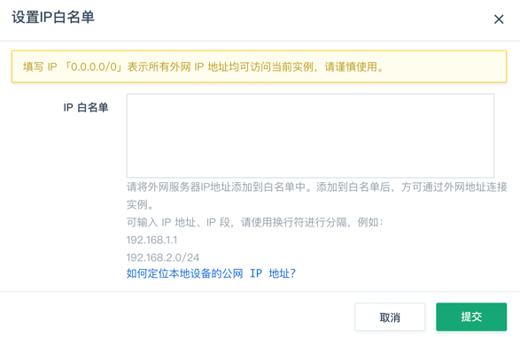
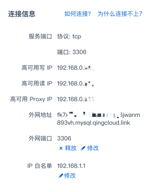
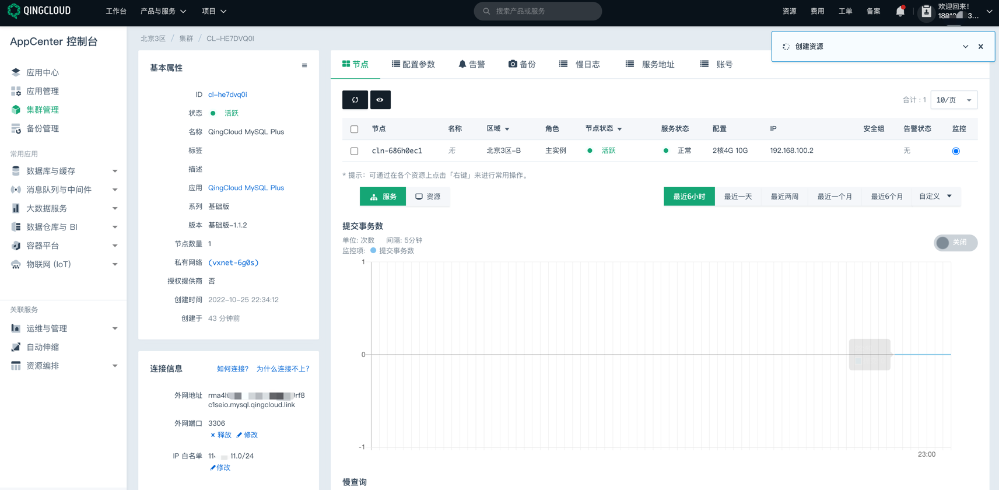

# 青云 MySQL 实例公网访问检测

### 1.检查项说明
!!! info ""
    青云检测您账号下 MySQL 实例不允许任意来源公网访问，视为“合规”，否则视为“不合规”

### 2.处置方案
!!! info ""
    1. 在 APPCenter 管理控制台，MySQL Plus 集群默认不提供外网地址；若需允许外网访问集群，需申请外网访问，并配置允许外部服务器访问的 IP 白名单；
    2. 外网又叫公网；开启外网访问后，外网地址可能会降低集群的安全性，请谨慎使用；
        - 为加强外网访问安全，外网安全组由系统维护，无需另行配置和管理；
        - 外网地址绑定的公网 IP，目前免费使用，由系统后台统一维护；
    3. IP 白名单指允许外网访问 MySQL Plus 集群的 IP 清单，建议您定期维护白名单，提高集群外网访问安全；需要设置 IP 白名单的场景如下：
        - 若需允许外部服务器正常访问集群，需要将外部 IP 地址添加至 IP 白名单；
        - 若需允许不同 VPC 网络服务器访问集群，可选择集群切换 VPC 网络或将服务器外网 IP 地址添加到 IP 白名单；
    4. 检查白名单策略，关闭来自 0.0.0.0/0 的地址访问。

### 3.操作步骤
!!! info ""
    1. 使用青云账号登录控制台；
    2. 在集群管理页面，点击目标集群 ID，进入集群详情页面；
    3. 在左侧连接信息模块，点击申请外网地址；
        { width="300px" }
    4. 在弹出的外网地址申请须知窗口，确认申请须知和免责声明信息后，勾选已阅读申请须知和免责声明，并同意申请外网地址；
        { width="400px" }
    5. 点击免费申请，返回集群详情页面；
        { width="300px" }
    6. 在连接信息模块，点击设置 IP 白名单；
        { width="400px" }
    7. 弹出白名单配置窗口，根据配置要求，输入允许访问的外网服务器 IP；
        - 可输入 IP 地址、IP 段；多个 IP 之间换行分隔；
        - IP 白名单不支持为空，不支持重复 IP 地址；
        - 单个集群最多支持10个 IP 地址或 IP 地址段；
        - IP 白名单添加0.0.0.0/0，表示任何外网 IP 地址均可连接数据库，请谨慎使用；
        - IP 白名单添加127.0.0.1，表示任何 IP 地址均无法连接数据库；
    8. 点击提交，返回集群详情页面，在连接信息模块，即可查看外网地址和 IP 白名单；
        { width="300px" }

{ width="95%" }

### 4.帮助资源
!!! info ""
    - https://docsv3.qingcloud.com/database/mysql/manual/mgt_connect/enable_external_network/
