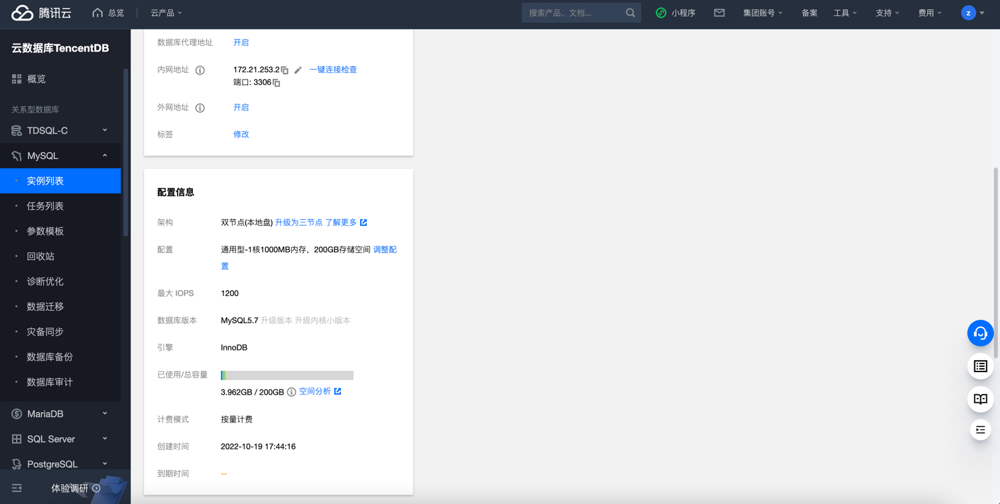

# 腾讯云 CDB 实例高可用状态检测

### 1.检查项说明
!!! info ""
    Tencent 账号下CDB实例具备高可用能力，视为“合规”，否则属于“不合规”

### 2.处置方案
!!! info ""
    1. 前往腾讯云控制台，调整数据库架构或者迁移数据库至高可用数据库集群；
    2. 云数据库 MySQL 支持三种架构：单节点（云盘版）、双节点（原高可用版）、三节点（原金融版）;
    3. 云数据库 MySQL 支持数据库引擎升级，请参见 升级数据库引擎版本，参考 https://cloud.tencent.com/document/product/236/8126 
    4. 云数据库 MySQL 支持升级双节点实例至三节点实例，请参见 双节点升级三节点，参考 https://cloud.tencent.com/document/product/236/42581
    5. 云数据库 MySQL 支持自动或手动升级内核小版本，请参见 升级内核小版本，参考 https://cloud.tencent.com/document/product/236/42581

### 3.操作步骤
!!! info ""
    1. 使用腾讯云账号登录控制台；
    2. 通过导航菜单进入云数据库-MySQL (或其他数据库)控制台；https://console.cloud.tencent.com/cdb/instance
    3. 进入数据库控制台；
    4. 在实例列表中，找到目标实例；
    5. 单击目标实例 ID，进入实例详情页面；
    6. 在实例详情的配置信息中，可看到当前数据库的部署架构；
    7. 目前可以从双节点升级为三阶段；
    8. 单节点 - 基础型（原基础版-已下线）,单节点（云盘版）架构目前支持的地域为上海，其他地域后续陆续开放；
    9. 如果是单节点切换到高可用版本，需要备份、导出数据，迁移到高可用架构的数据库集群中。
    10. 数据库迁移可参考 https://cloud.tencent.com/document/product/236/8464

{ width="95%" }
{ width="95%" }

### 4.帮助资源
!!! info ""
    - https://cloud.tencent.com/document/product/236/47905#gaokeyongban
    - https://cloud.tencent.com/document/product/236/47909
