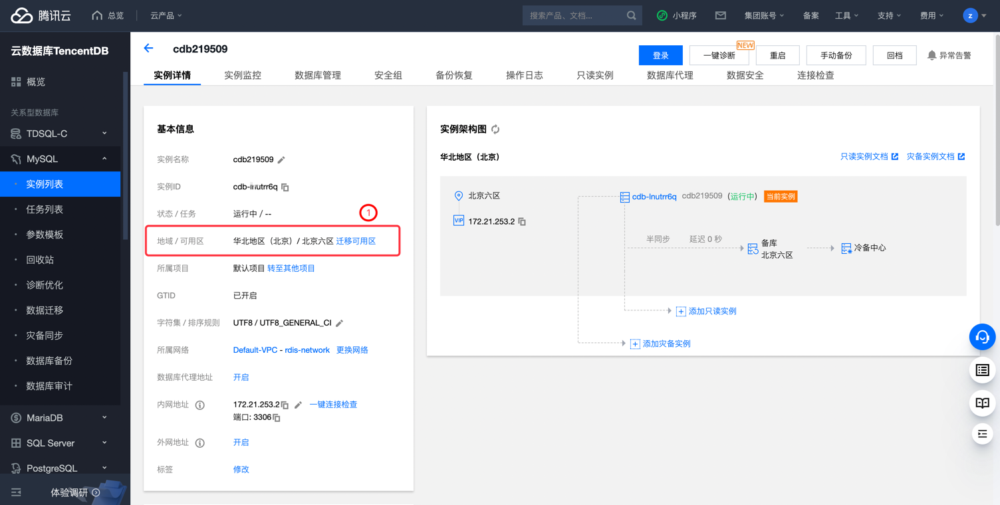
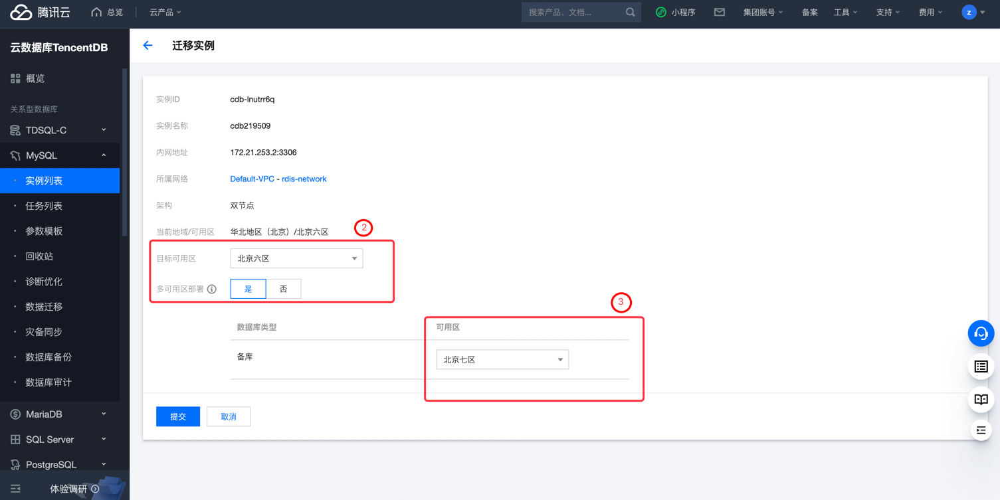

# 腾讯云 CDB 实例多可用区检测

### 1.检查项说明
!!! info ""
    Tencent 账号下 CDB 实例支持多可用区，视为“合规”，否则视为“不合规”

### 2.处置方案
!!! info ""
    1. 前往腾讯云控制台，调整数据库主备节点分别在不同可用区或者迁移数据库至高可用数据库集群；
    2. 多可用区部署可保护数据库，以防数据库实例发生故障或可用区中断，请参见地域和可用区 https://cloud.tencent.com/document/product/236/8458
    3. 云数据库 MySQL 多可用区部署为数据库实例提供高可用性和故障转移支持。多可用区是在单可用区的级别上，将同一地域的多个单可用区组合成的物理区域。
        - 无论数据库集群中的实例是否跨多个可用区，每个云数据库 MySQL 均有实时热备的备机保证数据库的高可用性。
        - 在多可用区部署中，云数据库 MySQL 会自动在不同可用区中预置和维护一个同步备用副本。
        - 主数据库实例将跨可用区同步复制到备用副本，以提供数据冗余、消除 I/O 冻结，并在系统备份期间将延迟峰值降至最小。

### 3.操作步骤
!!! info ""
    1. 使用腾讯云账号登录控制台；
    2. 通过导航菜单进入云数据库-MySQL (或其他数据库)控制台；https://console.cloud.tencent.com/cdb/instance
    3. 进入数据库控制台；
    4. 在实例列表中，找到目标实例;
    5. 单击目标实例 ID，进入实例详情页面；
    6. 在实例详情的配置信息中，可看到当前数据所在的可用区；
    7. 点击迁移实例-选择目标可用区-选择多可用区部署为"是"-备库选择为其他可用区.

{ width="900px" }
{ width="900px" }

### 4.帮助资源
!!! info ""
    - https://cloud.tencent.com/document/product/236/7272
    - https://cloud.tencent.com/document/product/236/8459