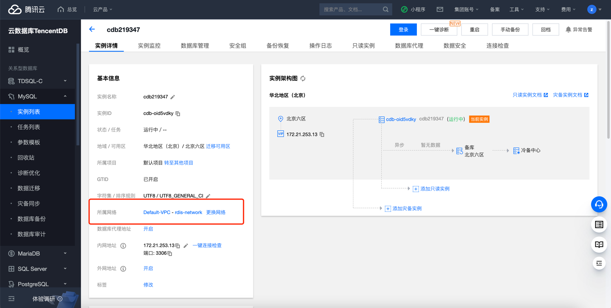
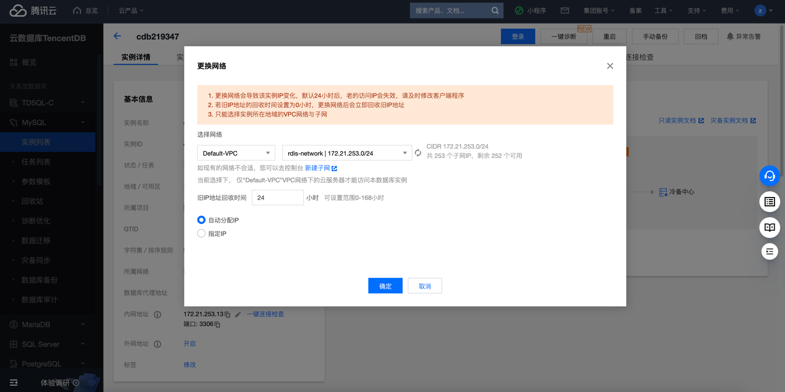

# 腾讯云 CDB 实例网络类型检测

### 1.检查项说明
!!! info ""
    Tencent  账号下 CDB 实例已关联到 VPC ,若您配置阈值，则关联的 VpcId 需存在您列出的阈值中，视为“合规”，否则属于“不合规”

### 2.处置方案
!!! info ""
    1. 前往腾讯云控制台，调整网络类型；
    2. 腾讯云网络分为 基础网络和私有网络 VPC，给用户带来不同的优质服务。在此基础之上，我们提供如下更灵活的服务，方便您管理网络；
    3. 网络间切换
        - 基础网络切换为私有网络：支持单台云数据库主实例的基础网络切换至私有网络。
        - 私有网络 A 切换为私有网络 B：支持单台云数据库主实例的私有网络 A 切换至私有网络 B。
    4. 设置自定义 IP 端口
        - 自定义主实例 IP：支持在实例详情页自定义主实例 IP 和端口。
        - 自定义只读实例 IP：支持在实例详情页自定义只读实例 IP 和端口。

### 3.操作步骤
!!! info ""
    1. 使用腾讯云账号登录控制台；
    2. 通过导航菜单进入云数据库-MySQL (或其他数据库)控制台；https://console.cloud.tencent.com/mysql
    3. 查看当前 MySQL 实例的网络类型，如果是非 VPC 网络或者不是目标 VPC 网络，根据实际情况可迁移至目标 VPC 网络；
    4. 进入 MySQL 控制台；
    5. 在实例列表中，找到目标实例。
    6. 单击目标实例 ID，进入实例详情页面；
    7. 在实例详情的网络信息区域，可看到当前 MySQL 实例所属网络和内网地址，单击所属网络后面的更换网络。
    8. 可从基础网络转换为私有网络或从当前私有网络更换到另一个私有网络。

{ width="900px" }
{ width="900px" }

### 4.帮助资源
!!! info ""
    - https://cloud.tencent.com/document/product/1003/79713
    