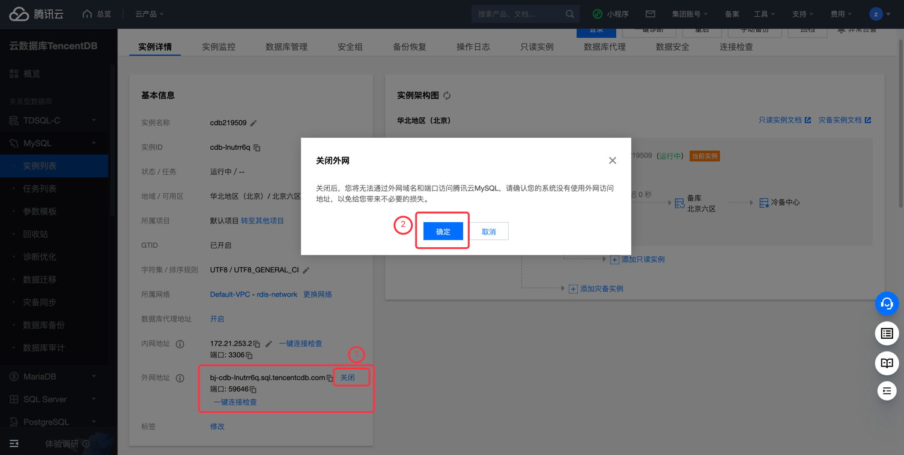

# 腾讯云 CDB 实例公网访问检测

### 1.检查项说明
!!! info ""
    Tencent  检测您账号下CDB实例不允许任意来源公网访问，视为“合规”，否则属于“不合规”

### 2.处置方案
!!! info ""
    1. 前往腾讯云控制台，关闭数据库外部访问；
    2. 云数据库 MySQL 支持内网和外网两种地址类型，默认提供内网地址供您内部访问实例，如果需要使用外网访问，除了开启外网地址后，通过 Linux 或者 Windows 云服务器连接访问实例，也可通过负载均衡 CLB 开启外网服务进行访问，通过 CLB 开启外网服务必须配置安全组规则。
    3. 如需强制开启外网访问，请设置安全策略最大程度的保证安全性，可参考 https://cloud.tencent.com/document/product/236/14469
    
### 3.操作步骤
!!! info ""
    1. 使用腾讯云账号登录控制台；
    2. 通过导航菜单进入云数据库-MySQL (或其他数据库)控制台；https://console.cloud.tencent.com/cdb/instance
    3. 进入数据库控制台；
    4. 在实例列表中，找到目标实例；
    5. 单击目标实例 ID，进入实例详情页面；
    6. 在实例详情的配置信息中，可看到当前数据库是否开启外网访问；
    7. 如已经开启外网访问可以点击关闭，以保证数据的安全性。

{ width="95%" }

### 4.帮助资源
!!! info ""
    - https://cloud.tencent.com/document/product/236/14469
    - https://cloud.tencent.com/document/product/236/80184
    - https://cloud.tencent.com/document/product/236/9537
