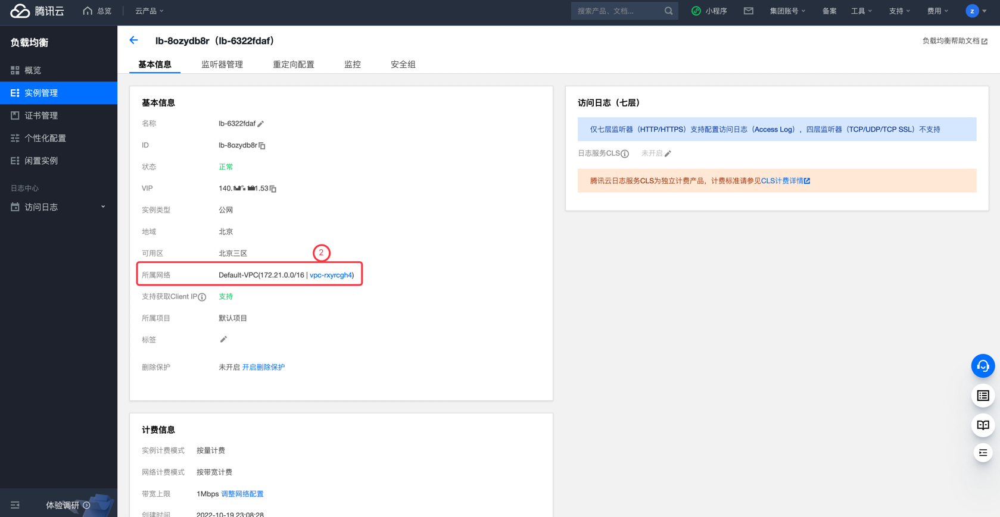

# 腾讯云 CLB 负载均衡实例关联到 VPC 检测

### 1.检查项说明
!!! info ""
    Tencent  账号下负载均衡实例已关联到VPC；若您配置阈值，则关联的 VpcId 需存在您列出的阈值中，视为“合规”，否则视为“不合规”

### 2.处置方案
!!! info ""
    1. 前往腾讯云控制台，查看 CLB 实例所在的 VPC；
    2. 如果 CLB 所在的 VPC 不在指定的 VPC内可通过以下办法进行修改；
    3. 负载均衡提供了克隆实例功能，您可以一键快速复制已有实例的配置，包括 CLB 的实例属性、监听器、安全组和日志等配置。

### 3.操作步骤
!!! info ""
    1. 使用腾讯云账号登录控制台；
    2. 通过导航菜单进入云服务器控制台；https://console.cloud.tencent.com/clb
    3. 选择需要调整的负载均衡实例，单机实例 ID；
    4. 查看当前 CLB 所在 VPC；
    5. 如果发现当前 VPC 和目标 VPC不一致，可通过以下两种办法进行网络更换：
        - 重新创建一个 CLB ，创建时选择正确的 VPC 网络
        - 通过克隆负载均衡实例来重新创建 CLB 实现 VPC更换（需要提工单）

{ width="900px" }

{ width="900px" }

### 4.帮助资源
!!! info ""
    - https://cloud.tencent.com/document/product/214/68790

    