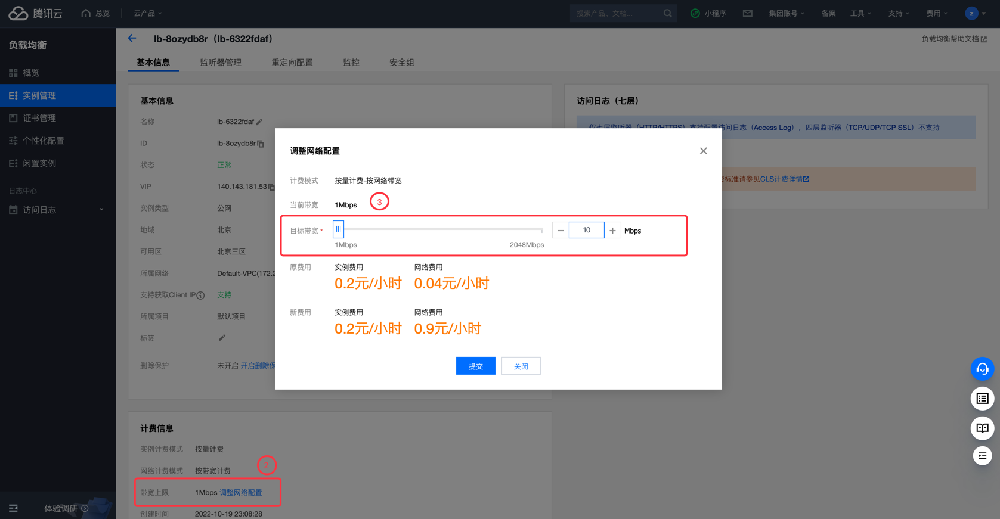

# 腾讯云 CLB 带宽峰值检测

### 1.检查项说明
!!! info ""
    Tencent  检测您账号下的 CLB 负载均衡实例是否达到最低带宽要求，是视为“合规”，否则视为“不合规”

### 2.处置方案
!!! info ""
    1. 前往腾讯云控制台，调整公网IP带宽；
    2. 内网负载均衡用于分发来自腾讯云内网的请求，没有公网 IP 且不能与公网互通。若您需要使用内网负载均衡并与公网互通，则可选择内网负载均衡绑定弹性公网 IP，通过弹性公网 IP 访问公网；
    3. 地域限制
        - 济南、福州、石家庄、武汉、长沙地域没有内网 CLB，因此不支持此功能。
    4. 产品属性限制
        - 仅标准账户类型支持，传统账户类型不支持。
        - 仅负载均衡实例类型支持，传统型负载均衡不支持。
        - 仅 VPC 的内网 CLB 支持，基础网络的内网 CLB 不支持。
    5. 功能限制
        - 目前内网 CLB 不支持端口段。
        - 内网 CLB 仅能绑定同地域且未被其他资源绑定的 EIP。
        - 每个内网 CLB 仅能与一个 EIP 互相绑定。
        - 内网 CLB 绑定 EIP 后，功能类似于公网 CLB，但公网 CLB 无法拆分为内网 CLB 和 EIP。
    6. - 安全组限制
        - 内网 CLB 绑定 EIP 后，CLB 上的安全组对来自 EIP 的流量不生效，对来自内网 CLB 的流量生效。
        - 内网 CLB 绑定 EIP 并开启安全组默认放通后，后端 CVM 的安全组会默认放通来自 EIP 和内网 CLB 的流量，即后端 CVM 的安全组对二者的流量均不生效。建议此类场景不要开启安全组默认放通。

### 3.操作步骤
!!! info ""
    1. 使用腾讯云账号登录控制台；
    2. 通过导航菜单进入云服务器控制台；https://console.cloud.tencent.com/clb
    3. 选择需要调整的负载均衡实例，单机实例 ID；
    4. 选择调整网络配置，弹出设置框后，填写带宽的值
    5. 注意包年包月的IP无法修改带宽

{ width="95%" }

{ width="95%" }

### 4.帮助资源
!!! info ""
    - https://cloud.tencent.com/document/product/214/65682
    - https://cloud.tencent.com/document/product/214/52050
