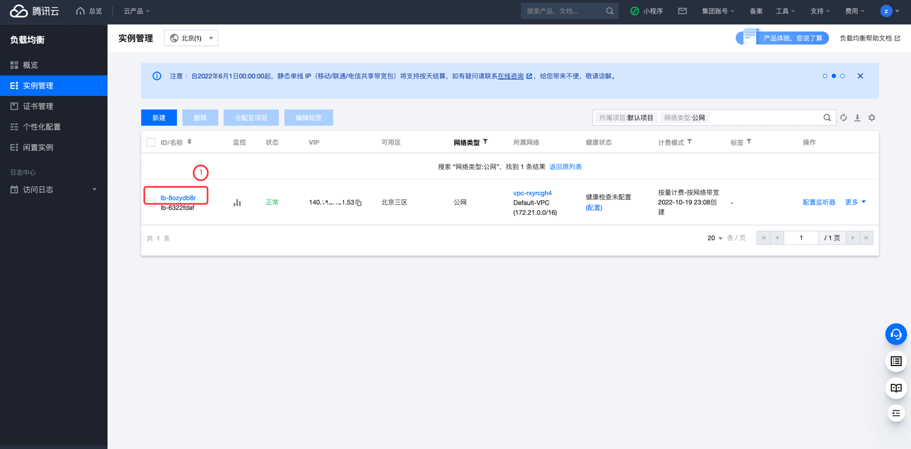
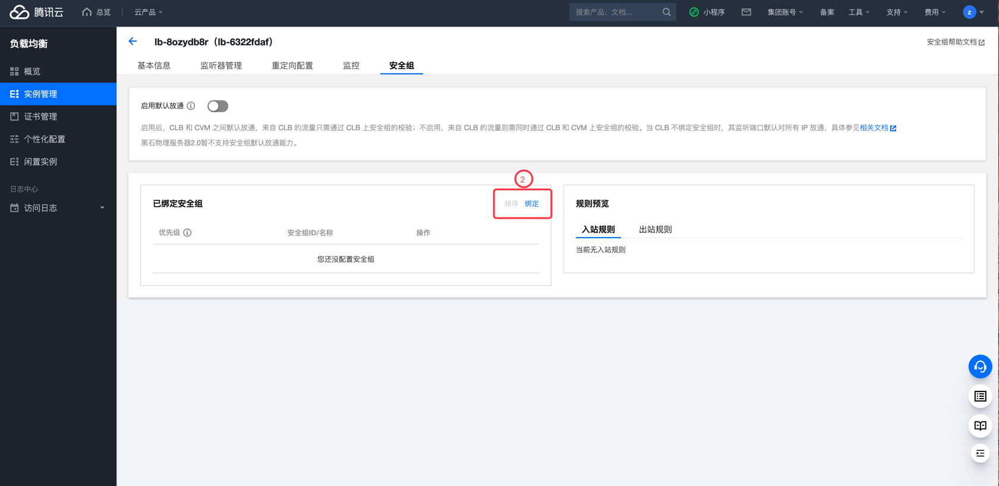
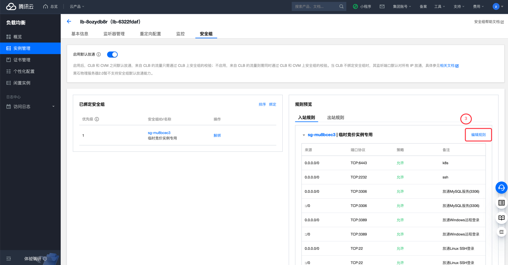

# 腾讯云 CLB 公网访问检测

### 1.检查项说明
!!! info ""
    Tencent  账号下 CLB 不允许任意来源公网访问，视为“合规”，否则属于“不合规”

### 2.处置方案
!!! info ""
    1. 前往腾讯云控制台，查看 CLB 安全组策略；
    2. 创建负载均衡（CLB）后，您可以配置 CLB 的安全组来隔离公网流量
    3. 每个 CLB 最多绑定5个安全组。
    4.CLB 的每个安全组规则条数最多为512条。
    5.传统型内网负载均衡和基础网络的内网负载均衡不支持绑定安全组，当内网负载均衡绑定 Anycast EIP 时，内网负载均衡绑定的安全组暂不生效。
    6.传统型内网负载均衡和基础网络的负载均衡不支持安全组默认放通功能，裸金属云服务器 暂不支持安全组默认放通能力。

### 3.操作步骤
!!! info ""
    1. 使用腾讯云账号登录控制台；
    2. 通过导航菜单进入云服务器控制台；https://console.cloud.tencent.com/clb
    3. 选择需要调整的负载均衡实例，单机实例 ID；
    4. 选择安全组-如果没有绑定安全组可绑定一个安全组；
    5. 在安全组内配置正确的访问规则。

{ width="95%" }

{ width="95%" }

{ width="95%" }

### 4.帮助资源
!!! info ""
    - https://cloud.tencent.com/document/product/214/14733

