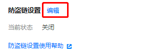
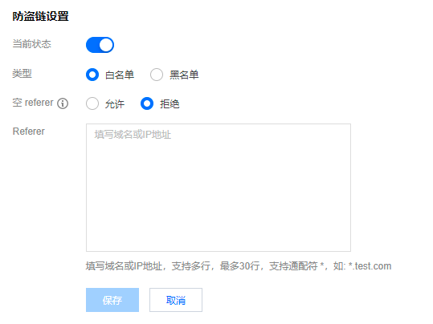
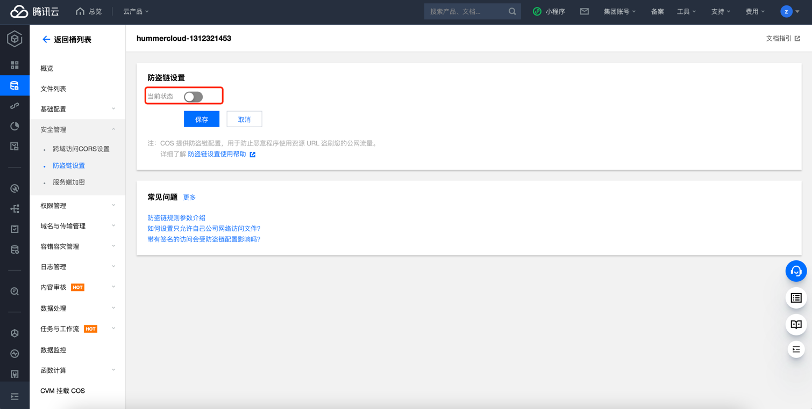

# 腾讯云 COS 防盗链检测

### 1.检查项说明
!!! info ""
    Tencent  检测 COS Bucket 是否开启防盗链开关，已开通视为“合规”，否则属于“不合规”

### 2.处置方案
!!! info ""
    1. 存储桶加密是针对存储桶的一项配置，通过设置存储桶加密，可对新上传至该存储桶的所有对象默认以指定的加密方式进行加密。
    2. 目前支持 SSE-COS 加密：即由对象存储（Cloud Object Storage，COS）托管密钥的服务端加密。
    3. 有关服务端加密的更多信息，请参见 服务端加密概述 https://cloud.tencent.com/document/product/436/18145 。

### 3.操作步骤
!!! info ""
    1. 使用腾讯云账号登录控制台；
    2. 通过导航菜单进入对象存储管理页面；https://console.cloud.tencent.com/cos/bucket
    3. 在 存储桶列表 页面，找到您需要设置加密的存储桶，单击其名称，进入存储桶配置页面；
    4. 在左侧导航栏中，单击安全管理 > 防盗链设置，找到防盗链设置，单击编辑进入可编辑状态；
    { width="400px" }
    5. 在服务端加密配置项，单击编辑，将当前状态修改为“开启”
    6. 修改当前状态为开启，选择名单类型（黑名单或白名单），设置好相应域名，设置完成后单击保存即可，配置项说明如下：
    { width="500px" }
        - 黑名单：拒绝名单内的域名访问存储桶的默认访问地址，若名单内的域名访问存储桶的默认访问地址，则返回403
        - 白名单：允许名单内的域名访问存储桶的默认访问地址，若名单外的域名访问存储桶的默认访问地址，则返回403
        - 空 referer：HTTP 请求中，header 为空 referer（即不带 referer 字段或 referer 字段为空）
        - Referer：支持设置最多10条域名且为相同前缀匹配，每条一行，多条请换行；支持域名、IP 和通配符*等形式的地址。示例如下：
            - 配置www.example.com：可限制如www.example.com/123、www.example.com.cn等以www.example.com为前缀的地址。
            - 支持带端口的域名和 IP，例如www.example.com:8080、10.10.10.10:8080等地址。
            - 配置*.example.com：可限制a.b.example.com/123、a.example.com等地址。

{ width="900px" }
{ width="900px" }

### 4.帮助资源
!!! info ""
    - https://cloud.tencent.com/document/product/436/13319
    
    