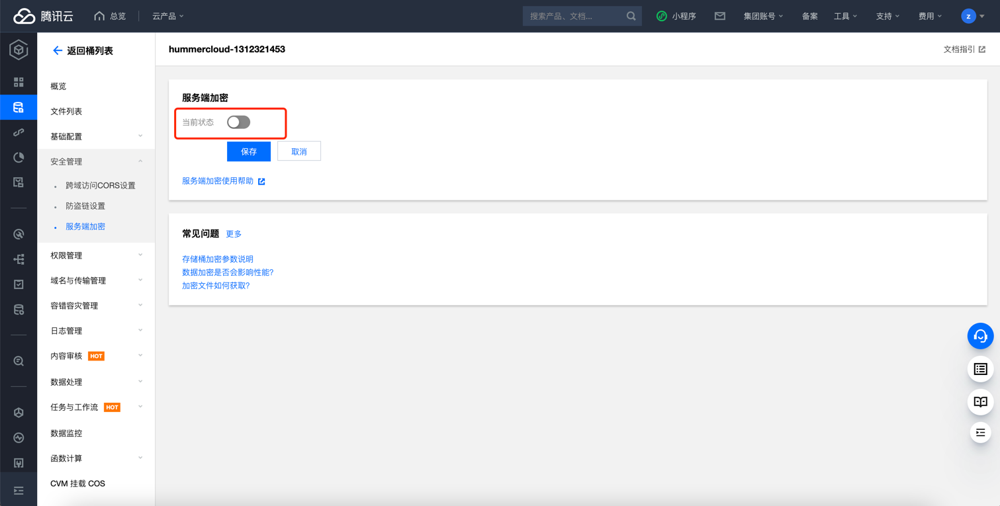

# 腾讯云 COS 存储桶加密检测

### 1.检查项说明
!!! info ""
    Tencent  查看并确认您的COS存储桶启用了默认加密，未开启则该存储桶不合规

### 2.处置方案
!!! info ""
    1. 存储桶加密是针对存储桶的一项配置，通过设置存储桶加密，可对新上传至该存储桶的所有对象默认以指定的加密方式进行加密。
    2. 目前支持 SSE-COS 加密：即由对象存储（Cloud Object Storage，COS）托管密钥的服务端加密。
    3. 有关服务端加密的更多信息，请参见 服务端加密概述 https://cloud.tencent.com/document/product/436/18145 。

### 3.操作步骤
!!! info ""
    1. 使用腾讯云账号登录控制台。
    2. 通过导航菜单进入对象存储管理页面。https://console.cloud.tencent.com/cos/bucket
    3. 在 存储桶列表 页面，找到您需要设置加密的存储桶，单击其名称，进入存储桶配置页面。
    4. 在左侧导航栏中，单击安全管理 > 服务端加密。
    5. 在服务端加密配置项，单击编辑，将当前状态修改为“开启”

{ width="900px" }

{ width="900px" }

### 4.帮助资源
!!! info ""
    - https://cloud.tencent.com/document/product/436/40117
    
    