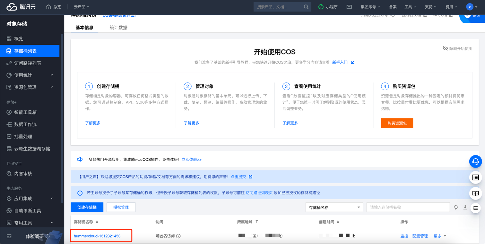
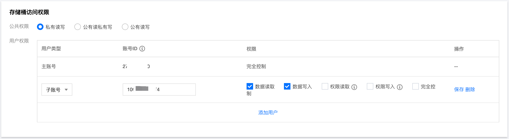
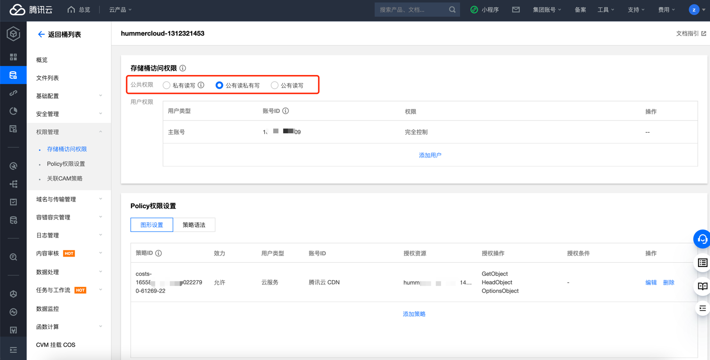

# 腾讯云 COS 公开写入访问权限检测

### 1.检查项说明
!!! info ""
    Tencent 查看您的 COS 存储桶是否不允许公开写入访问权限。如果某个 COS 存储桶策略或存储桶 ACL 允许公开写入访问权限，则该存储桶不合规

### 2.处置方案
!!! info ""
    1. 公共权限：私有读写、公有读私有写和公有读写。关于公共权限的说明，请参见存储桶概述中的 权限类别;
    2. 用户权限：主账号默认拥有存储桶所有权限（即完全控制）。另外 COS 支持添加子账号有数据写入、数据写入、权限写入、权限写入，甚至完全控制的最高权限;
    3. 有关服务端加密的更多信息，请参见 服务端加密概述 https://cloud.tencent.com/document/product/436/18145 。

### 3.操作步骤
!!! info ""
    1. 使用腾讯云账号登录控制台；
    2. 通过导航菜单进入对象存储管理页面；https://console.cloud.tencent.com/cos/bucket
    3. 在 存储桶列表 页面，找到您需要设置加密的存储桶，单击其名称，进入存储桶配置页面；
    4. 在左侧导航栏中，单击权限管理 > 存储桶访问权限，对存储桶的公共权限和用户权限（例如添加子账号，子账号 ID 可在 访问管理 控制台查看）进行设置；
    5. 选择私有读写，配置账户规则，关闭公有写入；
    5. 点击保存。

{ width="900px" }

{ width="900px" }

{ width="900px" }

### 4.帮助资源
!!! info ""
    - https://cloud.tencent.com/document/product/436/13315
    
    