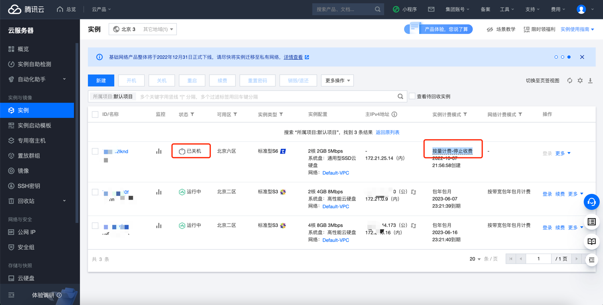

# 腾讯云CVM实例关机计费模式检测

### 1.检查项说明
!!! info ""
    Tencent CVM实例的关机计费模式是否为关机停止收费，是视为“合规”，否则视为“不合规”

### 2.处置方案
!!! info ""
    1. 前往腾讯云控制台，调整公网IP带宽;
    2. 实例关机不收费是指按量计费实例通过选择关机不收费选项使实例进入已关机状态后，不再收取实例（CPU、内存）费用（异构计算实例也会停止收取 GPU 或 FPGA 费用）。云盘（系统盘和数据盘）、公网带宽（按带宽计费）和镜像等组件将继续计费;
    3. 实例关机不收费功能仅适用于系统盘和数据盘均为云盘的按量计费实例;
    4. 实例关机不收费功能不适用于以下场景：
        - 不适用于在实例内部开/关机。
        - 不适用于搭载本地盘实例。
        - 不适用于竞价实例。
        - 不适用于因欠费导致关机的实例：若实例及关联资源因欠费而关机，在欠费期间，实例将停止计费，计算资源和公网 IP 也将会被释放。但当账户充值至余额为正数后，实例及关联资源将继续收费.
    5. 支持按量计费三级阶梯价的实例类型（请参见 按量计费实例价格）在关机不收费期间，暂停累计三级阶梯价的计算时长。重新启动实例后，继续累计关机前三级阶梯价的计算时长;
    6. 若批量关机操作中同时包含支持关机不收费和不支持关机不收费的实例，则：
        - 支持关机不收费的实例，关机后停止 CPU 和内存收费（异构计算实例也会停止收取 GPU 或 FPGA 费用）。
        - 不支持关机不收费的实例，关机后继续正常收费。
    

### 3.操作步骤
!!! info ""
    1. 使用腾讯云账号登录控制台
    2. 通过导航菜单进入云服务器控制台。https://console.cloud.tencent.com/cvm/instance
    3. 找到相关的CVM
    4. 如果是"按需实例"，在实例计费模式可以查看当前状态，如果是不收费则显示为"按量计费-停止收费"
    5. 注意只有"按需实例"才支持"关机停止收费"
    6. 如果已经关机，但不是"停止收费"状态，可以重新关机，并勾选关机不收费

{ width="95%" }

### 4.帮助资源
!!! info ""
    - https://cloud.tencent.com/document/product/213/19922
    - https://cloud.tencent.com/document/product/213/19918
