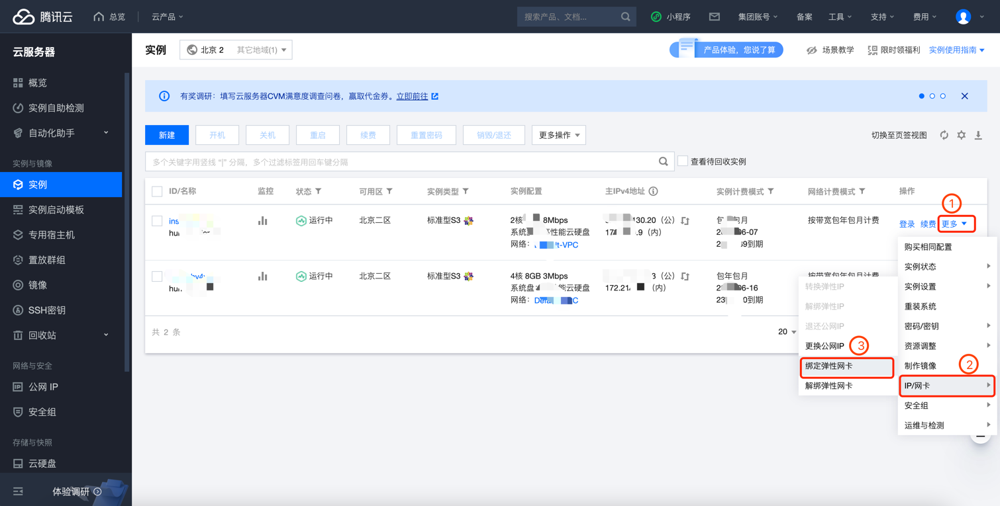

# CVM 实例公网IP检测

### 1.检查项说明
!!! info ""
    Tencent CVM实例未直接绑定公网IP，如果未绑定视为“合规”，否则属于“不合规”。该规则仅适用于 IPv4 协议

### 2.处置方案
!!! info ""
    给云主机直接绑定公网IP不仅容易被攻击，同时还会存在很多安全风险，您可以前往腾讯云控制台，根据实际情况，选择是否给云主机解绑公网

### 3.操作步骤
!!! info ""
    1. 使用腾讯云账号登录控制台。
    2. 通过导航菜单进入云服务器控制台。https://console.cloud.tencent.com/cvm/ip
    3. 选择需要绑定公网IP的VM, 更多-IP/网卡-解绑弹性IP或解绑弹性网卡

{ width="900px" }

### 4.帮助资源
!!! info ""
    https://cloud.tencent.com/document/product/1199/41702
    