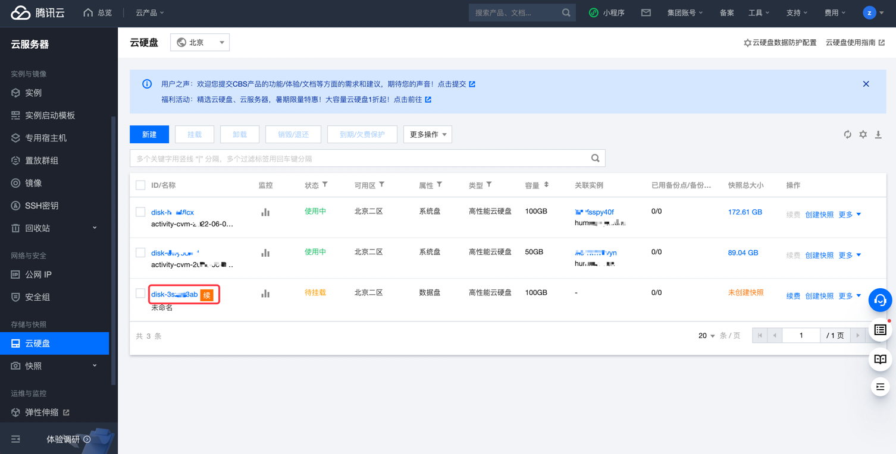
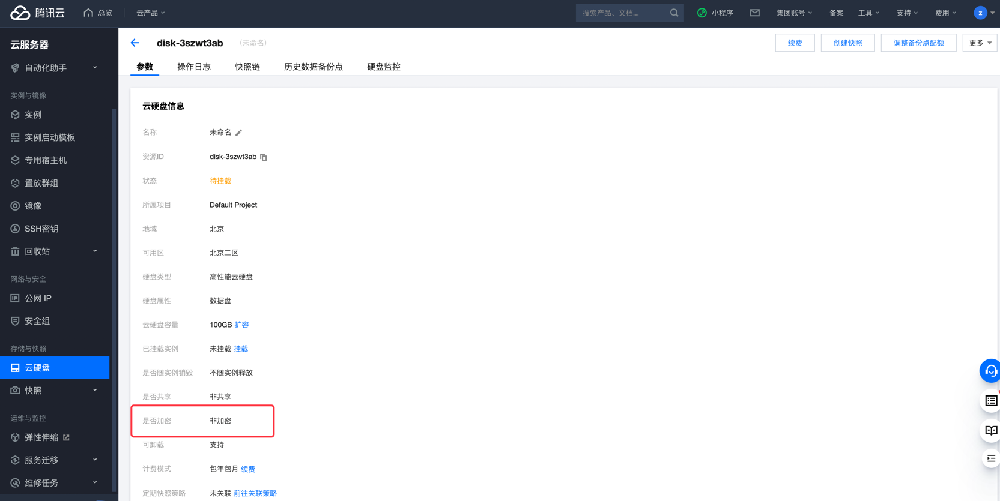

# 腾讯云 Disk 磁盘加密检测

### 1.检查项说明
!!! info ""
    Tencent 账号下所有的磁盘均已加密，视为“合规”，否则视为“不合规”

### 2.处置方案
!!! info ""
    1. 前往腾讯云控制台，关闭数据库外部访问；
    2. 当您的业务因为安全或合规要求等原因，需要对存储在云硬盘上的数据进行加密保护时，您可以开启云硬盘加密功能，使用 腾讯云密钥管理服务（KMS）- https://cloud.tencent.com/document/product/573/8780 提供的基础设施有效保护数据的隐私性；
    3. 腾讯云使用行业标准的 AES-256 算法，利用数据密钥加密您的云硬盘数据。第一次使用加密云硬盘时，系统会为您在 KMS 中的相应地域自动创建一个专门为云硬盘加密使用的用户主密钥（CMK）。该自动创建的密钥有且仅有一个，并存储在受严格的物理和逻辑安全控制保护的密钥管理服务上；
    4. 每个地域的加密云硬盘，都使用对应地域下唯一的256位数据密钥（DK）进行加密。通过加密云硬盘创建的快照，以及使用这些加密快照创建的加密云硬盘均关联该密钥。该密钥受 KMS 提供的密钥管理基础设施的保护，能有效防止未经授权的访问。云硬盘的数据密钥（DK）仅在实例所在的宿主机的内存中使用，不会以明文形式存储在任何持久化介质（即使是云硬盘本身）上；

    
### 3.操作步骤
!!! info ""
    1. 使用腾讯云账号登录控制台；
    2. 创建新的的加密磁盘，然后进行数据迁移；
    3. 目前可通过三种方法创建加密云硬盘：
        - 使用控制台创建加密云硬盘
        - 使用快照创建加密云硬盘
        - 使用 API 创建加密云硬盘
    4. 如果您需要对云硬盘现有数据从非加密状态转换为加密状态，建议您使用 Linux 下的 rsync 命令或者 Windows 下的 robocopy 命令，将数据从非加密盘上复制到新创建的加密盘上；
    5. 如果您需要对云硬盘现有数据从加密状态转换为非加密状态，则建议您使用相同命令将数据从加密盘上复制到新创建的非加密盘上。

{ width="95%" }

{ width="95%" }

### 4.帮助资源
!!! info ""
    - https://cloud.tencent.com/document/product/362/38946
