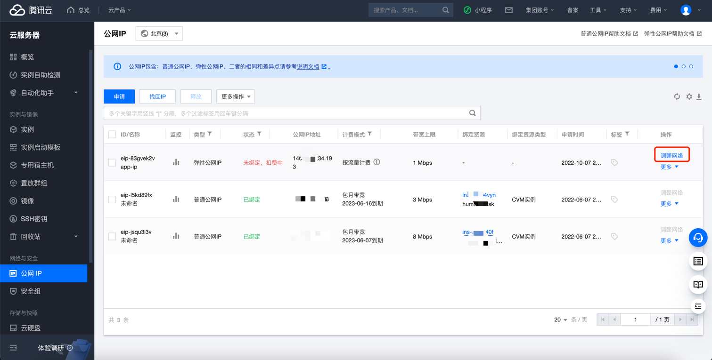

# 腾讯云 EIP带宽峰值检测

!!! info "检查项说明"
    Tencent 检测您账号下的弹性IP实例是否达到最低带宽要求，默认为10M，"是"视为“合规”，否则视为“不合规”

!!! info "处置方案"
    前往腾讯云控制台，调整公网IP带宽

!!! info "操作步骤"
    1. 使用腾讯云账号登录控制台。
    2. 通过导航菜单进入云服务器控制台。https://console.cloud.tencent.com/cvm/ip
    3. 选择需要调整的IP
    4. 选择调整网络，弹出设置框后，填写带宽的值
    5. 注意包年包月的IP无法修改带宽

{ width="900px" }

!!! info "帮助资源"
    https://cloud.tencent.com/document/product/213/15517
    