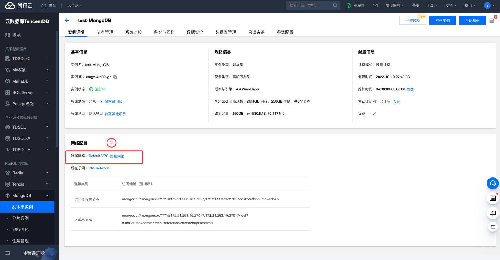
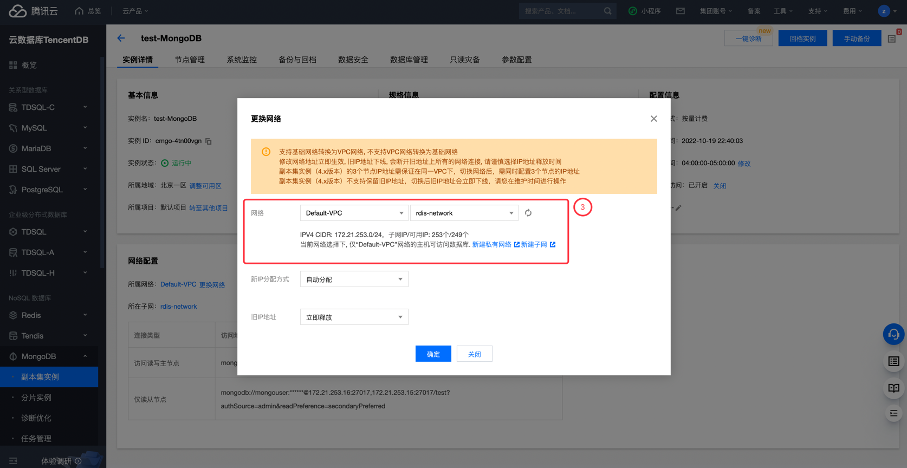

# 腾讯云 MongoDB 实例网络类型检测

### 1.检查项说明
!!! info ""
    Tencent  检测您账号下的 MongoDB 实例是否运行在VPC网络环境下，是视为“合规”，否则视为“不合规”

### 2.处置方案
!!! info ""
    1. 前往腾讯云控制台，调整网络类型；
    2. 腾讯云网络分为 基础网络和私有网络 VPC，给用户带来不同的优质服务。在此基础之上，我们提供如下更灵活的服务，方便您管理网络；
    3. 支持基础网络转换为VPC网络, 不支持VPC网络转换为基础网络
    4. 修改网络地址立即生效, 旧IP地址下线, 会断开旧地址上所有的网络连接, 请谨慎选择IP地址释放时间
    5. 副本集实例（4.x版本）的3个节点IP地址需保证在同一VPC下，切换网络后，需同时配置3个节点的IP地址

### 3.操作步骤
!!! info ""
    1. 使用腾讯云账号登录控制台；
    2. 通过导航菜单进入云数据库-MongoDB 控制台；https://console.cloud.tencent.com/mongodb/instance
    3. 查看当前 MongoDB 实例的网络类型，如果是非 VPC 网络或者不是目标 VPC 网络，根据实际情况可迁移至目标 VPC 网络；
    4. 进入 MongoDB 控制台；
    5. 在实例列表中，找到目标实例。
    6. 单击目标实例 ID，进入实例详情页面，单击所属网络右侧的更换网络。
    7. 在弹出更换网络对话框，在网络后面的下拉列表中，选择该地域的私有网络以及对应的子网。
    8. 如果当前的网络不满足您的需求，您可以单击新建私有网络或者新建子网重新创建后再选择网络。
    9. 新IP分配方式：选择自动分配或者指定地址。
        - 自动分配：系统将根据当前选择的网络环境，自动分配可用的 IP 地址。
        - 指定地址：您可以在新IPV4地址的输入框指定具体的 IP 地址。指定 IP 地址，请查看该私有网络的网段，指定网段内并未被占用的 IP 地址。

{ width="900px" }
{ width="900px" }
{ width="900px" }

### 4.帮助资源
!!! info ""
    - https://cloud.tencent.com/document/product/1003/79713
    - https://cloud.tencent.com/document/product/240/71287
    