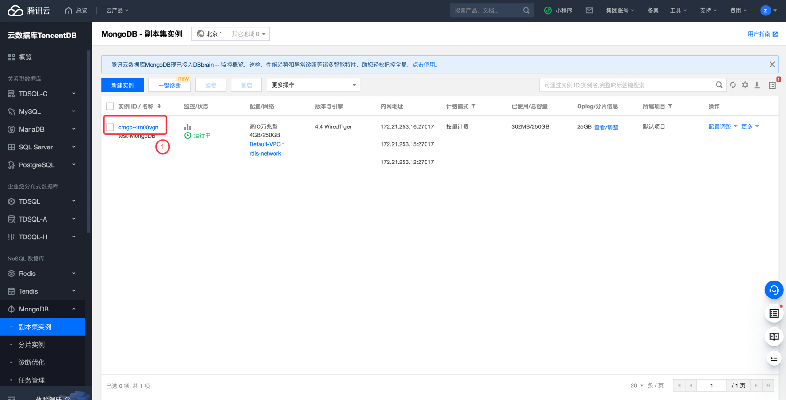
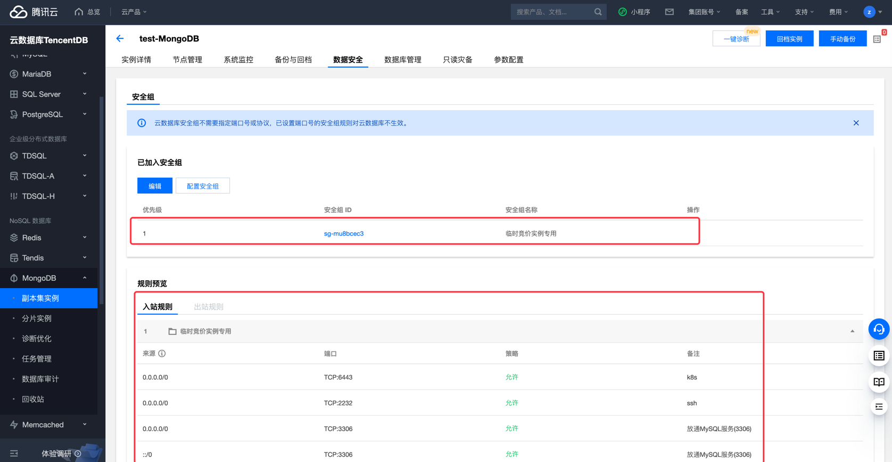

# 腾讯云 MongoDB 实例公网访问检测

### 1.检查项说明
!!! info ""
    Tencent  检测您账号下 MongoDB 实例不允许任意来源公网访问，视为“合规”，否则属于“不合规”

### 2.处置方案
!!! info ""
    1. 前往腾讯云控制台，配置mangoDB数据库安全组策略；
    2. 云数据库 MongoDB 支持在控制台配置安全组， 您可以对云数据库进行出入流量控制。
    3. 安全组 是一种有状态的包含过滤功能的虚拟防火墙，用于设置单台或多台云数据库的网络访问控制，是腾讯云提供的重要的网络安全隔离手段。安全组是一个逻辑上的分组，您可以将同一地域内具有相同网络安全隔离需求的云数据库实例加到同一个安全组内。云数据库与云服务器等共享安全组列表，安全组内基于规则匹配，具体规则与限制请参见 安全组详细说明。
        - 云数据库安全组目前仅支持私有网络 VPC 内网访问的网络控制，暂不支持对基础网络的网络控制。
        - 由于云数据库没有主动出站流量，因此出站规则对云数据库不生效。
        - 云数据库 MongoDB 安全组支持主实例、只读实例与灾备实例。
        - 云数据库 MongoDB 支持安全组功能，安全组功能当前为白名单控制，如您有需要，请 提交工单 申请。

### 3.操作步骤
!!! info ""
    1. 使用腾讯云账号登录控制台；
    2. 通过导航菜单进入云数据库- MongoDB 控制台；https://console.cloud.tencent.com/mongodb/instance
    3. 进入数据库控制台；
    4. 在实例列表中，找到目标实例；
    5. 单击目标实例 ID，进入实例详情页面；
    6. 在实例详情的配置信息中，切户到数据安全栏目；
    7. 查看当前 MongoDB 绑定的安全组，以及生效的安全策略，如果开启来源为 0.0.0.0/0 的访问，则进行修改

{ width="900px" }
{ width="900px" }

### 4.帮助资源
!!! info ""
    - https://cloud.tencent.com/document/product/240/32716