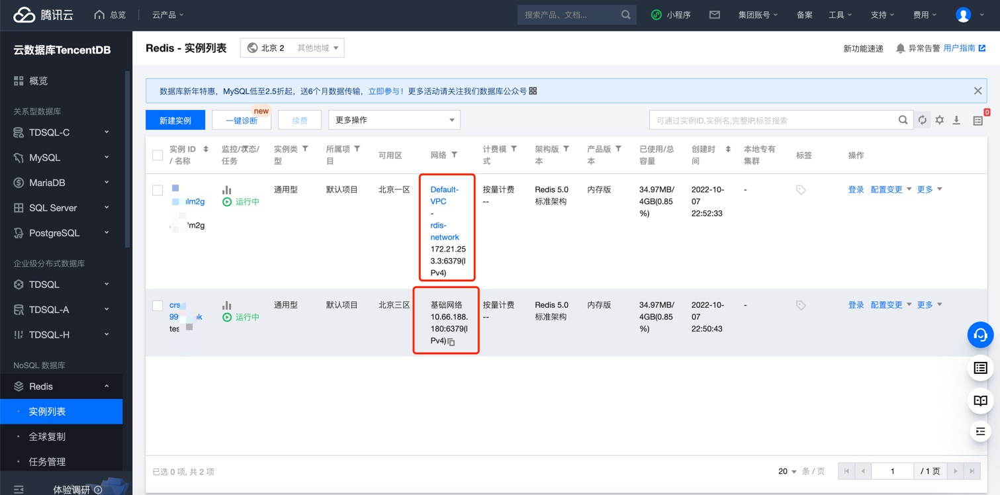
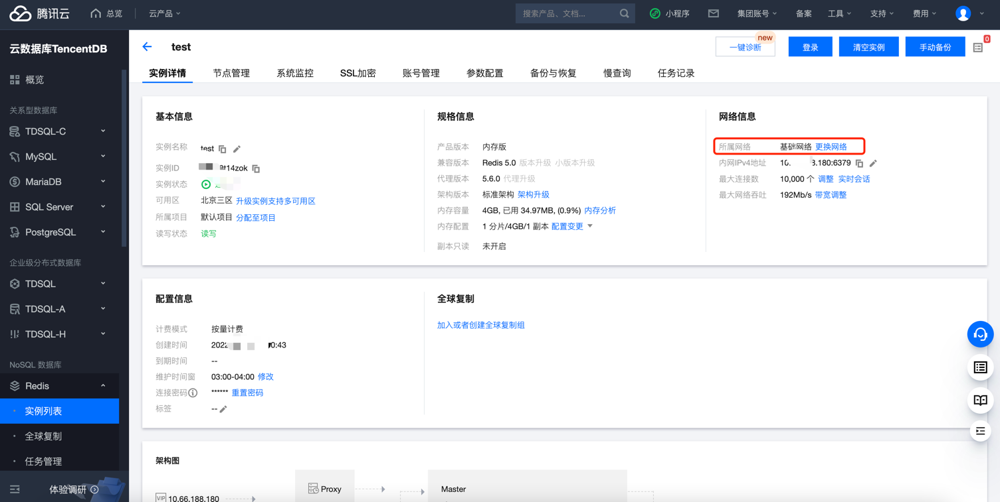

# 腾讯云 Redis VPC 网络检测

### 1.检查项说明
!!! info ""
    Tencent  检测您账号下的Redis实例是否运行在VPC网络环境下，是视为“合规”，否则属于“不合规”

### 2.处置方案
!!! info ""
    1. 前往腾讯云控制台，调整网络类型
    2. 基础网络与私有网络区别如下：
        - 基础网络是腾讯云上所有用户的公共网络资源池，所有云服务器的内网 IP 地址都由腾讯云统一分配，无法自定义网段划分、IP 地址。
        - 私有网络是用户在腾讯云上建立的一块逻辑隔离的网络空间，在私有网络内，用户可以自由定义网段划分、IP 地址和路由策略。两者相比，私有网络较基础网络更适合有网络自定义配置需求的场景。
        - 子网是私有网络的一个网络空间，云资源部署在子网中。一个私有网络中至少有一个子网，因此在创建私有网络时，会同步创建一个初始子网。当您有多业务需要部署在不同子网，或已有子网不满足业务需求时，您可以在私有网络中继续创建新的子网。
        - 子网具有可用区属性，同一私有网络下可以创建不同可用区的子网，同一私有网络下不同可用区的子网默认可以内网互通。
    3. 支持基础网络切换为私有网络，不支持私有网络切换为基础网络。
    4. 支持私有网络切换其他私有网络，支持切换同一私有网络下不同的子网。
    5. 切换网络之后，新的网络地址立即生效，原地址上所有连接将断开。原网络地址保留时长最长为15天。

### 3.操作步骤
!!! info ""
    1. 使用腾讯云账号登录控制台。
    2. 通过导航菜单进入云数据库-redis控制台。https://console.cloud.tencent.com/redis
    3. 查看当前redis实例的网络类型，如果是非VPC网络，根据实际情况可迁移至VPC网络
    4. 登录 Redis 控制台。
    5. 在右侧实例列表页面上方，选择地域。
    6. 在实例列表中，找到目标实例。
    7. 单击目标实例 ID，进入实例详情页面。
    8. 在实例详情的网络信息区域，可看到当前 Redis 实例所属网络和内网地址，单击所属网络后面的更换网络。
    9. 可从基础网络转换为私有网络或从当前私有网络更换到另一个私有网络。

{ width="900px" }
{ width="900px" }

### 4.帮助资源
!!! info ""
    - https://cloud.tencent.com/document/product/239/30871
    - https://cloud.tencent.com/document/product/239/30910
    