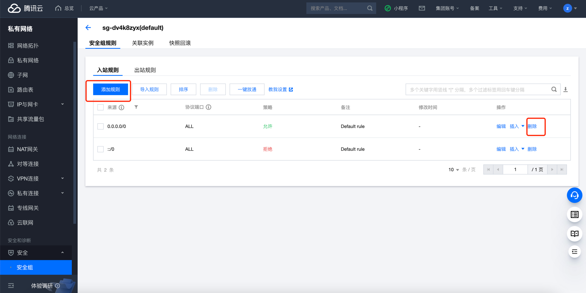

# 腾讯云 SecurityGroup 高危安全组检测

### 1.检查项说明
!!! info ""
    Tencent  检测安全组是否开启风险端口，未开启视为“合规”，否则属于“不合规”

### 2.处置方案
!!! info ""
    1. 前往腾讯云控制台，调整安全组策略；
    2. 入站规则：表示允许到达与安全组相关联的云服务器的入站流量；
    3. 出站规则：表示离开云服务器的出站流量；
        - 安全组内规则的优先级：位置越上，优先级越高。
        - 当一个云服务器绑定无规则的安全组时，默认拒绝所有的入站、出站流量。（若有规则，规则优先生效）
        - 当一个云服务器绑定多个安全组时，安全组优先级数字越小，优先级越高。
        - 当一个云服务器绑定多个安全组时，优先级最低的安全组的默认拒绝规则生效。

### 3.操作步骤
!!! info ""
    1. 使用腾讯云账号登录控制台；
    2. 通过导航菜单进入私有网络-安全组控制台； https://console.cloud.tencent.com/vpc/securitygroup
    3. 选择安全组，进行规则配置；
    4. 根据实际需求，勾选需要放通的 IP/端口，目前高危端口为（20,21,22,25,80,773,765, 1733,1737,3306,3389,7333,5732,5500），包括常见端口例如：
        - ICMP：放通 ICMP 协议，允许公网 Ping 服务器。
        - TCP:80：放通80端口，允许通过 HTTP 访问 Web 服务。
        - TCP:22：放通22端口，允许 SSH 远程连接 Linux 云服务器。
        - TCP:443：放通443端口，允许通过 HTTPS 访问 Web 服务。
        - TCP:3389：放通3389端口，允许 RDP 远程连接 Windows 云服务器。
        - 放通内网：放通内网，允许不同云资源间内网互通（IPv4）。

{ width="95%" }

### 4.帮助资源
!!! info ""
    - https://cloud.tencent.com/document/product/213/15377
