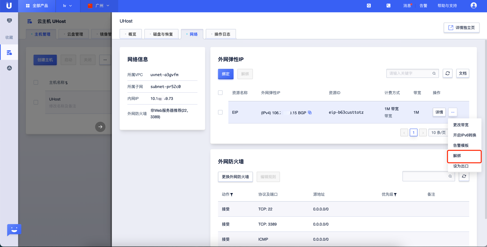
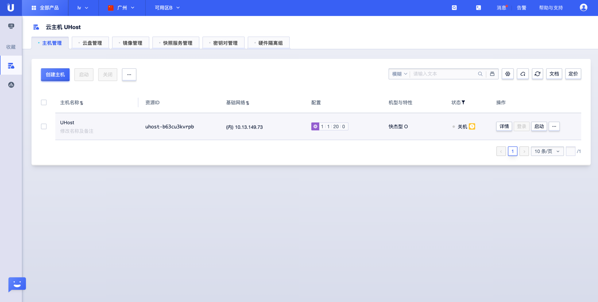

# UCloud Uhost 实例公网 IP 检测

### 1.检查项说明
!!! info ""
    UCloud Uhost 实例未直接绑定公网 IP ，视为“合规”，否则属于“不合规”；该规则仅适用于 IPv4 协议

### 2.处置方案
!!! info ""
    1. 给云主机直接绑定公网 IP 不仅容易被攻击，同时还会存在很多安全风险，您可以前往UCloud云控制台，根据实际情况，选择是否给云主机解绑公网；
    2. 弹性公网IP（EIP）是可以独立购买和持有的公网 IP 地址资源，EIP 绑定云资源后，云资源可以通过 EIP 与公网通信。
    3. 外网IP地址是用户访问云主机以及主机实例对外提供服务的主要方式。在UCloud，外网IP是可弹性迁移的，当一台主机出现故障时可以轻松的将外网IP迁移到别的主机，即“弹性IP”。在您创建主机的时候，如果选择了同时购买弹性IP以及外网带宽额度，即会同时分配一个弹性IP，并和您的主机完成了绑定。您可以同时在网络产品的资料面板中查找到此IP资源信息。

### 3.操作步骤
!!! info ""
    1. 使用 UCloud 账号登录控制台；
    2. 选择全部产品 > 计算 > 云主机，进入云服务器页面；https://console.ucloud.cn/uhost/uhost
    3. 点击云主机名称，进入网络配置页面；
    4. 请根据需要选择绑定公网 IPv4 或者公网 IPv6。
    5. 点击解绑，弹出选择公网 IP 窗口。
    6. 选择待解绑的公网 IP 地址。
    7. 点击提交，完成公网 IP 地址的解绑操作。
    8. 在云主机列表页面，您可以查看云主机的公网 IP 所在列显示为空。

{ width="900px" }

{ width="900px" }

### 4.帮助资源
!!! info ""
    - https://docs.ucloud.cn/uhost/introduction/network/eip
    