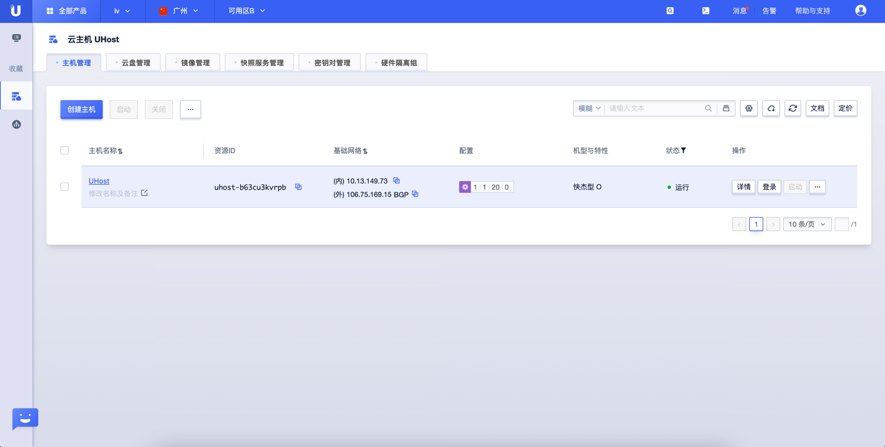
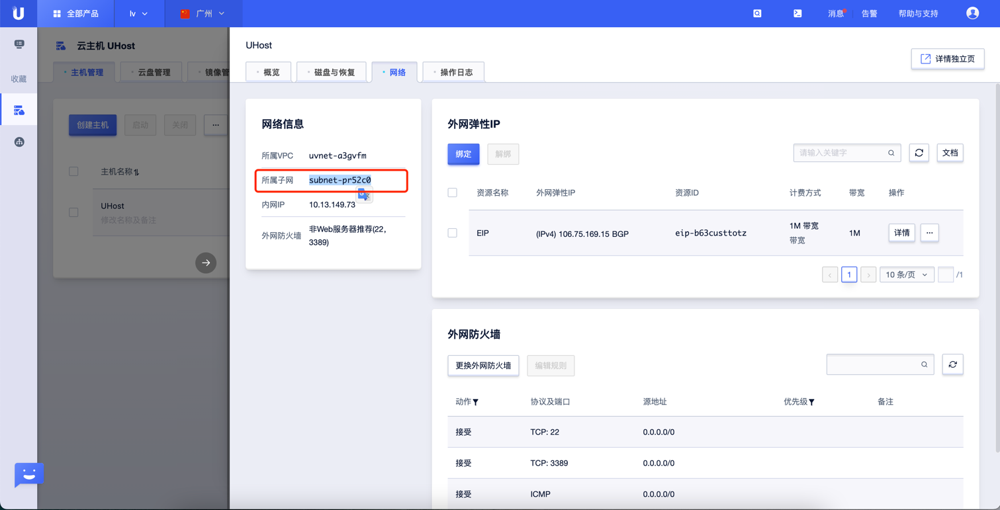
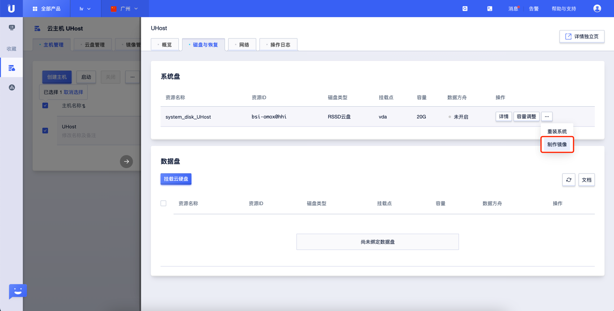
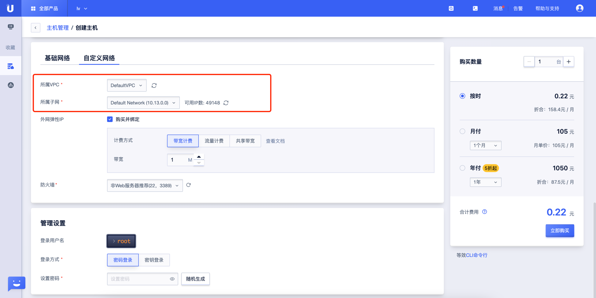

# Ucloud Uhost VPC 检测

### 1.检查项说明
!!! info ""
    Ucloud账号下的 Uhost 实例指定属于哪些 VPC, 属于则合规，不属于则"不合规"

### 2.处置方案
!!! info ""
    1. 前往Ucloud控制台，调整网络类型；
    2. 私有网络 VPC（Virtual Private Cloud）是属于用户的、逻辑隔离的网络环境。在私有网络中，可以创建指定网段的VPC，在VPC中创建子网并自主管理云资源，同时通过网络ACL实现安全防护;
    3. 查看当前 Uhost 的 VPC 是否和预期一致，如果不一致可进行更换；

### 3.操作步骤
!!! info ""
    1. 使用腾讯云账号登录控制台；
    2. 通过导航菜单进入云服务器控制台；https://console.Ucloud.com/pek3/instances/
    3. 选择需要更换 VPC 网络的的 Uhost, 点击实例名称；
        - { width="600px" }
        - { width="600px" }
    4. 进入磁盘与恢复，对当前系统盘制作镜像；
    5. 用新的镜像创建 Uhost, 创建时选择正确的 vpc。
        - { width="600px" }
        - { width="600px" }

### 4.帮助资源
!!! info ""
    - https://docs.ucloud.cn/uhost/introduction/network/vpc

