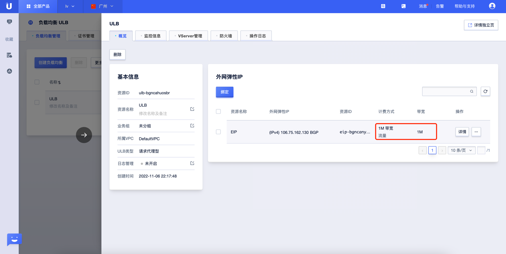
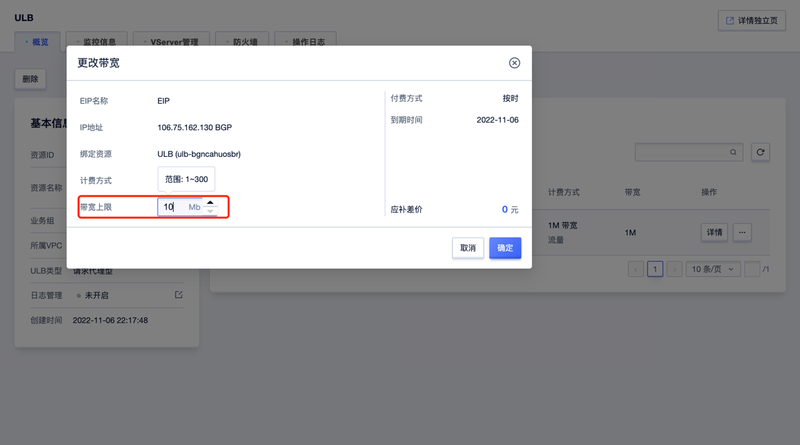

#  UCloud ULB 带宽峰值检测

### 1.检查项说明
!!! info ""
    UCloud 检测您账号下的负载均衡实例是否达到最低带宽要求，符合视为“合规”，，否则视为“不合规”

### 2.处置方案
!!! info ""
    1. 前往 UCloud 控制台，调整公网IP带宽；
    2. 内网负载均衡用于分发来自 UCloud 内网的请求，没有公网 IP 且不能与公网互通。若您需要使用内网负载均衡并与公网互通，则可选择内网负载均衡绑定弹性公网 IP，通过弹性公网 IP 访问公网；

### 3.操作步骤
!!! info ""
    1. 使用 ucloud 账号登录控制台；
    2. 通过导航菜单进入云服务器控制台；https://console.ucloud.cn/ulb
    3. 选择需要调整的负载均衡实例，单机实例 ID；
    4. 选择"更改带宽"，弹出设置框后，填写带宽的值；
    5. 注意包年包月的 IP 无法修改带宽。

{ width="95%" }

{ width="95%" }

{ width="95%" }

### 4.帮助资源
!!! info ""
    - https://docs.ucloud.cn/ulb/guide/ulb/eip
