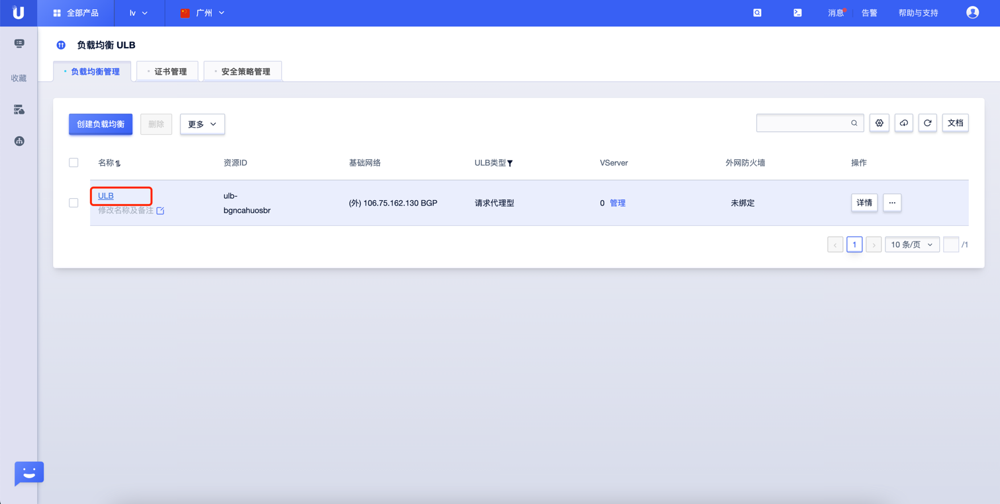
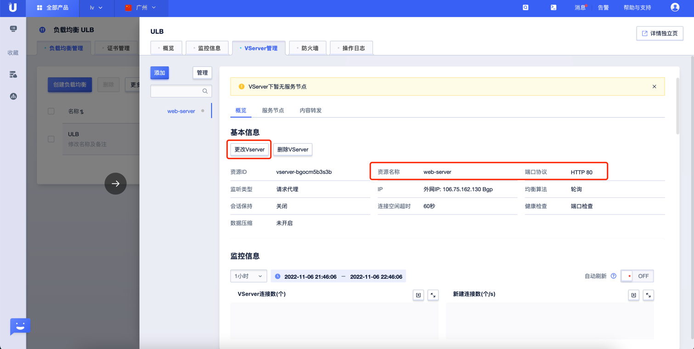
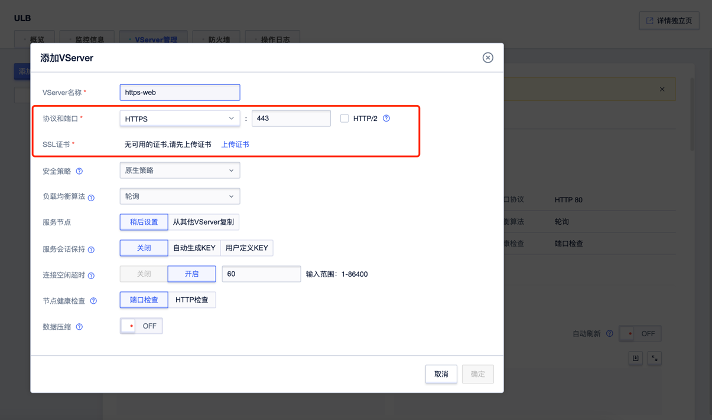

#  UCloud ULB 负载均衡监听检测

### 1.检查项说明
!!! info ""
    UCloud 账号下的 ULB 负载均衡是否开启 HTTPS 或 HTTP 监听，开启视为“合规“，否则“不合规“

### 2.处置方案
!!! info ""
    1. 前往 UCloud 控制台，调整 VServer 协议端口为 https；

### 3.操作步骤
!!! info ""
    1. 使用 ucloud 账号登录控制台；
    2. 通过导航菜单进入云服务器控制台；https://console.ucloud.cn/ulb
    3. 选择需要调整的负载均衡实例，单机实例 ID；
    4. 选择"VServer管理"，弹出设置框后，添加Server；
    5. 创建并选择协议为 https 的 VServer。

{ width="95%" }

{ width="95%" }

{ width="95%" }

### 4.帮助资源
!!! info ""
    - https://docs.ucloud.cn/ulb/guide/forwardpolicy/addrule
