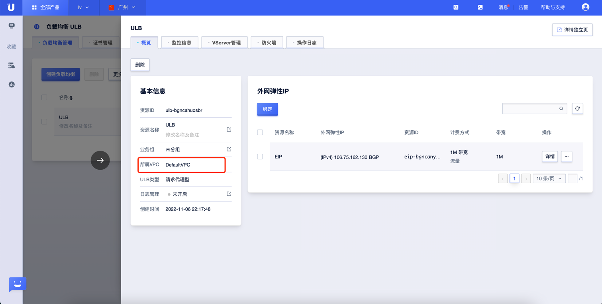
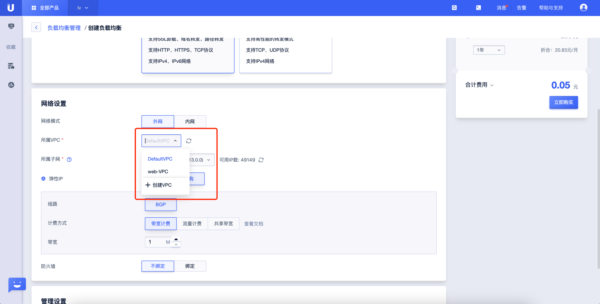

# UCloud ULB VPC 检测

### 1.检查项说明
!!! info ""
    UCloud 账号下 ULB 负载均衡实例指定属于哪些 VPC, 属于则合规，不属于则“不合规“

### 2.处置方案
!!! info ""
    1. 前往 ucloud 控制台，调整网络类型；
    2. 私有网络 VPC（Virtual Private Cloud）是属于用户的、逻辑隔离的网络环境。在私有网络中，可以创建指定网段的VPC，在VPC中创建子网并自主管理云资源，同时通过网络ACL实现安全防护;
    3. 查看当前 Uhost 的 VPC 是否和预期一致，如果不一致可进行更换；

### 3.操作步骤
!!! info ""
    1. 使用 ucloud 账号登录控制台；
    2. 通过导航菜单进入负载均衡 ULB 控制台；https://console.ucloud.cn/ulb/ulb
    3. 查看当前 ULB 实例的网络类型，如果是非 VPC 网络或者不是目标 VPC 网络，根据实际情况创新创建 ULB 并选择正确的 VPC 网络。

{ width="95%" }

{ width="95%" }

### 4.帮助资源
!!! info ""
    - https://docs.ucloud.cn/ulb/guide/ulb/createulb
