!!! info "多云检测"
    通过绑定混合云的账号信息（Access Key ID / Access Key Secret）, 一键执行内置或自定义规则组，得到混合云的安全合规资源的风险结果信息。

### 工作流程

!!! abstract "工作流程"
    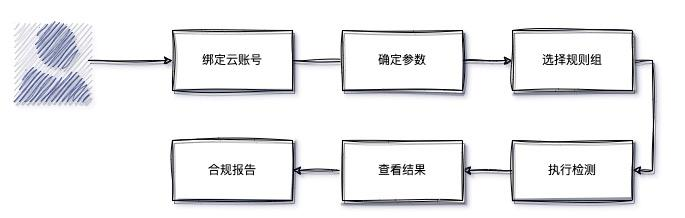{ width="95%" }    

### 云账号管理
!!! abstract "绑定云账号"
* 点击“混合云安全”，点击“多云检测”进入云账号管理页面，首先需要绑定云账号信息（Access Key ID / Access Key Secret）。    
* 点击左上角「创建云账号」按钮，打开云账号配置页面。    
* 通过对应的云平台，获取账号信息（一般为AK/SK），填写信息并绑定，HummerRisk会自动获取区域和认证等信息。    
* 请注意绑定的账号需要一定的权限，在对应云平台赋予相应的 IAM 策略，具体策略内容请参考页面提示信息。    
    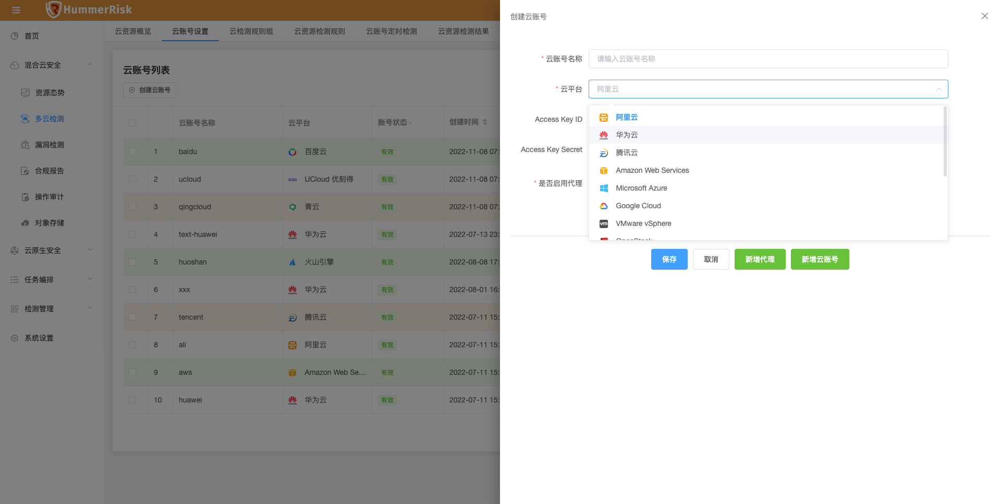{ width="95%" }    
    - 在绑定云账号时，还可以配置代理，以解决无法直接访问公网的情况。点击“新增代理”可以创建新的代理配置。添加过的代理信息会被保存，后续可以直接选择使用，无需重复创建。代理相关配置如下图：   
    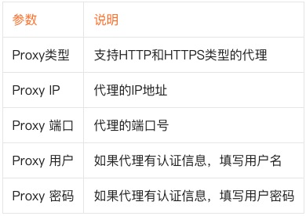{ width="40%" }    
    - 云账号可以一次创建多个，点击“新增多个”，可以增加云账号配置，一次性保存。
!!! abstract "云账号列表"
    - 云账号绑定完成后，会显示在云账号列表，系统会自动校验账号的状态，状态显示为『有效』时即为绑定成功。    
    - 选择需要校验状态的云账号，点击“一键校验”，可对账号状态执行校验。    
    - 如果绑定信息有误，点击账号列表中操作按钮的第三个「编辑」，可对已绑定的账号进行编辑。
    - 每个云账号的“区域”按钮，点击可以查看该云账号所支持的区域信息。    
    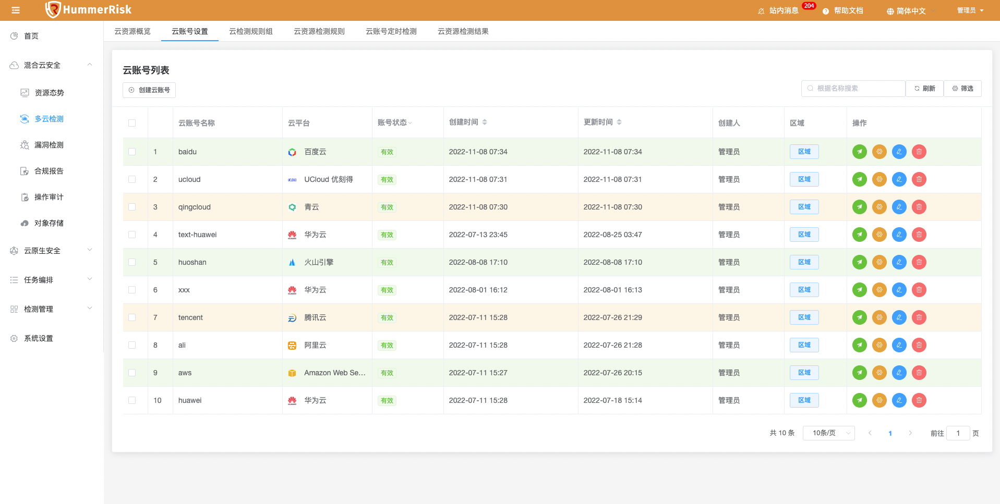{ width="95%" }    
!!! abstract "云账号调参"    
    - 点击云账号后的操作按钮，可以打开云账号调参列表页面，提供了对当前云账号的检测规则参数调整、批量设置等操作，以及针对现有参数的快速检测操作。如下图：   
    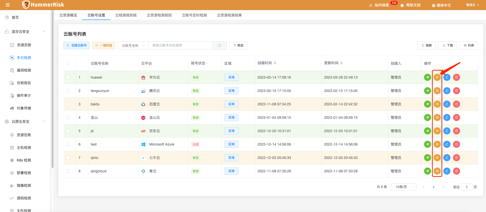{ width="95%" }     
    - 云账号调参，主要是针对检测规则中的变量，调整对应的默认值。以下图中的规则为例
    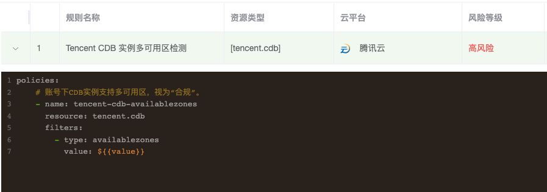{ width="95%" }    
    - 可以看到规则中有一个变量，在执行检测规则管理中可以做调整，我们可以在云账号调参中找到这个参数，给其设置默认值。
    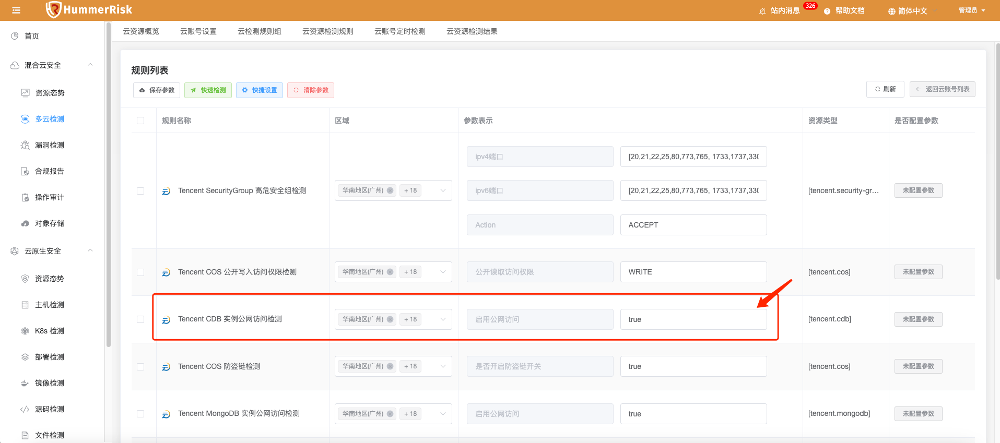{ width="95%" }    
    调整后的参数将绑定到此云账号，以便以后云账号安全检测的过程中将按此用户定义数据进行检测。调参页面的几个快捷操作：
      - 快速检测：可以根据已经填写的区域信息与参数设置，立即检测执行选中的规则。   
      - 快捷设置：可以批量设置区域信息到规则列表中。   
      - 清除参数：将绑定到此云账号的参数清空，以后检测的过程中将按规则列表中的默认的参数检测。   

### 执行检测
!!! abstract "执行入口"
    现在我们要对绑定好的云账号进行安全检测，执行检测有两个入口。   
!!! abstract "云账号列表入口"   
    首先是在云账号列表中，执行步骤如下：   

    - 点击混合云安全，点击多云检测，进入云账号管理页面   
    - 找到希望检测的云账号，点击云账号后面的“一键检测”按钮   
    - 在弹出窗口中，选择希望执行检测的规则，之后确认即可开始检测。   
    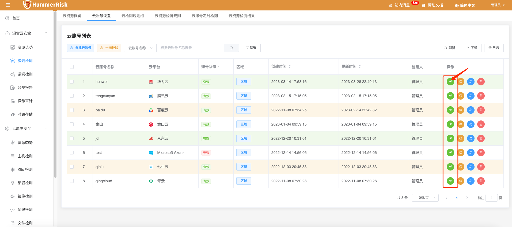{ width="95%" }    
!!! abstract "规则组入口" 
    第二个检测入口是在规则组中，以某个规则组为执行主体，这样每次只能执行一个规则组的检测，但是方便我们找到希望执行的检测内容，也可以精简检测执行的内容。具体步骤如下：    

    - 点击混合云安全，点击多云检测，点击云检测规则组。
    - 找到希望执行检测的规则组，点击“操作”下拉菜单中的“检测”按钮。
    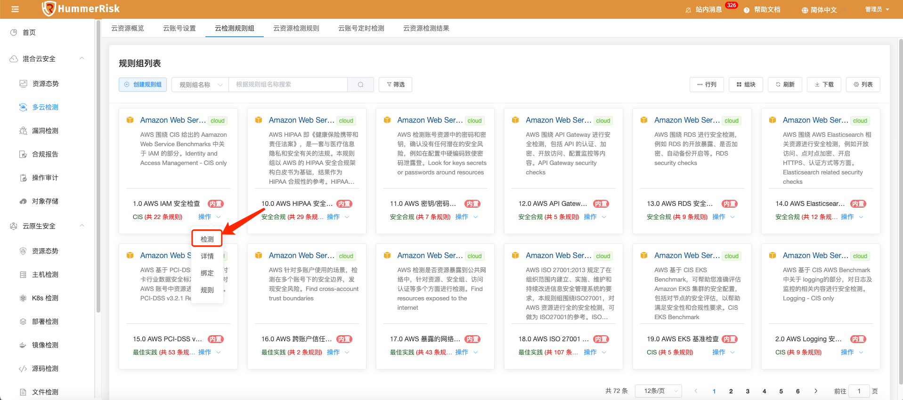{ width="95%" }    
    - 选择希望执行的云账号，点击确定开始检测。检测开始后会跳转到检测结果页面，实时显示检测进度。
    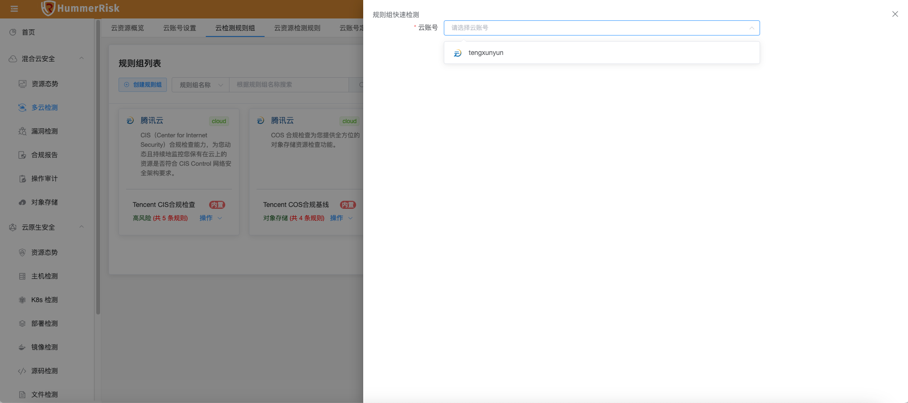{ width="95%" }    

### 检测规则&检测规则组

!!! abstract "检测规则"
    规则是 HummerRisk 针对各种资源检测进行检测的基础，它定义了需要检测与过滤的基本内容。在HummerRisk中除了系统自带规则外，用户也可以自定义规则，我们来看下管理和编辑规则的步骤：    

    - 依次点击“混合云安全”，“多云检测”，“云检测规则”进入规则管理页面。    
    - 列表中会显示出目前已经存在的所有规则。可以管理规则的启用状态，点击列表这种的状态可以切换启用和禁用，系统自带的规则不能进行编辑和删除。   
    注：内置检测规则只有添加对应类型的云账号后才显示。    
    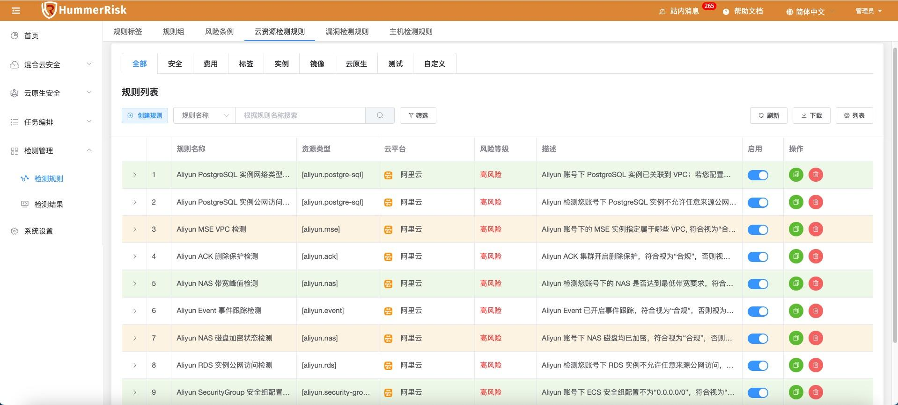{ width="95%" }    

    - 查看规则内容：点击规则前面箭头，可以展开查看规则的详细内容。如果规则中存在变量，可以支持查看变量的默认值和启用状态。   
    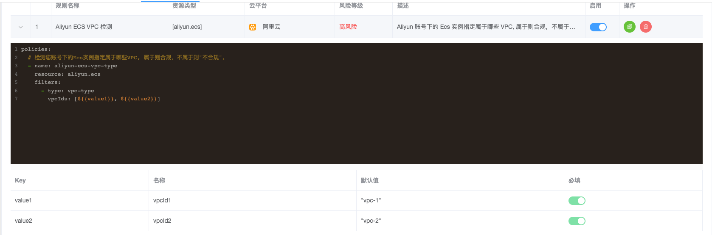{ width="95%" }    

    - 创建自定义规则：用户可以根据自己需要定义规则，点击左上角的“创建规则”按钮，创建新规则。因为规则具有一定复杂性，我们提供了复制规则功能。用户可以先找到一个类似的内置规则，点击规则列表后的“复制”按钮    
    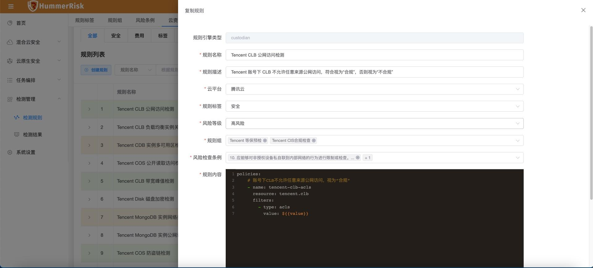{ width="95%" }    
    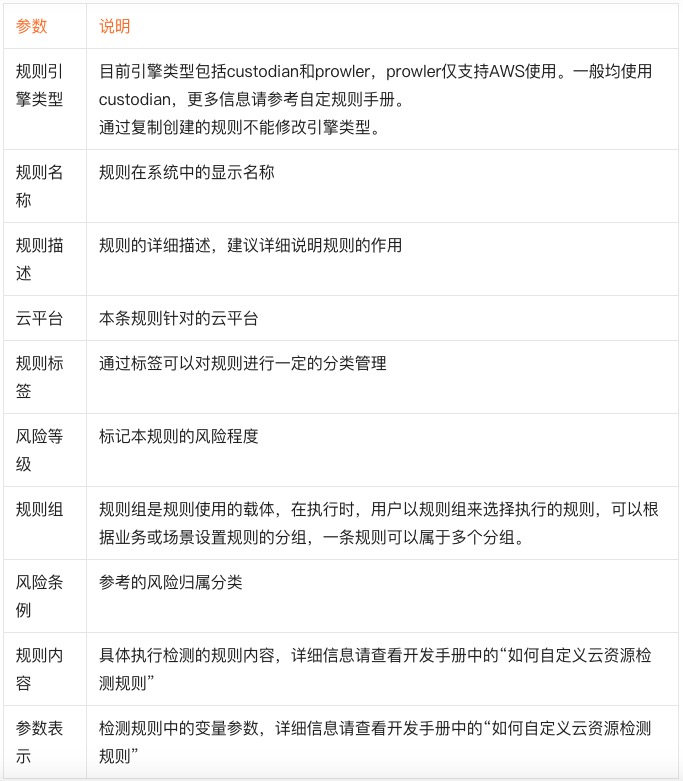{ width="95%" }    
!!! abstract "检测规则组"
    检测规则组是规则的使用载体，在HummerRisk中，实际执行规则、分析结果等都是基于规则组进行。设计规则组的目的是为了更加灵活的依据业务和场景进行检测，例如场景的合规要求(比如等保、HIPPA)都可以定义为规则，并可以灵活扩展。    
    HummerRisk 系统初始化时会默认创建内置的对应云平台的规则组，用户也可以根据自己的需要手动创建规则组。我们来看下管理规则组的步骤：    

    - 依次点击“混合云安全”，“多云检测”，“云检测规则组”进入规则组管理页面。规则组支持卡片和列表两种展现方式，默认会以卡片的形式展示，如果喜欢列表形式，可点击右上角的“行列”和“卡片”进行切换。
    - 创建规则组：点击左上角的“创建规则组按钮”，会打开新建页面，填写相关信息就可以创建自定义规则组。    
    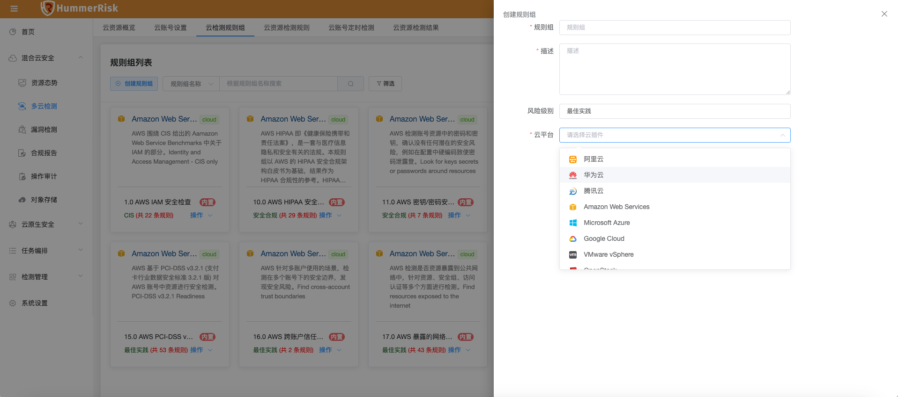{ width="95%" }    

    - 规则组操作：点击规则组的“操作”按钮，可以看到操作项。点击“详情”可以查看规则组的基本信息，就是新建时填写的信息。点击“规则”可以查看当前规则组中包含的规则。    
    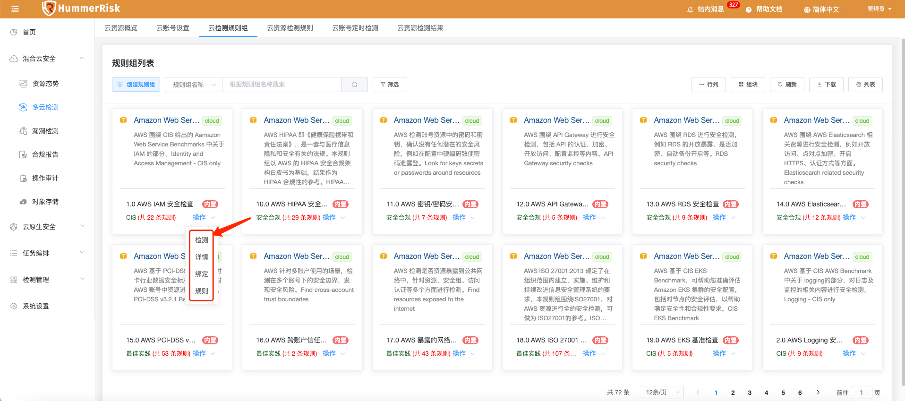{ width="95%" }   

    - 绑定规则：新建的规则组不包含任何规则，需要手动绑定。点击规则组的“操作”按钮，之后点击“绑定”，会打开绑定规则页面，如下图：    
    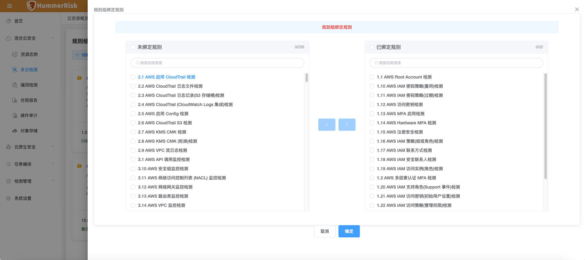{ width="95%" }  

    - 执行检测：在“执行检测”部分中介绍过，检测有2个入口，其中一个就是规则组。点击规则组的“操作”按钮，之后点击“检测”，在弹出页面中选择希望执行的云账号，就可以在这个云账号上执行这个规则组的检测。

### 检测结果

!!! abstract "检测结果"
    检测开始后，就可以到检测结果页面查看检测的执行状态和检测结果。 

    - 依次点击“混合云安全”，“多云检测”，“云检测结果”进入检测结果页面。    
    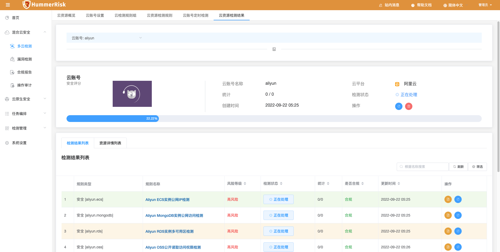{ width="95%" }   

    - 选择云账号：检测结果是基于云账号为基本显示范围的，所以首先需要在左上角的下拉列表中选择希望查看的云账号。
    - 页面中部会显示账号的检测概要信息，包括安全评分，检测状态等。如果此时该云账号正在执行检测，会显示检测的执行进度。
    - 详细结果：下方列表中会显示本云账号的详细检测结果，包括两个维度，检测规则维度和资源维度。在规则维度列表中，会将本云账号执行的所有规则及结果进行展示，还可以点击“检查状态”，来查看本规则的检测详细日志。    
    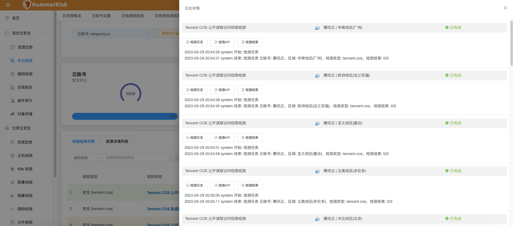{ width="95%" }   
    资源维度列表中，会以本云账号检测涉及的全部规则进行展示，提供快捷过滤能力，并展示对应的风险情况。    
    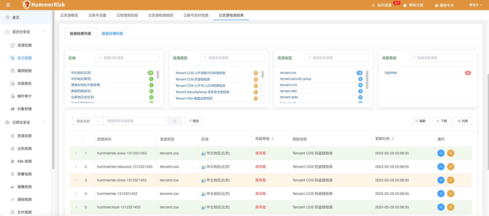{ width="95%" }   

### 云资源概览

!!! abstract "云资源概览"
    在云资源概览中会提供统计分析图标，我们可以快速分析出当前管理的云账号安全状态，以便于管理员快速发现安全问题。
    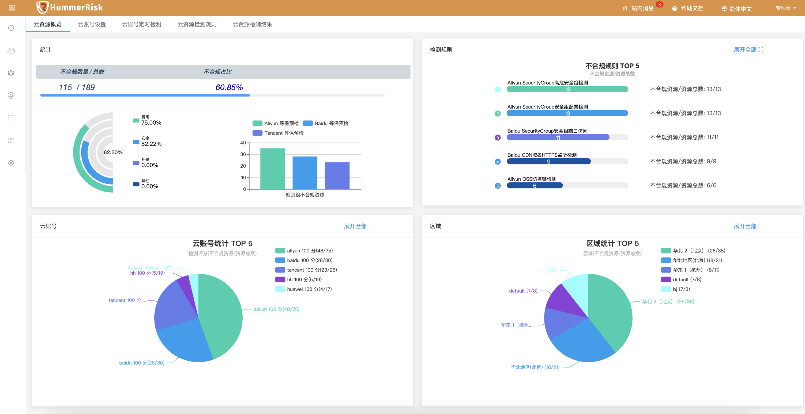{ width="95%" }   

