!!! info "多云检测"
    通过绑定混合云的账号信息（Access Key ID / Access Key Secret）, 一键执行内置或自定义规则组，得到混合云的安全合规资源的风险结果信息。

### 云账号概览

!!! abstract "云账号概览"
    云账号概览可以查看云资源检测情况。

{ width="95%" }

### 云账号设置

!!! abstract "云账号设置"
    - 云账号列表页面提供了对云账号的创建、删除、编辑、查找、校验、检测、调参等操作。
    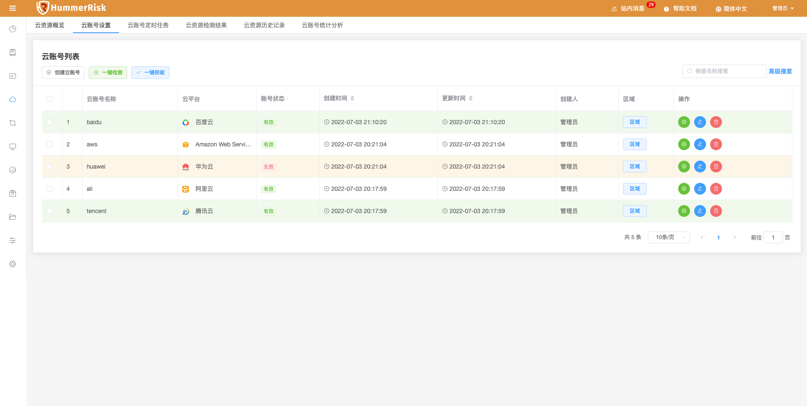{ width="95%" }
    - 新增云账号信息，点击"新增云账号"按钮可添加多个账号。点击"新增代理"按钮可添加代理配置，云账号可配置代理，选择"启用代理"可选择以已配置的代理。
    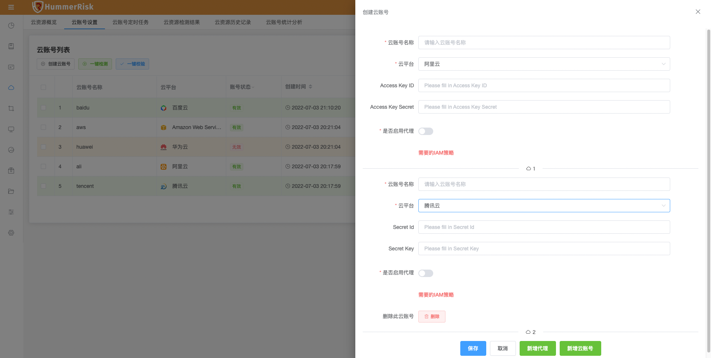{ width="95%" }
    - 编辑云账号信息。
    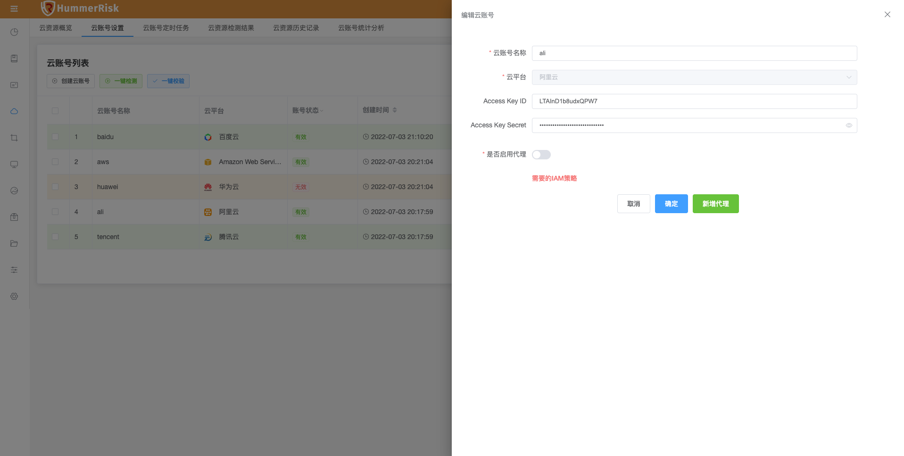{ width="95%" }
    - 在新增/编辑云账号信息的页面快速添加代理。
    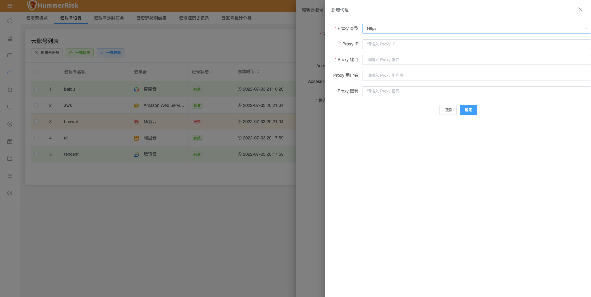{ width="95%" }
    - 查看云平台对应的 IAM 策略信息。
    { width="95%" }
    - 云账号调参列表页面，提供了对当前云账号的规则则信息参数的保存、清除等操作，以及针对现有参数的快速检测操作。
    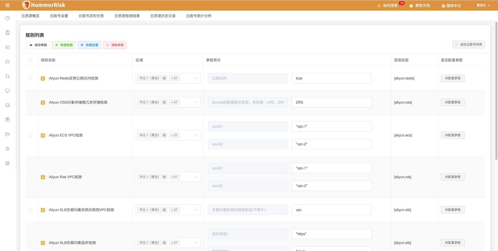{ width="95%" }
    - 保存参数：将规则列表的参数绑定到此云账号，以便于以后次云账号安全检测的过程中将按此用户定义数据进行检测。
    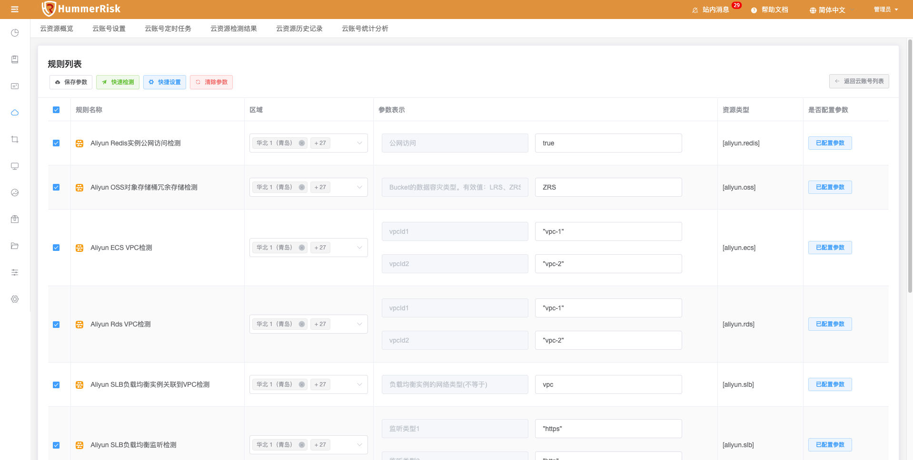{ width="95%" }

!!! warning "调参页面"
    1. 快速检测：可以根据已经填写的区域信息与参数表示，立即检测执行选中的规则行。
    2. 快捷设置：可以批量设置区域信息到规则列表中。
    3. 清除参数：将绑定到此云账号的参数清空，以后检测的过程中将按规则列表中的默认的参数检测。

### 云检测规则组

!!! abstract "云检测规则组"
    - 规则组页面提供了对规则组的创建、删除、编辑、查找等操作。
    - hummerrisk 系统初始化时会默认创建内置的对应云平台的规则组，用户也可以根据自己的需要手动创建规则组。
    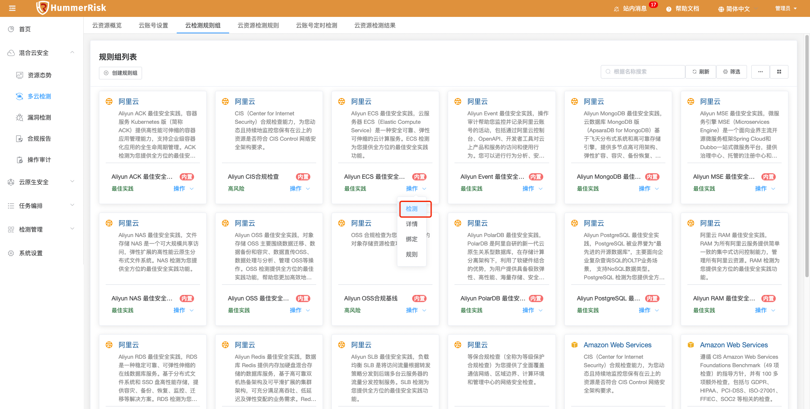{ width="95%" }
    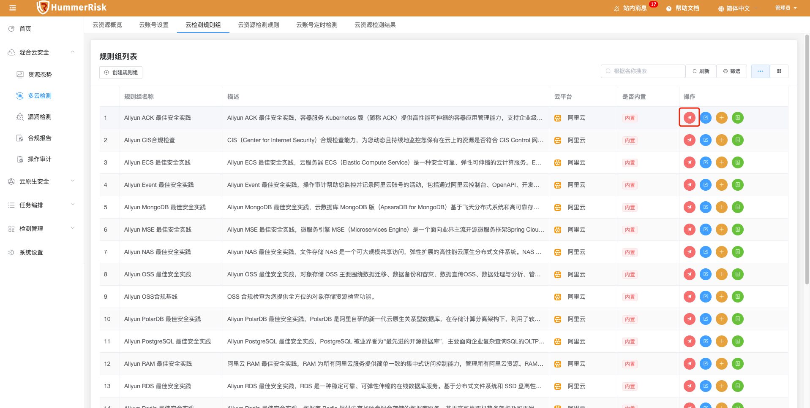{ width="95%" }

### 云账号检测规则

!!! abstract "云账号检测规则"
    规则是 HummerRisk 针对各种资源检测进行检测的基础，它定义了需要检测与过滤的基本内容。规则标签、规则组、等保条例、漏洞等从不同维度针对检测规则的统计划分。

!!! warning "注意"
    注：内置检测规则只有添加对应的账号后才自动显示。

!!! abstract "云账号检测规则"
    - 检测规则页面提供了对规则的创建、关闭、删除、编辑、查找等操作。hummerrisk 系统初始化时会默认创建规则，用户也可以根据自己的需要手动创建规则，但是要注意云资源规则内容符合 Yaml 格式规范。
    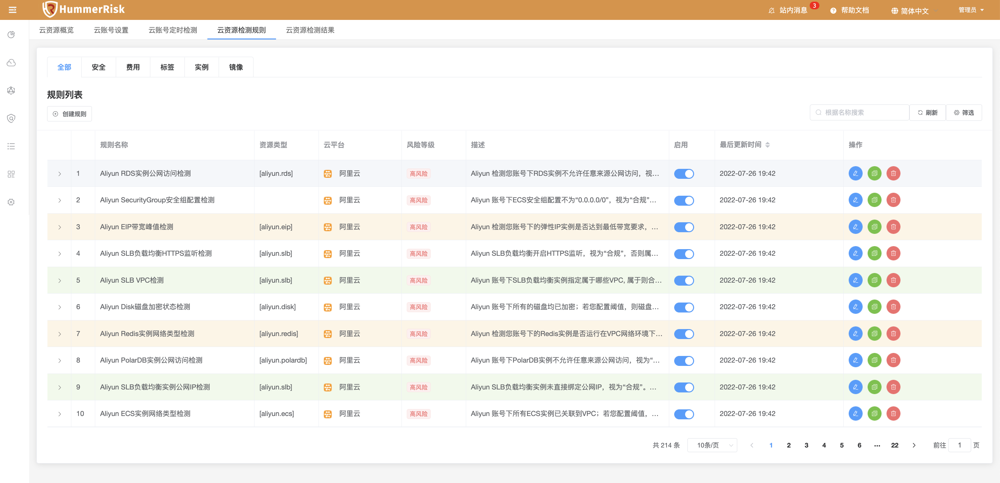{ width="95%" }
    - 新增/编辑检测规则。
    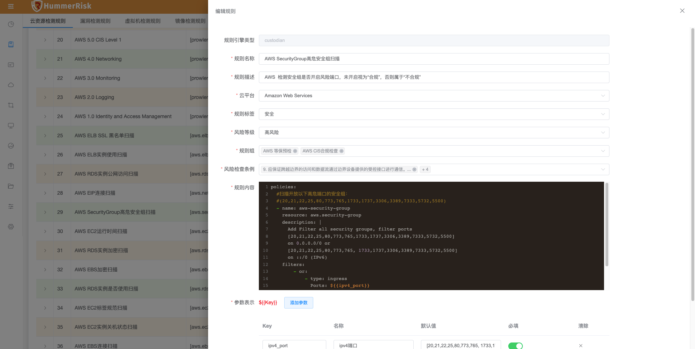{ width="95%" }

### 云账号定时任务

!!! abstract "云账号定时任务"
    定时任务列表页面，可以创建定时任务，便于定时检测某些云账号或某些规则。

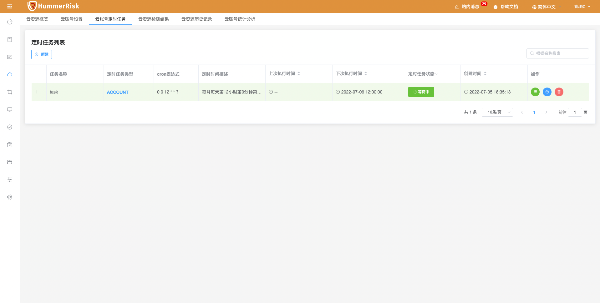{ width="95%" }

!!! abstract "云账号定时任务"
    可配置定时任务cron表达试及检测类型，检测类型分为云账号（可配置多个云账号进行检测）和规则（可选择云账号下的多个规则进行检测）。

{ width="95%" }

### 云资源检测结果

!!! abstract "云资源检测结果"
    云资源检测结果列表页面，可以查看所有云账号检测结果。

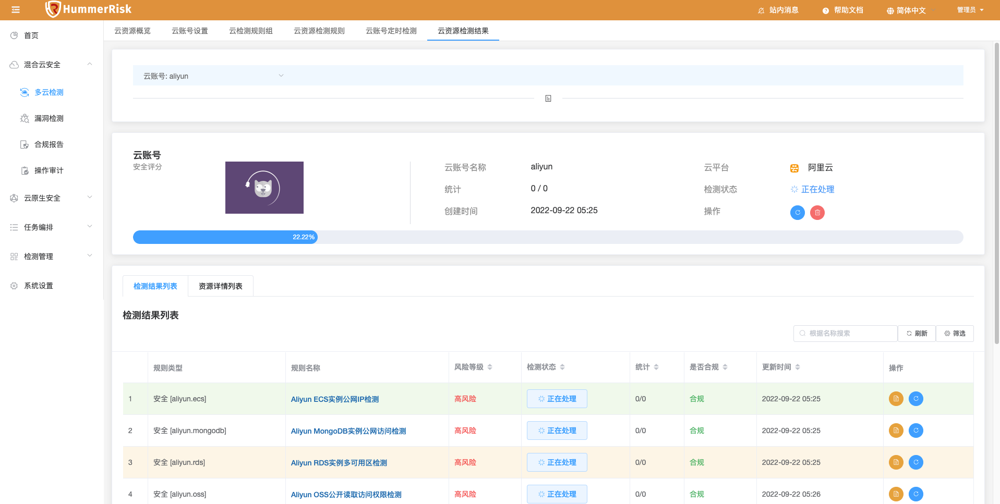{ width="95%" }

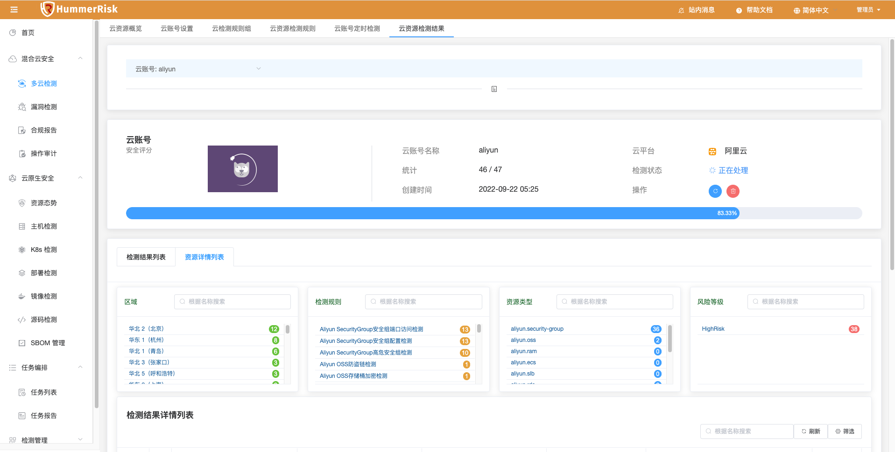{ width="95%" }

