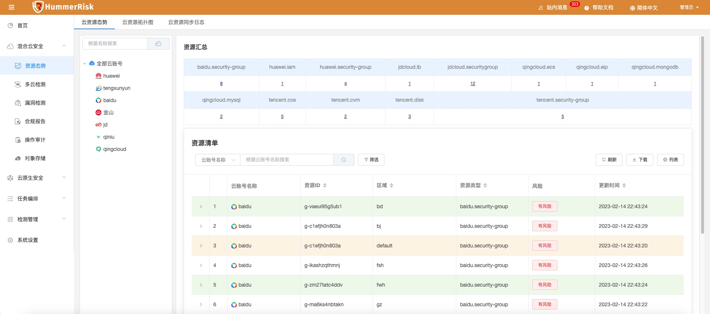
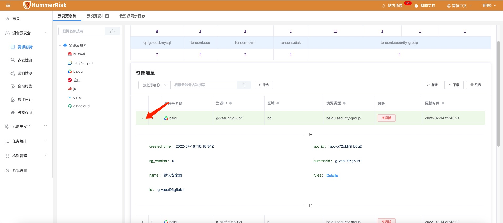
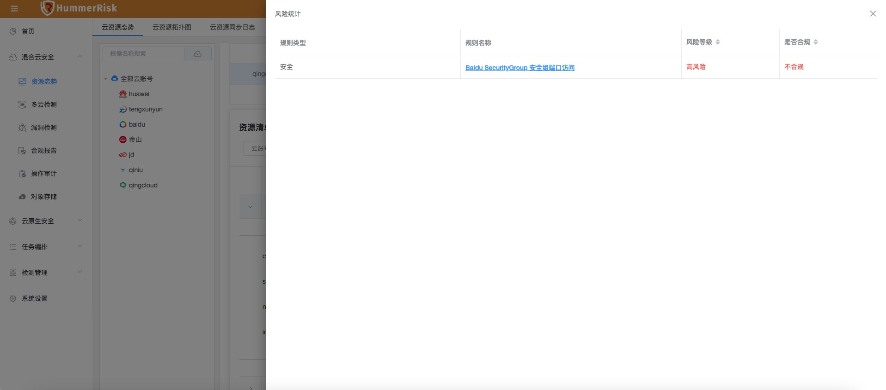
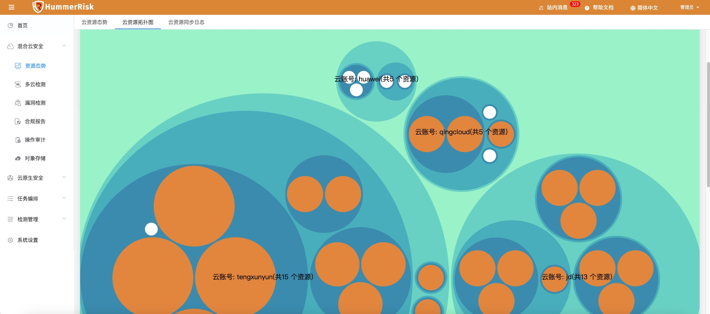
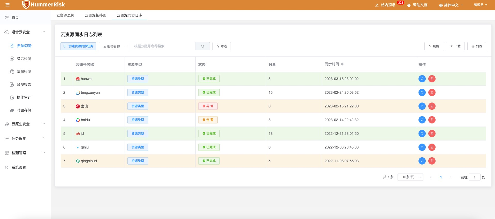
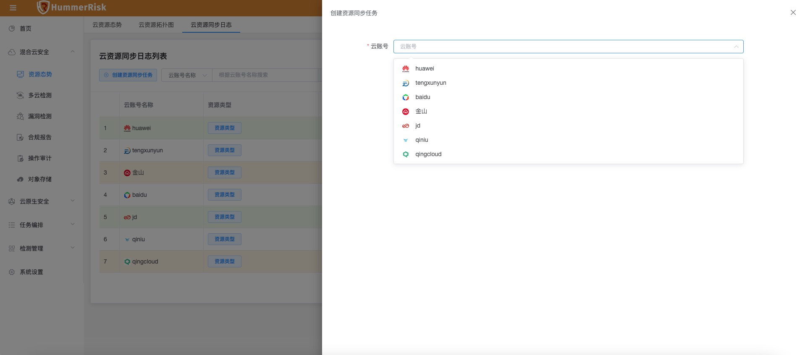
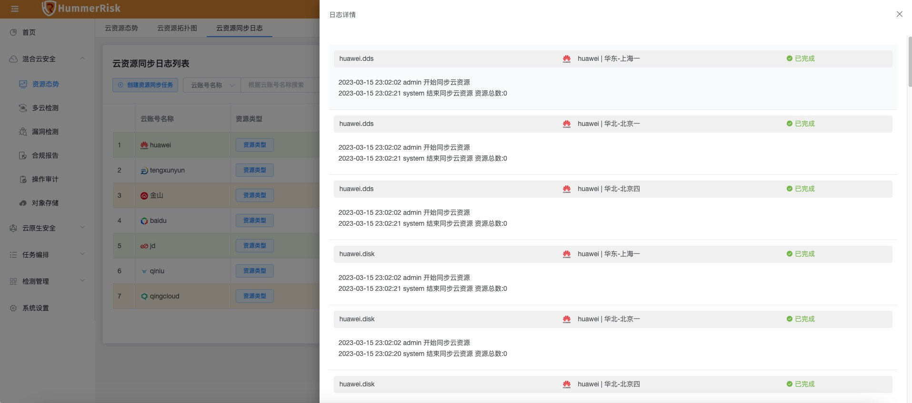
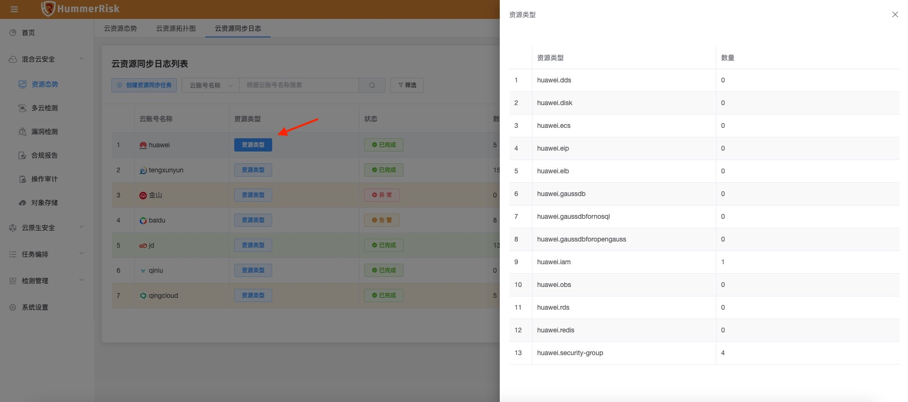

!!! abstract "概述"
    使用资源态势相关功能的前提是要完成绑定云账号，相关绑定云账号的内容，请查看多云检测相关的使用说明，这里我们假定您已经在系统中绑定好了云账号。在完成云账号绑定后，系统会自动执行一次资源同步，同步完成后即可在资源态势中查看相关云账号的资源情况。
### 资源清单
!!! abstract "资源清单"
    在资源态势页面，可以通过统一的界面查看多云账号中的资源情况。
    { width="95%" }    
    *左侧的「全部云账号」会列出目前绑定账号中支持资源态势的账号，点击某一账号，即可查看对应账号的云资源。   
    *资源汇总」部分会将云资源按类别汇总数量，比如huawei.iam等。汇总打分时候会夸账号统计。   
    *资源清单」会列出详细的资源信息，每条记录就是云上的一个相关资源。点击左侧的箭头，可以展开资源的详细信息。   
    { width="95%" }

### 风险情况
!!! abstract "风险情况"
    每条记录都会显示风险情况，这里的风险依赖于「多云检测」的结果。如果在多云检测的过程中，发现对应的云资源存在风险，那么这里就会显示「有风险」，而如果没有风险，则对应显示「无风险」。风险状态分为「有风险」，「无风险」，「未检测」。
    点击「有风险」的状态按钮，可以查看检测出本资源存在风险的检测规则，再根据相关检测历史，方便修复对应风险。
    { width="95%" }   
### 云资源拓扑图

!!! abstract "云资源拓扑图"
    云资源拓扑图中会将所有云账号中的资源以拓扑图的形式呈现。
    每一个大圈代表一个云账号，其下还会有3层，分别代表区域 -> 资源类型 -> 具体资源。同时上层的圈中会汇总下层资源的数量，便于看到统计信息。   
    另一个需要注意的事颜色，白色的资源代表该资源没有风险，而橘色的资源代表有风险，和前面介绍「资源清单」中的风险情况一致。   
    { width="95%" }

### 云资源同步任务

!!! abstract "云资源同步任务"
    除了首次绑定云账号后的自动同步任务外，还可以在系统中手动进行资源同步，在云资源同步日志列表中可以查看到全部的同步任务。
    { width="95%" }
    点击「创建资源同步任务」，选择希望手动同步的云账号，即可创建同步任务。
    { width="95%" }
    创建完任务后，可以在列表中查看到任务执行情况。列表中的状态包括「正在处理」，「已完成」，「异常」，「告警」，点击状态中的按钮，可以查看同步任务的详细日志信息。
    { width="95%" }
    任务列表中还提供了「资源类型」的显示，因为各个公有云资源类型繁多，我们会逐步扩充和支持，所以通过资源类型，可以更加方便用户了解目前支持的资源。
    点击云账号中的对应按钮，可以查看到该云账号支持同步的云资源类型。
    { width="95%" }
