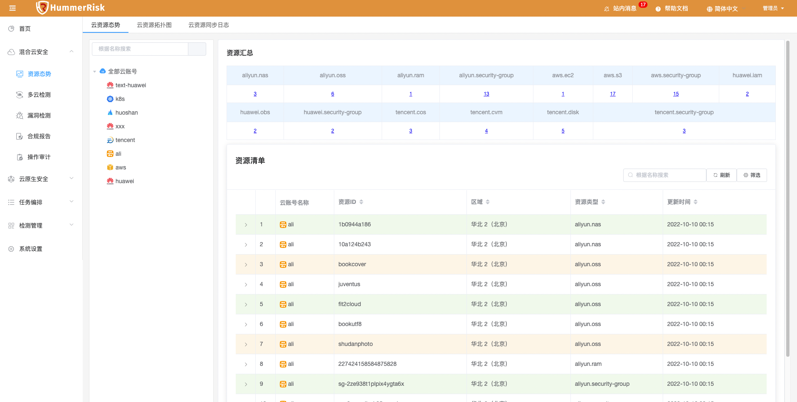
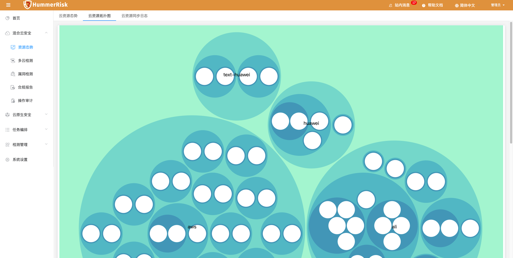
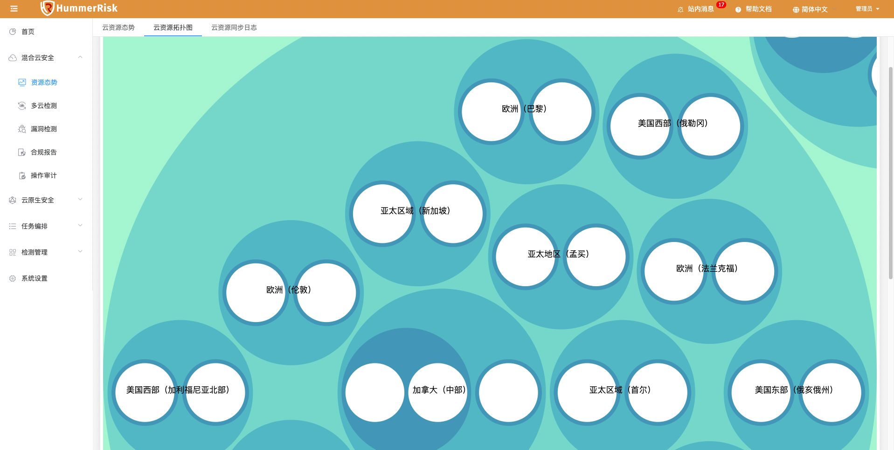
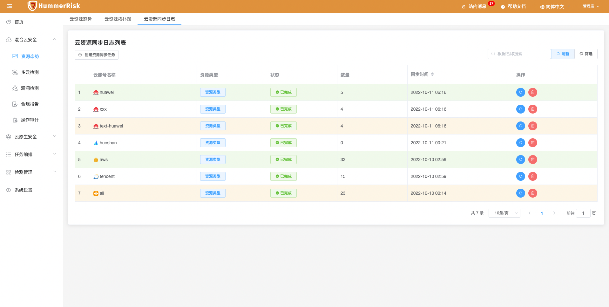

### 资源态势

> 资源态势功能，绑定 K8s 环境信息，即可获取 K8s 的 Namespace、Pod、Node、Deployment、Service 等20余种资源信息。

{ width="95%" }

### 拓扑图

> 云资源拓扑图功能，根据同步云资源汇总信息，形成拓扑图。

{ width="95%" }
{ width="95%" }

### 同步日志

> 绑定完混合云账号是可以自动获取资源态势信息的。同时，也可以在同步日志页面手动获取资源态势信息。手动创建同步任务，即可查看同步资源数与同步状态。

{ width="95%" }
