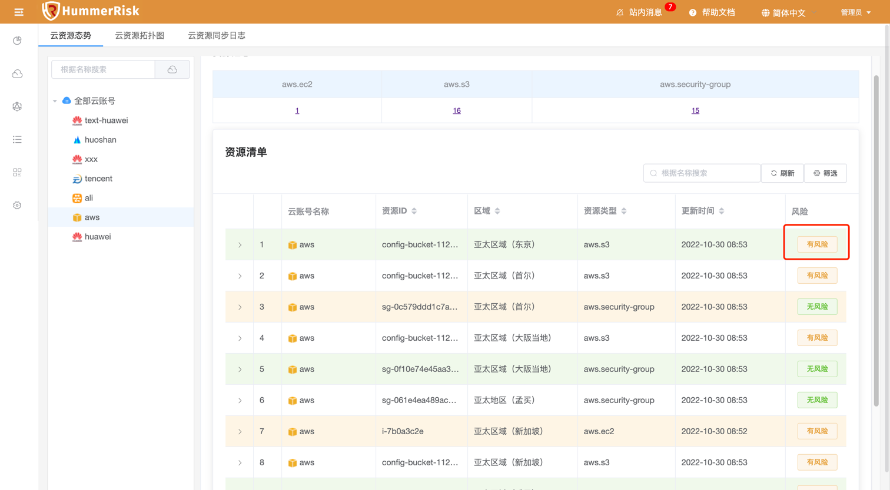

### 云资源态势

!!! abstract "云资源态势"
    - 资源态势功能，绑定混合云账号信息，即可同步获取云资源汇总信息。
    - 执行检测后，可以自动关联云资源态势信息，可以查看到具体哪些资源具有安全合规风险。

{ width="95%" }

### 云资源拓扑图

!!! abstract "云资源拓扑图"
    云资源拓扑图功能，根据同步云资源汇总信息，形成资源拓扑图。

{ width="95%" }

### 云资源同步日志

!!! abstract "云资源同步日志"
    1. 绑定完混合云账号可以自动获取资源态势信息。
    2. 同时，也可以在同步日志页面手动获取资源态势信息。
    3. 手动创建同步任务，即可查看同步资源数与同步状态。

{ width="95%" }
