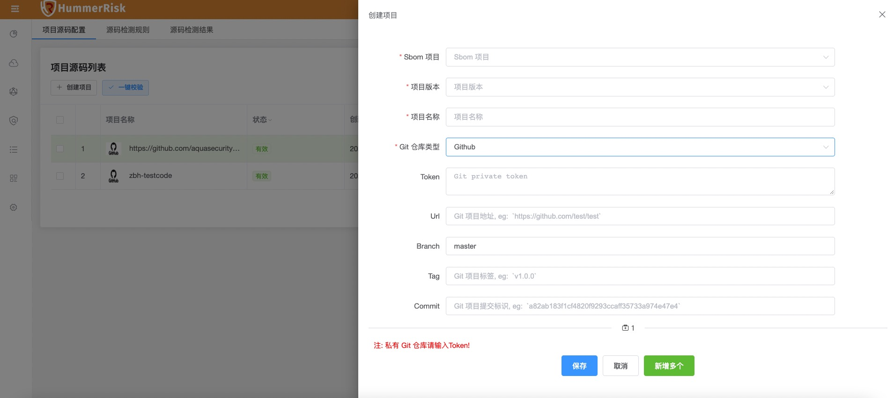
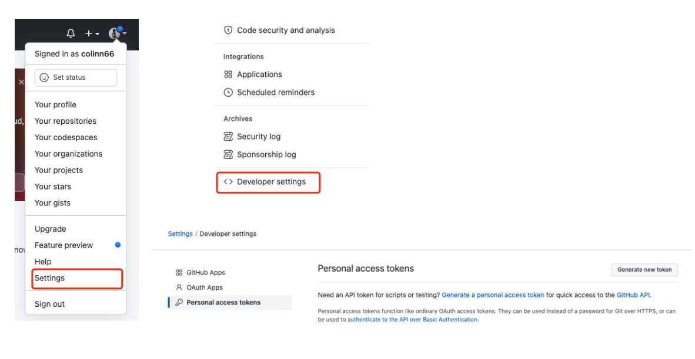
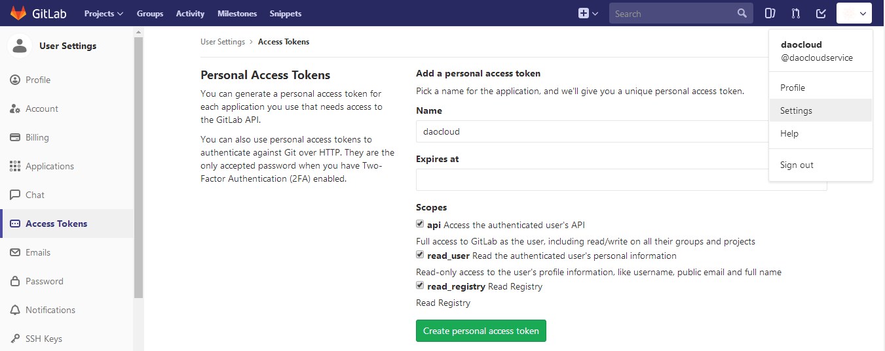
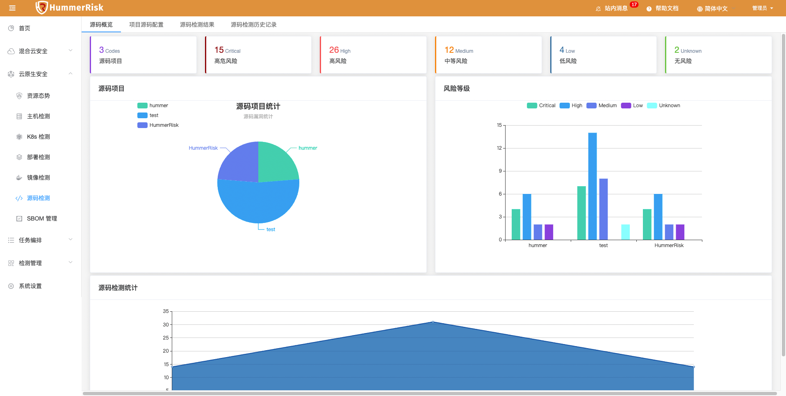
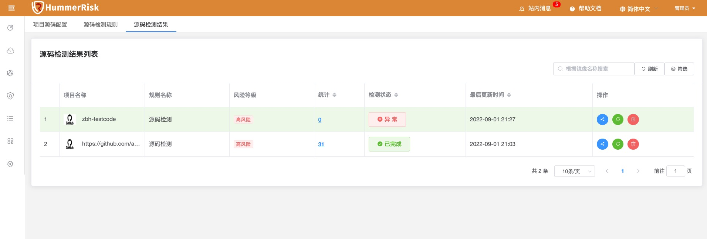
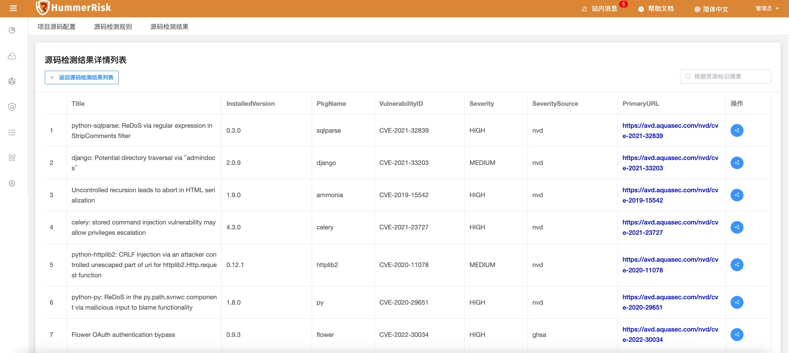
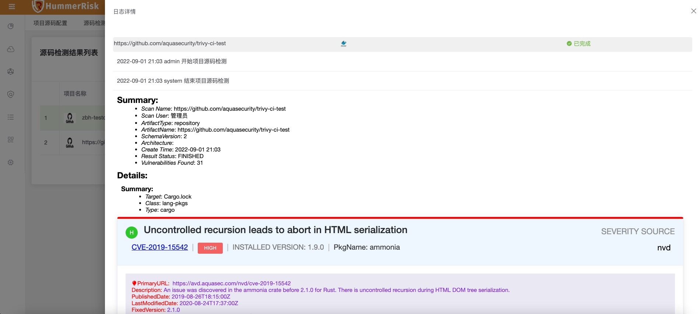
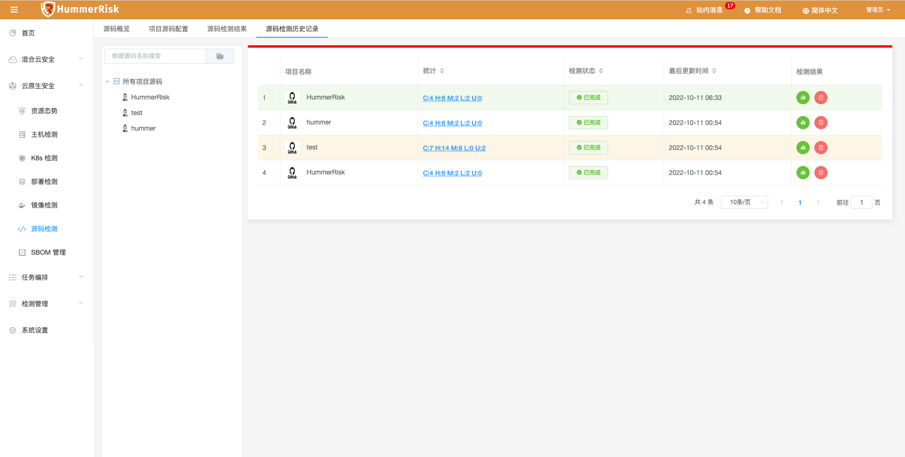
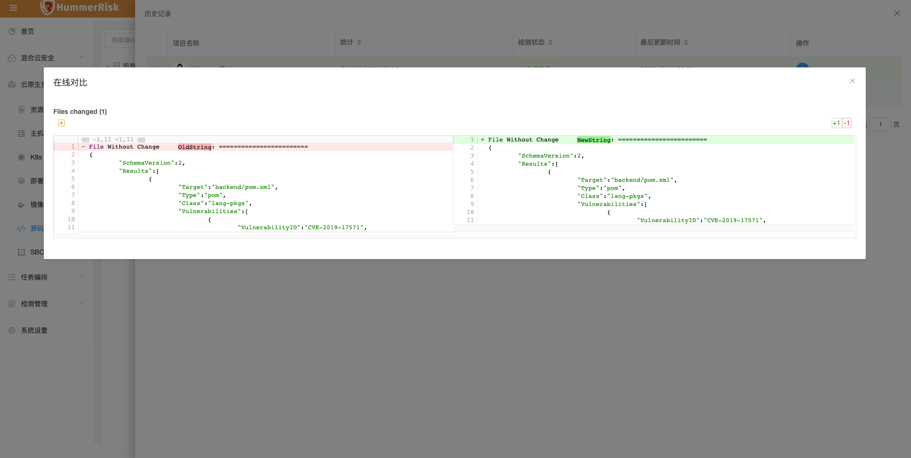

在源码检测部分，通过对源码依赖的扫描，发现项目中存在的漏洞。

### 项目源码配置
首先需要把源代码仓库中的项目绑定进来，点击[创建项目]，在弹出窗口中填写相关信息。
{ width="900px" }
> 源码检测是一个项目软件安全检测的一部分，所以需要选择项目和版本信息。

> 目前绑定仓库支持两种类型：GitHub 和 GitLab 。

>Token 的获取：首先私有仓库需要填入Token，共有仓库无需填写Token

Gtihub Token:   
1. 登录你的帐号，登录后点击右上角你的头像的Settings.
2. 选择左侧菜单的“Developer settings”一项
3. 再选择“Personal access tokens”
4. 点击“Generate a personal access token” 
5. 设置 token 名字勾选权限 。在 Note 中随便填一个描述名称，下面的复选框是你这个token需要的权限.之后点击生成Token按钮。
6. 复制token值
   下面这个就是你的token了，可以直接复制使用。（记住这个token值 ，此值只显示一次）
{ width="900px" }
GitLab Token:
7. 登录您的 GitLab 账号，点击头像进入【Settings】
8. 在左侧栏中选定【Access Tokens】
9. 再在右边输入名字，勾选【Scopes】下的所有选项，最后点击【Create Personal access token】。
10. Token 生成后，请立即妥善保存。离开此页面后，您将无法在 GitLab 上查询到您刚刚获取到的 Token！
{ width="900px" }

项目源码列表中会显示已绑定的项目，验证成功可以正常访问的状态会显示为 [有效]。  
点击 [执行检测]，可以对项目执行检测任务。

### 源码检测概览

> 源码检测数据概览。

{ width="900px" }

### 源码检测结果

> 源码检测结果列表会显示出所有的检测任务。
>
{ width="900px" }
> 统计列中的数字表示漏洞数量，点击该数字可以打开和该项目相关的漏洞列表
> 
{ width="900px" }

> 点击源码检测结果列表中状态列中的按钮，可以打开检测的详细日志页面，在这里可以看到检测的详细内容。

{ width="900px" }

源码检测的漏洞和SBOM数据可以通过SBOM管理统一查看。

### 源码检测历史记录

{ width="900px" }
{ width="900px" }
